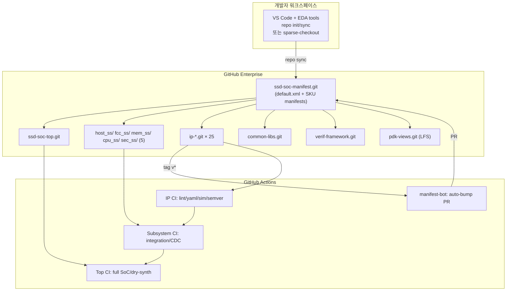

# 01. 시스템 설계서 (System Design Document)

> **TL;DR** — 100명+ SSD Controller SoC 팀을 위한 형상관리 시스템.
> AOSP `repo` + manifest를 외피로, IP는 개별 Git repo, IPLM-lite (OpenTitan 스타일 YAML)
> 로 메타데이터 일원화, GitHub Actions 기반 3계층 CI(품질 게이트). 4가지 형상관리
> 방식(monorepo / submodule / repo+manifest / subtree)을 비교한 결과 **단일 전략이
> 100명+ 규모에 모두 들어맞지 않으므로 하이브리드 구성을 추천**한다.

---

## 1. 목표 (Goals)

| # | 목표 | 측정 (KPI) |
|---|---|---|
| G1 | 100명+ RTL 개발자의 일관된 협업 가능 | 동시 작업 IP 25개, 일일 PR 50건 처리 |
| G2 | 양산 SKU/파생(derivative) 1주일 내 분기 | SKU 1개 추가 = manifest 1파일 + CI 통과 |
| G3 | IP-level 품질 게이트 강제 | PR 모두 lint/yaml/sim 통과 후 머지 |
| G4 | 양산/사인오프 시점의 완전한 재현 가능성 | Release manifest 가 모든 component SHA pin |
| G5 | 권한·라이선스 격리 | 보안 IP, vendor IP, PDK 별도 ACL |
| G6 | 신규 IP onboarding 30분 이내 | `seed-ip.sh` 1줄 명령으로 부트스트랩 |
| G7 | 형상관리 변경 시 운영 비용 최소 | 정책 변경 1회 = reusable workflow 1파일 |

## 2. 비기능 요구 (Non-Functional Requirements)

- **확장성**: IP 50개, 200명 규모로 무리없이 확장.
- **가시성**: 현재 mainline / 각 SKU 의 BOM (Bill-of-Materials) 한눈에.
- **이중화/DR**: GitHub Enterprise의 ha 클러스터 + mirror nightly.
- **감사(audit)**: 모든 권한·릴리스 동작은 GitHub Audit log + signed commit.
- **다 플랫폼**: Linux(주), macOS(개발자), Windows(일부 EDA tool) 모두 동작.

## 3. 컨텍스트와 제약 (Context & Constraints)

- VCS 호스팅: **GitHub Enterprise** (확정)
- EDA 도구: **상용(VCS/Xcelium/Spyglass/DC) 라이선스 환경** 가정, CI에서는 오픈소스 대체로 dry-run.
- 외부 IP: vendor PCIe Gen5 hard IP, vendor LDPC, 향후 추가 가능성.
- PD 데이터(PDK, LEF, GDS): 대용량(수십 GB) — 별도 LFS repo.
- 보안 IP: 별도 ACL, 추가 reviewer 필수.

---

## 4. 아키텍처 개요 (Architecture)



### 4.1 컴포넌트 책임

| Component | 책임 | Owner |
|---|---|---|
| `ssd-soc-manifest` | 모든 component 의 revision pin (mainline + SKU). 변경 = PR 리뷰 | `@integration-team` |
| `ssd-soc-top` | Top SoC integration, SoC-level verification, release tag | `@integration-team` |
| `<ss>_ss` (5개) | Subsystem wrapper RTL, integration sim, IP 목록 (ss.yaml) | 각 SS-team |
| `ip-*` (25개) | IP RTL/sim/문서/ip.yaml/CODEOWNERS. semver tag로 릴리스 | 각 IP-owner |
| `common-libs` | AXI/APB if, package, BFM, 공용 waiver | `@platform-team` |
| `verif-framework` | UVM env, test infra. RTL과 lifecycle 분리 | `@verif-team` |
| `pdk-views` | LEF/LIB/GDS (LFS). 별도 ACL | `@pd-team` |

### 4.2 데이터 모델 (IPLM-lite)

`ip.yaml` 이 IP의 **single source of truth**. CODEOWNERS, manifest, CI, BOM, audit 모두 본 파일 참조.
스키마: [`recommended/scaffolding/policy/ip-yaml-schema.json`](../recommended/scaffolding/policy/ip-yaml-schema.json)

```yaml
name:        pcie_phy
version:     2.4.0
status:      qual
owner:       "@acme-ssd/host-team"
subsystem:   host_ss
bus:         axi
parameters:  { LANES: 4, GEN: 4 }
dependencies: [common-libs >= 1.0.0]
qual: { lint: pass, cdc: pass, coverage: pass, formal: pending }
```

핵심 필드:
- `status` ∈ {`proto`, `alpha`, `qual`, `gold`} — 양산 후보일수록 reviewer/CI 게이트 강화.
- `owner`/`backup`/`reviewers` — CODEOWNERS와 drift 감시.
- `qual.*` — 자동 CI가 갱신, 사람이 직접 편집하지 않음.

### 4.3 매니페스트 구조

- `default.xml` — mainline. 대부분의 project `revision="main"` (HEAD tracking).
- `sku-gen4-1tb.xml` / `sku-gen5-4tb.xml` — `<include>` + `<remove-project>` 로 일부만 tag pin.
- `release-<id>.xml` — `tools/release.py snapshot` 산출. 모든 project SHA-pinned, 완전 재현 가능.

---

## 5. 4가지 형상관리 방식 비교 결과

상세 매트릭스: [`../cm-strategies/README.md`](../cm-strategies/README.md). 핵심 요약:

| 항목 | Monorepo | Submodule | **repo+manifest** | Subtree |
|---|---|---|---|---|
| 학습 곡선 | 낮음 | 중 | 중-높음 | 중 |
| 권한 분리 | 약 | **강** | **강** | 약 |
| 파생 SKU | 브랜치/디렉터리 | top SHA pin | **manifest 분기** ✓✓ | 디렉터리 |
| Atomic change | ✓✓ | ✗ (다단계 PR) | △ topic upload | ✓ |
| 외부 IP 흡수 | 어색 | 자연스러움 | 자연스러움 | **자연스러움** |
| 100+ 운영 사례 | OpenTitan | Chipyard | **AOSP/Pixel SoC** | (일부) |

### 5.1 추천 하이브리드 (결정 사항)

| 레이어 | 선택 | 근거 |
|---|---|---|
| **외피** | `repo` + manifest | SKU 분기, 100+ multi-repo의 사실상 표준 |
| **IP** | 개별 Git repo | ACL/CODEOWNERS/CI 권한 격리 |
| **Vendor IP** | 별도 repo (또는 monorepo 본체에 subtree) | 라이선스 격리 |
| **PDK** | 별도 repo + Git LFS | 대용량, 별도 ACL, opt-in 동기화 |
| **IPLM** | OpenTitan 스타일 ip.yaml (Git 친화) | 상용 IPLM 도구 없이 Git+YAML+Actions |

배제된 후보:
- **순수 Monorepo**: 권한/라이선스 격리 약함, 보안 IP 다루기 어려움.
- **순수 Submodule**: SKU 파생 시 모든 SKU 마다 superproject 분기 필요 → 폭주.
- **순수 Subtree**: 외부 vendor 외 일반 IP 에도 적용하면 history 폭증.

---

## 6. 권한·브랜치 정책 (Branch & Permission Policy)

### 6.1 브랜치 정책 — Trunk-Based

- 모든 IP repo: `main` 만 보호. feature branch 수명 < 5일.
- semver tag: `vMAJOR.MINOR.PATCH[-SKU]`. `v2.4.0`, `v2.4.0-gen5`.
- Top repo: `main` + `rel/<sku>` (양산 분기 한정).
- Force push 금지, Linear history 강제, signed commit 권장.

### 6.2 GitHub Branch Protection (정책 JSON 으로 일괄 적용)

`recommended/scaffolding/policy/branch-protection.json` 가 모든 IP/SS repo 에 동일하게 적용:
- `required_pull_request_reviews.required_approving_review_count = 1`
- `require_code_owner_reviews = true`
- `required_linear_history = true`
- `required_status_checks` = [lint, yaml-schema, smoke-sim, semver-bump-check]

### 6.3 CODEOWNERS vs ip.yaml drift

CODEOWNERS는 **자동 생성물** — `tools/sync_codeowners.py` 가 `ip.yaml` 의 owner/backup/reviewers로부터 생성.
드리프트 감지 CI(`reusable-codeowners-drift.yml`) 가 PR마다 검증.

### 6.4 보안 IP (sec_ss 5개)

- 추가 reviewer: `@security-lead` 필수.
- IP repo 접근: 별도 GitHub team `@crypto-team`, `@secure-boot-team` 로 제한.
- ip.yaml `reviewers` 에 보안팀 명시 → CODEOWNERS 자동 반영.

---

## 7. CI / 자동화 토폴로지

상세: [`../ci/README.md`](../ci/README.md). 핵심 다이어그램:

```
   IP repo (×25)         Subsystem repo (×5)        Top SoC repo (×1)
       │                       │                          │
       ├─ PR: lint/yaml/sim   ├─ PR: integration sim    ├─ PR: SoC elab
       ├─ tag v* push ───────►│  CDC/RDC                ├─ weekly: full sim
       │   (manifest-bot)     │  manifest-resolve       ├─ tag sku-*: release
       │       ▼              │       ▼                 │       ▼
       │   manifest PR ──┐    │  golden tag (auto)      │  release-<id>.xml
       │                ▼     │                         │  BOM-<id>.md
       │       ssd-soc-manifest.git
       │                ▲                                ▲
       │                └────────────────────────────────┘
       │                          (SoC integration)
```

### 7.1 핵심 자동화 도구 (`tools/`)

| 도구 | 용도 |
|---|---|
| `scaffold_ssd_soc.py` | 신규 프로젝트 부트스트랩 (25 IP 일괄 생성) |
| `ipgen.py` | 단일 ip.yaml → 시그니처/README 재생성 (운영) |
| `repo_lite.py` | minimal `repo` 호환 매니페스트 도구 (실제 `repo` 폴백) |
| `manifest_bump.py` | manifest add-ip / bump 자동화 |
| `sync_codeowners.py` | ip.yaml ↔ CODEOWNERS drift 감지·교정 |
| `bom.py` | manifest+ip.yaml → Markdown BOM |
| `release.py` | release snapshot manifest 생성 |

---

## 8. 운영 모델 (Operating Model)

### 8.1 IP-owner 모델 (Linux kernel lieutenant 차용)
- IP당 1명 owner + 1명 backup.
- Owner는 ip.yaml/RTL/sim/doc 1차 책임. backup이 대리 승인 가능.
- `status` ≥ `qual` 시 추가 reviewer (`@integration-team`) 필수.

### 8.2 통합 윈도우 (Integration Windows)
- **매주 화/목** — manifest-bot 이 IP tag → manifest PR 일괄 생성.
- **격주 금요일** — Top SoC tag candidate 윈도우.
- **분기 1회** — 양산 SKU 동결 (release snapshot).

### 8.3 SKU 분기/동결 절차
1. 신규 SKU 매니페스트 작성 (`sku-<name>.xml`) — manifest PR.
2. Top CI weekly 실행으로 검증.
3. 통과 시 `release.py snapshot` 으로 동결 manifest 산출.
4. 릴리스 태그 (`sku-<name>-rcN`) 푸시.

---

## 9. 확장성/재해복구

| 항목 | 설계 |
|---|---|
| Repo 갯수 폭주 | manifest groups로 그룹별 sync, IP는 IP repo 안에서만 변경 |
| CI 비용 | reusable workflow + path filter, weekly heavy job |
| 외부 IP 라이선스 | vendor namespace, LFS, SPDX header CI |
| GHE 장애 | nightly mirror to backup org, manifest는 텍스트라 복원 용이 |
| 사람 이탈 | ip.yaml owner 변경 PR → CODEOWNERS 자동 동기화 |

## 10. 알려진 한계 (Known Limitations)

- **상용 IPLM**(IC Manage/Methodics) 의 풍부한 메타데이터 모델 대비 ip.yaml 은 가벼움.
  → 향후 ip-yaml-schema.json 확장으로 흡수.
- **Atomic cross-IP refactor** 는 `repo` topic upload 로 보조 (완전한 monorepo atomicity 는 아님).
- **macOS/Windows** 의 `repo` 도구 동작은 dev container 표준화로 흡수.
- **Verilator 만으로는 UVM full 회귀 불가** — 사내 상용 도구와 병행.

## 11. 참고 자료 (References)

- AOSP `repo` 도구 docs: https://gerrit.googlesource.com/git-repo/
- OpenTitan IPLM/topgen: https://opentitan.org/book/util/
- Chipyard 매크로 구조: https://chipyard.readthedocs.io/
- BlackParrot RTL/SDK/HDK 분리: https://black-parrot.org/
- Linux kernel maintainer model: https://www.kernel.org/doc/html/latest/process/

---

다음:
- 구축 절차 → [`02-build-guide.md`](02-build-guide.md)
- 일상 운영 → [`03-admin-guide.md`](03-admin-guide.md)
- 개발자 워크플로 → [`04-developer-guide.md`](04-developer-guide.md)
