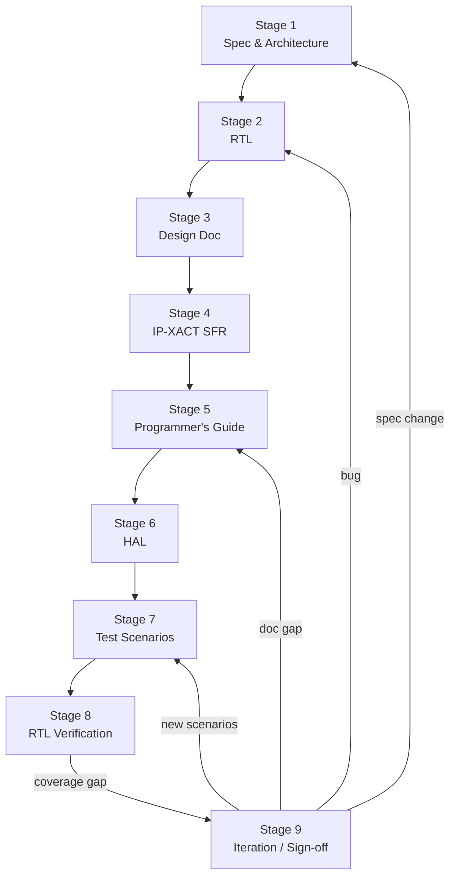

# IP Development Workflow — Closed Loop

본 문서는 본 레포에서 하나의 IP를 처음부터 끝까지 만들고, SW가 실제로
호출 가능한 상태까지 가져가고, 그 SW 시나리오로 다시 RTL을 검증하는
**closed-loop workflow**를 정의한다. 각 단계의 산출물, 책임자, gating
조건, 그리고 이 흐름을 자동화하는 harness(`tools/ipflow.py`)의 연결
지점을 명시한다.

> 시각 자료: 본 워크플로우의 인터랙티브 다이어그램은 `web/` 디렉터리에
> 있으며 GitHub Pages로 배포된다 (`https://k31001.github.io/ssd-soc-cfg-mngt/`).

---

## 1. 전체 흐름



핵심은 **Stage 5 (Programmer's Guide)가 SW-HW 계약**이라는 점이다.
가이드의 모든 사용 시나리오는 Stage 7에서 RTL test scenario로 1:1
매핑되며, 매핑되지 않은 RTL 기능은 "사용되지 않는 기능"으로 식별되어
spec rationale을 다시 점검한다. 이 매핑이 곧 closed loop의 핵심
invariant이다.

---

## 2. 단계별 정의

### Stage 1 — Spec & Architecture
- **산출물**: `cfg/<ip>.ip.yaml` (parameters, deps, version, owner)
- **책임자**: IP architect / lead
- **Gate to next**: yaml-schema 검증 통과, IP 폴더 스캐폴드 존재
- **Harness 명령**: `ipflow scaffold <ip>` (예정 — `tools/ipgen.py` 활용)

### Stage 2 — RTL
- **산출물**: `rtl/<ip>.sv` (합성 가능, lint clean)
- **책임자**: RTL designer
- **Gate to next**: lint pass, smoke TB 통과
- **Harness 명령**: `ipflow status <ip>` 가 RTL 존재 여부 확인

### Stage 3 — Design Doc
- **산출물**: `doc/DESIGN.md` + `doc/diagrams/*` (Mermaid + WaveDrom)
- **책임자**: RTL designer (저자) + reviewer
- **Gate to next**: 모든 register/port가 §5 register map, §2 port table에 등재됨; 모든 diagram source가 SVG 산출물과 동기화 (`render-diagrams.sh --check`)
- **Harness 명령**: `ipflow validate <ip> --stage design`

### Stage 4 — IP-XACT SFR
- **산출물**: `doc/<ip>.ipxact.xml` (IEEE 1685-2014)
- **책임자**: RTL designer
- **Gate to next**: IP-XACT의 register offsets/widths/access가 `DESIGN.md §5` 표와 1:1 일치 (harness가 자동 비교)
- **Harness 명령**: `ipflow validate <ip> --stage ipxact`

### Stage 5 — Programmer's Guide
- **산출물**: `doc/PROGRAMMERS_GUIDE.md` (초기화 sequence, ISR flow, worked examples §6, pitfall §8)
- **책임자**: SW lead (저자) + RTL designer (리뷰)
- **Gate to next**: Stage 6 HAL이 가이드의 모든 API 호출을 제공; Stage 7 scenarios가 가이드의 모든 worked example을 cover
- **Harness 명령**: `ipflow validate <ip> --stage guide` (§6 worked examples 추출 → scenarios 매핑 점검)

### Stage 6 — HAL
- **산출물**: `sw/<ip>_hal.{h,c}` + `sw/test_hal_host.c` + `sw/Makefile`
- **책임자**: SW engineer
- **Gate to next**: `make test` 호스트 smoke 통과; IP-XACT의 모든 SFR offset이 HAL macro에 등장; HAL이 가이드 §6의 모든 함수를 export
- **Harness 명령**: `ipflow validate <ip> --stage hal`, `ipflow run <ip> --stage hal-host`

### Stage 7 — Test Scenarios
- **산출물**: `verif/scenarios.yaml` — guide §6의 각 worked example과 §8의 각 pitfall을 testable scenario로 변환한 manifest
- **책임자**: Verification engineer
- **Gate to next**: 모든 scenario가 TB에 task로 구현되어 있음; 모든 가이드 worked example이 적어도 하나의 scenario를 참조
- **Scenario 포맷**:
  ```yaml
  scenarios:
    - id: S01
      name: reset_state
      guide_ref: "§1"            # 가이드 섹션
      rtl_features: [reset]      # 검증 대상 RTL feature 태그
      summary: "All regs zero, no eip after reset"
      tb_task: t_reset_state     # TB에 구현된 SV task 이름
  ```
- **Harness 명령**: `ipflow scenarios <ip>` (목록 출력), `ipflow validate <ip> --stage scenarios`

### Stage 8 — RTL Verification
- **산출물**: `sim/tb_<ip>.sv` (scenarios.yaml의 모든 tb_task를 호출), CI smoke-sim 통과 로그
- **책임자**: Verification engineer
- **Gate to next**: 모든 scenario PASS, coverage report 생성
- **Harness 명령**: `ipflow run <ip> --stage sim` (시뮬레이터가 설치된 환경에서 작동)

### Stage 9 — Iteration / Sign-off
- coverage gap → Stage 7로 돌아가 scenario 추가
- 가이드 변경 → Stage 5, 그에 맞춰 Stage 7도 갱신
- RTL bug → Stage 2 수정 후 전 단계 재검증
- 최종 sign-off 시 IP status: `proto → alpha → qual → gold` 단계로 promote
- **Harness 명령**: `ipflow promote <ip> --to qual`

---

## 3. Closed-loop invariants (harness가 강제)

`tools/ipflow.py validate <ip>` 는 다음을 모두 검사한다:

| Invariant                                  | Source 1                | Source 2                |
|--------------------------------------------|-------------------------|-------------------------|
| 모든 SFR offset/width/access 일치           | `DESIGN.md §5` 표        | `<ip>.ipxact.xml`       |
| 모든 SFR이 HAL에 macro로 등장               | `<ip>.ipxact.xml`       | `sw/<ip>_hal.h`         |
| HAL이 가이드 §6의 모든 함수를 export         | `PROGRAMMERS_GUIDE.md` § 6 | `sw/<ip>_hal.h`     |
| 가이드 §6 worked example ↔ scenarios 매핑   | `PROGRAMMERS_GUIDE.md` § 6 | `verif/scenarios.yaml` |
| scenarios.yaml의 tb_task ↔ TB SV task 매핑  | `verif/scenarios.yaml`  | `sim/tb_<ip>.sv`        |
| 모든 diagram JSON ↔ SVG 동기화              | `doc/diagrams/*.json`   | `doc/diagrams/*.svg`    |
| ip.yaml의 version과 git tag 단조 증가       | `cfg/<ip>.ip.yaml`      | `git tag`               |

이 invariant들은 CI (`ci/ip-ci.yml`)의 `workflow-validate` job에서
자동 실행되며, 어느 하나라도 깨지면 PR이 fail한다.

---

## 4. Harness 명령 빠른 참조

```bash
# 모든 IP의 stage-완료 매트릭스를 출력
tools/ipflow.py status

# 특정 IP의 closed-loop invariant 전체 검사
tools/ipflow.py validate ssd_soc/subsystems/cpu_ss/ip/irq_ctrl

# scenarios.yaml 파싱 + tb_task 매칭
tools/ipflow.py scenarios ssd_soc/subsystems/cpu_ss/ip/irq_ctrl

# 호스트 단계 일괄 실행 (도면 렌더 → validate → HAL smoke test)
tools/ipflow.py run ssd_soc/subsystems/cpu_ss/ip/irq_ctrl

# 웹 대시보드용 status JSON 생성
tools/ipflow.py status --json > web/data/status.json
```

---

## 5. 시각 자료 (Web)

`web/` 디렉터리는 본 워크플로우를 인터랙티브하게 설명하는 정적 사이트다:

- **Overview**: 9-stage Mermaid 다이어그램, stage 클릭 시 정의/책임자/gate 표시
- **Live status**: `tools/ipflow.py status --json`이 생성한 JSON을 읽어
  현재 레포의 모든 IP에 대해 stage 완료 매트릭스를 표시
- **Closed-loop trace**: 특정 IP(예: irq_ctrl)에서 guide 섹션 → scenario
  → tb_task 매핑을 시각화

배포는 GitHub Pages — `main` 브랜치의 `/web` 경로를 source로 설정.

---

## 6. 처음 IP를 만들 때

1. `tools/ipgen.py --name <ip> --subsystem <ss>` 로 스캐폴드 생성 (Stage 1)
2. RTL 작성 (Stage 2) → `tools/ipflow.py status <ip>` 로 다음 단계 추적
3. Design doc + diagram (Stage 3) → `tools/render-diagrams.sh`
4. IP-XACT SFR (Stage 4) → `tools/ipflow.py validate <ip> --stage ipxact`
5. Programmer's Guide의 §6 worked examples를 먼저 적는다 (Stage 5).
   이 단계가 SW-HW 계약이므로 이후 모든 산출물의 기준점이 된다.
6. HAL 작성 (Stage 6) → 호스트 smoke test 통과
7. scenarios.yaml 작성 (Stage 7) — 가이드 §6 각 example을 ID 한 줄로 옮긴다
8. TB의 SV task 구현 (Stage 8) → smoke-sim 통과
9. `ipflow validate` 가 모두 통과하면 ip.yaml의 status를 promote

---

## 7. 왜 이 순서인가

흔한 실수는 RTL → TB → HAL → 가이드 순으로 가는 것이다. 그러면 가이드가
"이미 만들어진 것을 사후 설명"하는 문서가 되고, SW 사용성 관점의 결함이
sign-off 단계에서야 드러난다.

본 워크플로우는 **가이드를 의도적으로 HAL보다 먼저 두어**, SW가 어떤
순서로 register를 만지고 어떤 ISR 패턴을 쓸지를 spec 단계에서 확정한다.
HAL은 그 가이드를 코드로 옮긴 것이며, scenarios는 그 가이드를 검증
대상으로 옮긴 것이다. 이 한 줄(가이드 → HAL, 가이드 → scenarios)이 본
워크플로우의 핵심이다.
