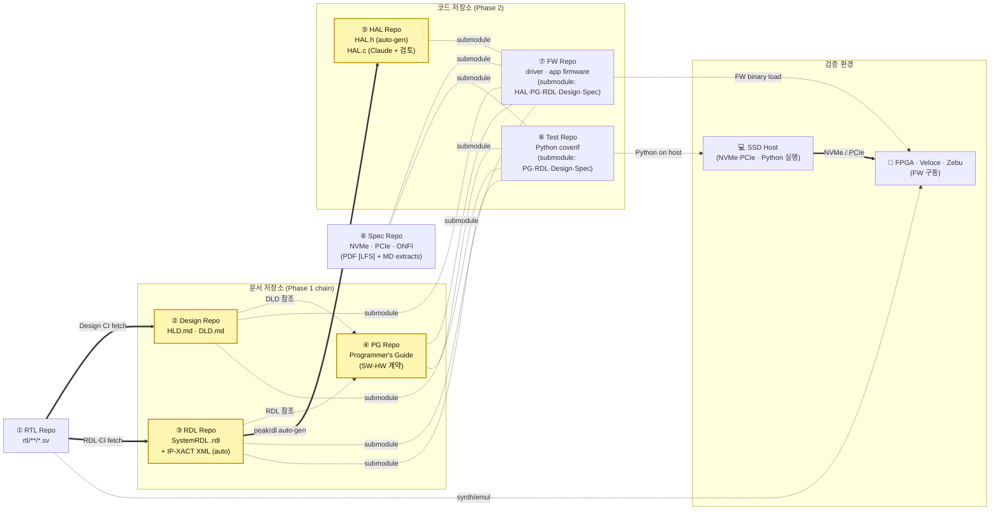

# 2. 제안 — Markdown · Git · Submodule · RTL-Grounded 통합 워크플로우

본 장은 본 보고서의 핵심 제안을 **한 장의 아키텍처**로 압축한다.
이후 3–6장에서 산출물 분류·정합성 CI·AI 자동화 측면에서 각각 정당화한다.

---

## 2.1 한 장의 그림 — 8개 저장소 토폴로지

본 제안의 형상관리는 **8개의 독립 저장소**로 구성된다. 문서는 작성 의존
체인에 따라 **Design / RDL / PG** 3개로 분리되어 있고, 코드는 **HAL / FW
/ Test** 3개로 분리되어 있으며, **RTL Repo (source)** 와 **Spec Repo
(외부 표준 PDF)** 이 양 끝에 있다.



### 저장소별 내용 — "무엇이 어디에 사는가"

| # | Repo | 내용 | 1차 책임자 | 누가 submodule? |
|---|---|---|---|---|
| ① | **RTL Repo** | `rtl/**/*.sv`, lint·synth 설정 | RTL designer | (없음 — Design·RDL CI가 read-only fetch) |
| ② | **Design Repo** | `HLD.md` · `DLD.md` (같은 저장소, 작성 의존성 강함) | Architect (HLD) + RTL designer (DLD) | FW, Test |
| ③ | **RDL Repo** | SystemRDL `.rdl` (사람 author) + IP-XACT XML (peakrdl auto-gen) | RTL designer | HAL, FW, Test |
| ④ | **PG Repo** | `Programmer's Guide.md` (DLD + RDL 기반으로 작성, **SW-HW 계약**) | SW lead | HAL (참조), FW, Test |
| ⑤ | **HAL Repo** | `HAL.h` (RDL→peakrdl auto-gen) + `HAL.c` (Claude 작성 + 사람 검토) | FW team | FW |
| ⑥ | **Spec Repo** | NVMe / PCIe / ONFI 등 표준 PDF (git LFS) + 자동 추출 MD | Standards 담당 | FW, Test |
| ⑦ | **FW Repo** | driver · app firmware. **submodules**: HAL · PG · RDL · Design · Spec | FW team | (없음) |
| ⑧ | **Test Repo** | Python coverif scenarios · NVMe/PCIe host helper. **submodules**: PG · RDL · Design · Spec | DV / Validation team | (없음) |

### 핵심 관찰점

1. **문서가 3개 저장소로 분리됨** — Design (HLD/DLD), RDL (SystemRDL), PG (Programmer's Guide). 작성 의존 체인 (Phase 1) 이 명확:
   - **RTL → Design (HLD/DLD)**: HLD는 IP의 개념·블록도, DLD는 RTL의 구현 디테일.
   - **RTL + DLD → RDL (SystemRDL)**: 레지스터 사양은 RTL이 진실, DLD 의도와 함께 RDL로 표현.
   - **DLD + RDL → PG (Programmer's Guide)**: SW 개발자가 보는 SW-HW 계약. RTL은 보지 않음.
2. **HAL이 별도 저장소** — `HAL.h` 는 RDL → peakrdl auto-gen, `HAL.c` 는 Claude Code 가 PG + HAL.h 를 보고 작성. FW Repo 가 submodule 로 끌어옴. 다른 검증 도구도 HAL 만 끌어다 쓸 수 있도록 분리.
3. **참조 위계 — RTL 직접 참조 금지** — FW · Test 개발자 (사람과 Claude) 의 기본 컨텍스트는 **PG + RDL** 만. 더 깊은 정보가 필요하면 **DLD** 까지. **RTL 은 절대 직접 참조하지 않는다** — 추상화 경계를 보존하기 위함. PG·DLD 가 부족하면 그것이 문서의 버그.
4. **FW 와 Test 의 명확한 분리** — FW 는 SoC 위 (FPGA·Veloce·Zebu) 에서 실행되는 C 펌웨어, Test 는 SSD Host 에서 NVMe/PCIe 로 그것을 구동하는 Python. 책임·언어·실행 환경 모두 다름.
5. **Spec Repo 가 표준 문서 출구** — NVMe / PCIe / ONFI 표준 PDF 는 Spec Repo 에 LFS 로 보관, 자동 추출 Markdown 과 함께. FW · Test 가 submodule 로 핀하여 Claude 가 grep · Read 로 접근. MCP 미사용 (§9 참고).
6. **Submodule fan-out 으로 결정론 보장** — FW Repo · Test Repo 모두 5개 doc submodule (Design · RDL · PG · HAL [FW만] · Spec) 을 동일 tag 로 핀. clone 하면 모든 컨텍스트가 따라온다.

### 어느 시점에 무엇이 무엇과 정렬되는가

검증 1회의 실행은 다음 **다중-tuple**로 한 줄에 확정된다:

> `rtl-v* × design-v* × rdl-v* × pg-v* × hal-v* × spec-v* × fw-v* × test-v*`

FW Repo 와 Test Repo 가 5개 doc submodule (Design, RDL, PG, HAL, Spec) 의
SHA 를 같게 핀 — Release gate R1 (`§4.2.4`) 이 자동 강제.

---

## 2.2 4개 빌딩블록과 그 선택 사유

### (1) Markdown (+ Mermaid + WaveDrom + 임베드된 IP-XACT XML 참조)
- **이유**: ① diff 가능 → PR-기반 리뷰 ② LLM이 토큰 효율 최상으로 읽음 ③ 어떤
  static site generator로도 렌더 가능 ④ 오프라인·CLI에서도 즉시 가독
- **반론 대비**: "DOCX/PDF가 더 익숙하다" — 익숙함은 잠금이다. PR 워크플로우
  내에서 마크다운 리뷰가 정착하면 익숙함도 1주 내 역전된다.

### (2) Git + 단방향 Submodule fan-out (8-repo)
이미 본 레포 `cm-strategies/` 가 **monorepo / submodule / repo+manifest /
subtree** 4개 전략을 비교한 결과, **submodule이 SoC 산출물의 현실에
가장 적합**하다는 결론이 도출되었다.[^1] 본 제안은 그 결론을 **8-repo
fan-out** 모델로 구체화한다 — 5개 doc/code 저장소 (Design · RDL · PG · HAL ·
Spec) 가 FW Repo 와 Test Repo 의 submodule 출처가 되며, RTL Repo 는 어느 곳의
submodule 도 아니라 Design · RDL CI 가 read-only fetch 한다.

#### 왜 문서를 3개 저장소로 쪼개는가
- **Design / RDL / PG 는 작성자·생애주기·소비 패턴이 모두 다르다**.
  Design 은 Architect/RTL designer 가 IP 설계 시점에 쓰고, RDL 은 RTL 설계자가
  레지스터 변경 시 갱신, PG 는 SW lead 가 SW-facing 인터페이스 결정 시 쓴다.
- 같은 repo 에 묶으면 한 사람의 작업이 다른 두 사람을 자주 conflict 시킨다.
  분리하면 Design PR 이 PG PR 을 blocking 하지 않는다.
- FW · Test 의 submodule pin 이 **doc 의 어느 부분이 어디서 변경됐는지** 를
  fine-grained 로 추적 가능 (5개 SHA).

#### 왜 HAL 을 별도 저장소로 분리하는가
- `HAL.h` 는 RDL 에서 결정론적으로 auto-gen, `HAL.c` 는 Claude Code 가 PG +
  HAL.h 기반으로 작성. 둘 다 **SW-HW 계약의 코드 표현**이므로 같은 저장소.
- 분리하면 **FW 가 아닌 다른 컨슈머** (예: 사내 다른 펌웨어 프로젝트, 단위 테스트
  러너, 정적 분석 도구) 가 HAL 만 끌어다 쓸 수 있다.
- HAL 변경 빈도가 FW 변경 빈도보다 낮으므로 release 주기 분리도 자연스럽다.

| 요구사항 | Monorepo | **8-repo fan-out submodule (본 제안)** | repo+manifest | Subtree |
|---|---|---|---|---|
| RTL · 3 doc · HAL · Spec · FW · Test 의 역할/권한 분리 | 매우 어려움 | **자연스러움** (저장소가 곧 권한 경계) | 가능 | 어려움 |
| Doc 의 fine-grained 변경 추적 | 한 SHA 로 모두 묶임 | **5개 submodule SHA 로 어느 doc 가 어디서 변했는지** 명시 | 매니페스트 갱신 | 어색 |
| FW · Test 의 독립 릴리스 주기 | 어려움 | **자연스러움** | 가능 | 어색 |
| HAL 의 별도 컨슈머 (사내 다른 프로젝트) | 어려움 | **자연스러움** (HAL Repo 만 별도 pin) | 가능 | 어색 |
| 신규 SoC 파생 시 FW·Test 만 fork | 어색 | **자연스러움** (doc·rtl·hal·spec 은 공용) | 가능 | 어색 |
| 도구 생태계 표준성 | 표준 | **표준 (git native)** | Android 색채 | 비표준 |

#### 왜 RTL Repo 는 어떤 것의 submodule 도 아닌가
- RTL 산출물은 **합성/에뮬레이션 빌드 인프라**가 소비하지, FW · Test 가 직접 소비하지 않는다.
- 양방향 의존을 만들면 RTL 전체가 SW 팀에 노출되어 권한 분리가 무너진다.
- 대신 **Design Repo CI · RDL Repo CI** 가 RTL Repo 를 read-only fetch 하여 invariant 검사. **정합성 게이트는 문서 저장소들에서 일어난다.**

#### 왜 5개 (Design · RDL · PG · HAL · Spec) 가 FW · Test 양쪽의 submodule 인가
- **SW-HW 계약과 외부 표준** 이 모두 FW 와 Test 양쪽에 같은 형태로 필요.
- Submodule SHA 가 "FW 가 보는 doc" 과 "Test 가 보는 doc" 의 정렬을 명시적으로 만든다.
- Release gate R1 (§4.2.4) 이 5개 SHA 의 일치를 강제 → 두 팀이 같은 계약을 보고 있다는 객관 증거.
- Claude Code 가 HAL.c · Python scenario 를 자동 생성할 때 컨텍스트가 결정론적.

#### 왜 FW와 Test를 분리하는가
- **실행 환경이 다르다** — FW 는 SoC 위 (FPGA·Veloce·Zebu) 에서, Test 는 SSD Host (Linux 서버) 위에서 실행.
- **언어·툴체인이 다르다** — FW 는 C/임베디드 빌드, Test 는 Python/pip/pytest.
- **책임 부서가 다르다** — FW 는 펌웨어 팀, Test 는 DV/Validation 팀.
- **릴리스 주기가 다르다** — FW 는 ROM/eMMC binary, Test 는 빠른 iteration 검증 스크립트.

Submodule fan-out 의 학습 곡선은 양쪽 저장소의 `make doc-update` 한 줄 wrapper 로 흡수된다 (§9 리스크 참고).

### (3) SFR 표준 — SystemRDL 또는 IEEE 1685-2022 IP-XACT
SFR을 어떤 포맷으로 author하느냐는 **두 가지 선택지**가 있으며, 둘 다
산업 표준이다.

| 옵션 | 권장 용도 | 강점 | 약점 |
|---|---|---|---|
| **SystemRDL** (Accellera 2.0) | **author format으로 권장** | 텍스트 친화·간결·`peakrdl-*` OSS 툴체인으로 IP-XACT XML/HAL.h/Markdown 표 일괄 emit | XML 표준 ID는 별도 |
| **IP-XACT XML** (IEEE 1685-2022) | **interchange format** | IEEE 국제 표준,[^2] EDA 벤더 도구 호환, UVM regmodel 자동 생성 | XML 직접 편집은 사람에게 비친화적 |

권장 워크플로우:

```
<ip>.rdl  (사람이 author, SystemRDL — Doc Repo)
   ↓ peakrdl
   ├─→  <ip>.ipxact.xml     (interchange, IEEE 1685-2022)
   ├─→  include/<ip>_hal.h  (HAL 헤더)
   └─→  DLD.md §5 register 표 (Markdown 인서트)
```

이 변환은 Doc Repo CI가 매 PR마다 결정론적으로 수행하므로, **사람은
SystemRDL `.rdl` 한 곳만 편집**한다. IP-XACT XML / HAL.h / Markdown 표는
모두 그 그림자이다. (IP-XACT XML을 author format으로 직접 쓰는 팀은
변환 단계 없이 IP-XACT → HAL.h만 emit해도 됨 — 정합성 검사는 동일.)

### (4) RTL-Grounded CI — 저장소별로 책임이 갈라진 정합성 검사
정합성 검사는 한 곳에서 모두 일어나지 않는다. **세 저장소(Doc / FW /
Test) 각각의 CI가 자기 경계 안의 invariant를 검사**하고, 경계를 넘는
검사는 Doc Repo CI가 RTL을 read-only fetch하는 형태로 흡수한다.

| Invariant | 검사 위치 | Source A | Source B |
|---|---|---|---|
| RTL ↔ DLD §5 register map | **Doc Repo CI** | RTL Repo의 RTL (fetch) | `doc/<ip>/DLD.md §5` |
| DLD §5 ↔ SFR (RDL/IP-XACT) | **Doc Repo CI** | `doc/<ip>/DLD.md §5` | `doc/<ip>/<ip>.rdl` 또는 `.ipxact.xml` |
| SFR ↔ HAL.h (auto-gen) | **Doc Repo CI** | `<ip>.rdl` / `.ipxact.xml` | `include/<ip>_hal.h` |
| HAL.h ↔ Guide §6 함수 시그너처 | **Doc Repo CI** | `include/<ip>_hal.h` | `doc/<ip>/PROGRAMMERS_GUIDE.md §6` |
| Diagram source ↔ SVG | **Doc Repo CI** | `doc/diagrams/*.json` | `doc/diagrams/*.svg` |
| HAL `.c` export ↔ HAL `.h` (submodule) | **FW Repo CI** | `doc/include/*_hal.h` | `fw/hal/*_hal.c` |
| FW Repo `doc/` submodule SHA 단조 증가 | **FW Repo CI** | submodule SHA | git tag history |
| Host smoke pass | **FW Repo CI** | HAL.c + host smoke | `make test` |
| Python scenarios ↔ Guide §6 worked example | **Test Repo CI** | `doc/<ip>/PROGRAMMERS_GUIDE.md §6` | `tests/scenarios/<ip>/*.py` |
| Python regression ↔ Guide §8 pitfall | **Test Repo CI** | `doc/<ip>/PROGRAMMERS_GUIDE.md §8` | `tests/scenarios/<ip>/regress_*.py` |
| Test Repo `doc/` submodule SHA 단조 증가 | **Test Repo CI** | submodule SHA | git tag history |
| FW.doc-SHA == Test.doc-SHA (release gate) | **Release CI** | FW Repo doc submodule | Test Repo doc submodule |

검사들은 PR 시점에 자동 실행되어 **정합성이 깨지면 PR이 fail**한다.
즉 정합성이 "규칙"이 아니라 "**빌드 시스템**"이 된다. 4장에서 각 invariant의
구현 디테일을 다룬다.

---

## 2.3 RAG 대신 Submodule을 쓰는 결정의 의미

이 제안의 가장 비전형적인 결정은 **"RAG/벡터DB를 일체 도입하지 않는다"**는
점이다. 대신:

- LLM이 문서를 읽어야 할 때 → **submodule path를 직접 read** (결정론적).
- 검색이 필요할 때 → **ripgrep / git grep** (sub-second, 정확).
- 버전이 필요할 때 → **git tag / commit SHA** (재현 가능).
- diff·blame이 필요할 때 → **git native** (별도 인프라 0).

이는 단순히 비용 절감이 아니다. Anthropic Claude Code 팀이 자신들의 도구
에 같은 결정을 내렸고, 4가지 사유로 RAG를 폐기했다: **precision, simplicity,
freshness, privacy**.[^3] 우리 SoC 산출물은 코드보다 더 정확한 심볼에
의존하므로, 이 4개 사유가 **더 강하게** 적용된다.

---

## 2.4 무엇이 달라지는가 — Before / After 한눈에

| 항목 | Before (Word/Excel + Confluence + RAG) | After (8-repo + Markdown + SystemRDL + RTL-Grounded) |
|---|---|---|
| 문서 포맷 | HLD/DLD = Word, SFR = Excel, 산출물 분산 | 모두 Markdown + SystemRDL — 작성 의존 따라 3개 저장소 분리 |
| 산출물 위치 | 여러 시스템에 분산 | 8개 repo 각자 명확한 경계 · 책임자 |
| 문서 작성 순서 | 불명확 · 각자 알아서 | **명시적 체인: RTL → Design → RDL → PG** (Phase 1) |
| HAL 위치 | FW 코드 안에 묻힘 | 별도 HAL Repo (`.h` auto-gen + `.c`) · 다른 컨슈머도 활용 가능 |
| 표준 spec (NVMe·PCIe) 참조 | PDF 첨부/메일/공유드라이브 | Spec Repo (PDF + auto MD) · submodule pin 으로 결정론적 |
| FW · Test 의 RTL 참조 | 가능 (필요 시) | **금지** — PG/RDL primary, DLD 만 fallback |
| 버전 관리 | 시스템별 별도 | git tag · FW/Test 가 5개 doc submodule pin |
| AI 컨텍스트 주입 | RAG/MCP 검색 → 청크 다수 | submodule 직접 read (Claude Code) — 참조 위계 규칙 적용 |
| 정합성 보장 | 사람의 성실성 | 8개 repo CI invariant + Release gate R1 (doc-tag 정렬) |
| 수동 vs 자동 정합성 | 모두 사람 | **Hybrid**: authored zone (사람) + shadow zone (auto, 수동 편집 차단) |
| 검증 방식 | SV TB 또는 spec walk-through | **FW가 FPGA·Veloce·Zebu, Python이 SSD Host** — HW/SW coverif |
| 신규 SoC 파생 | 사람이 복제·수정 | FW/Test 만 fork + submodule pin → CI 자동 |
| 평균 LLM 토큰 사용 | 검색 청크 포함 (수배) | 필요한 파일만 (최소) |
| 락인 | 벤더 위키·EDA AI | 표준 + 오픈 포맷 (SystemRDL · IP-XACT · Markdown · LFS) |

다음 장(3장)부터는 이 전략 안에서 다섯 가지 산출물 유형(HLD / DLD /
Programmer's Guide / SFR / HAL)이 어떻게 정의되고 서로 관계 맺는지를
Diátaxis 프레임워크에 비추어 정당화한다.

---

[^1]: 본 레포 [`cm-strategies/README.md`](../../cm-strategies/README.md) 4개 전략 비교 결론.
[^2]: [IEEE 1685-2022](https://ieeexplore.ieee.org/document/10054520), [Accellera IP-XACT WG](https://www.accellera.org/activities/working-groups/ip-xact).
[^3]: [Why Cursor, Claude Code, and Devin Use grep, Not Vectors — MindStudio](https://www.mindstudio.ai/blog/is-rag-dead-what-ai-agents-use-instead).
