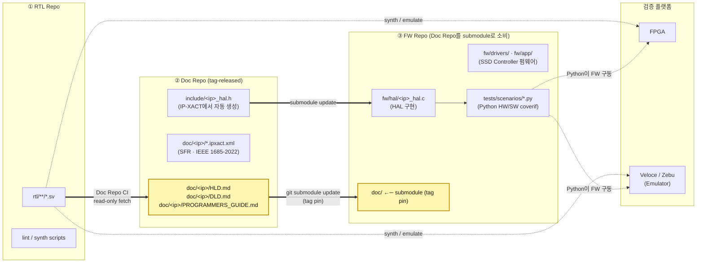

# 2. 제안 — Markdown · Git · Submodule · RTL-Grounded 통합 워크플로우

본 장은 본 보고서의 핵심 제안을 **한 장의 아키텍처**로 압축한다.
이후 3–6장에서 산출물 분류·정합성 CI·AI 자동화 측면에서 각각 정당화한다.

---

## 2.1 한 장의 그림 — 3개 저장소 토폴로지

본 제안의 형상관리는 **3개의 독립 저장소 + 단방향 submodule**로 구성된다.

### 저장소별 내용 — "무엇이 어디에 사는가"

| Repo | 내용 | 1차 책임자 | 출구 산출물 |
|---|---|---|---|
| ① **RTL Repo** | `rtl/**/*.sv` (Verilog RTL), lint·synth 설정 | RTL designer | 합성된 FPGA bitstream, Emulator image (별도 빌드 인프라) |
| ② **Doc Repo** | HLD / DLD / Programmer's Guide (Markdown), IP-XACT SFR XML, **HAL 헤더(`*.h`) 자동 생성본** | RTL designer + SW lead + Architect | tag로 release. FW Repo가 submodule로 소비 |
| ③ **FW Repo** | HAL `*.c` 구현, driver/app firmware, **Python coverif scenarios**, host smoke. Doc Repo를 `doc/` 경로에 submodule | FW team + DV team | FPGA·Veloce·Zebu에서 실행되는 FW binary + Python scenario suites |

### 핵심 관찰점

1. **Submodule은 한 방향뿐** — FW Repo → Doc Repo. RTL/Doc/FW가 동등하게 묶이지 않고, **Doc Repo가 SW-HW 계약의 단일 출처**가 되어 FW가 이를 핀하여 소비한다.
2. **RTL ↔ Doc은 submodule이 아니라 CI 동기화** — Doc Repo CI가 RTL Repo를 read-only로 fetch하여 invariant를 검사 (§4 참고). 양방향 의존을 만들지 않는다.
3. **검증은 SV testbench가 아니라 FW + Python on FPGA/Emulator** — SSD Controller 같이 실제 펌웨어 구동이 본질인 SoC에서는, SV TB로는 측정 불가능한 NVMe 명령 흐름·에러 주입·전력 시퀀스를 펌웨어와 함께 평가해야 한다.
4. **노란 블록 = SW-HW 계약** — Doc Repo의 문서 3종 + FW Repo의 submodule pin. 이 두 지점이 일관되면 HW/SW 인터페이스가 결정론적이다.
5. **AI 컨텍스트는 결정론적** — FW Repo를 clone하면 `doc/` 안에 정확한 tag의 문서가 따라온다. AI는 별도 RAG/MCP 없이 `doc/<ip>/PROGRAMMERS_GUIDE.md` 같은 경로를 직접 read한다.

---

## 2.2 4개 빌딩블록과 그 선택 사유

### (1) Markdown (+ Mermaid + WaveDrom + 임베드된 IP-XACT XML 참조)
- **이유**: ① diff 가능 → PR-기반 리뷰 ② LLM이 토큰 효율 최상으로 읽음 ③ 어떤
  static site generator로도 렌더 가능 ④ 오프라인·CLI에서도 즉시 가독
- **반론 대비**: "DOCX/PDF가 더 익숙하다" — 익숙함은 잠금이다. PR 워크플로우
  내에서 마크다운 리뷰가 정착하면 익숙함도 1주 내 역전된다.

### (2) Git + 단방향 Submodule (FW Repo → Doc Repo)
이미 본 레포 `cm-strategies/` 가 **monorepo / submodule / repo+manifest /
subtree** 4개 전략을 비교한 결과, **submodule이 SoC 산출물의 현실에
가장 적합**하다는 결론이 도출되었다.[^1] 본 제안은 그 결론을 **3-repo
단방향** 모델로 구체화한다.

| 요구사항 | Monorepo | **3-repo + Submodule (본 제안)** | repo+manifest | Subtree |
|---|---|---|---|---|
| RTL · Doc · FW의 역할/권한 분리 | 어려움 | **자연스러움** (저장소가 곧 권한 경계) | 가능 | 어려움 |
| Doc 변경의 FW로의 결정론적 전파 | 검토 PR 단위로만 | **`submodule update --remote`** 한 번 | 매니페스트 갱신 | 어색 |
| Tag 기반 doc release | 가능 | **자연스러움** | 자연스러움 | 어색 |
| 신규 SoC 파생 시 FW만 fork | 어색 | **자연스러움** (doc·rtl은 공용) | 가능 | 어색 |
| 도구 생태계 표준성 | 표준 | **표준 (git native)** | Android 색채 | 비표준 |

#### 왜 RTL Repo는 submodule이 아닌가
- RTL 산출물은 **합성/에뮬레이션 빌드 인프라**가 소비하지, FW가 직접 소비하지 않는다.
- 양방향 의존(FW가 RTL을 submodule로 끌고 옴)을 만들면 FW 개발자에게 RTL 전체가 노출되어 권한 분리가 무너진다.
- 대신 Doc Repo CI가 RTL을 read-only fetch하여 invariant를 검사. **정합성 게이트는 Doc Repo에서 일어난다.**

#### 왜 Doc Repo가 FW Repo의 submodule인가
- SW-HW 계약(Programmer's Guide·SFR·HAL 헤더)은 **FW 개발자가 매일 보는 것**.
- Submodule은 commit SHA / tag를 핀하므로, FW가 doc의 어떤 버전을 따르는지가 명시적이다.
- `git submodule update --remote` 한 줄로 FW가 새 doc tag로 이동. AI가 그 시점에 HAL `.c` · Python scenarios를 자동 갱신.

Submodule의 단점인 "학습 곡선"은 FW Repo의 `make doc-update` 같은 한 줄 wrapper로 흡수된다 (9장 리스크 참고).

### (3) IEEE 1685-2022 IP-XACT (SFR 표준)
- 2022-09 IEEE SA Board 승인 → 2023-06 Accellera 보충자료 승인된 **국제 표준**.[^2]
- 우리 SFR 문서를 IP-XACT로 표현하면 ① EDA 벤더 도구와 호환 ② 검증
  도구·UVM register model 자동 생성 ③ HAL 헤더 자동 생성 ④ 보고서·웹
  대시보드 렌더링 모두 같은 source에서 파생된다.

### (4) RTL-Grounded CI — 저장소별로 책임이 갈라진 정합성 검사
정합성 검사는 한 곳에서 모두 일어나지 않는다. **각 저장소의 CI가 자기
경계 안의 invariant를 검사**하고, 경계를 넘는 검사는 Doc Repo CI가
RTL을 read-only fetch하는 형태로 흡수한다.

| Invariant | 검사 위치 | Source A | Source B |
|---|---|---|---|
| SFR offset/width/access | **Doc Repo CI** | RTL Repo의 RTL (fetch) | `doc/*.ipxact.xml` |
| DLD §5 ↔ IP-XACT | **Doc Repo CI** | `doc/DLD.md §5` | `doc/*.ipxact.xml` |
| HAL macro ↔ IP-XACT | **Doc Repo CI** | `doc/*.ipxact.xml` | `include/*_hal.h` (자동 생성) |
| HAL `.c` export ↔ HAL `.h` (=Guide §6) | **FW Repo CI** | `doc/PROGRAMMERS_GUIDE.md §6` (submodule) | `fw/hal/*_hal.c` |
| Python scenarios ↔ Guide §6 worked example | **FW Repo CI** | `doc/PROGRAMMERS_GUIDE.md §6` (submodule) | `tests/scenarios/*.py` |
| Diagram source ↔ SVG | **Doc Repo CI** | `doc/diagrams/*.json` | `doc/diagrams/*.svg` |
| Submodule tag 진행 (monotonic) | **FW Repo CI** | `doc/` submodule SHA | git tag history |

검사들은 PR 시점에 자동 실행되어 **정합성이 깨지면 PR이 fail**한다.
즉 정합성이 "규칙"이 아니라 "**빌드 시스템**"이 된다. 4장에서 각 invariant의
구현 디테일을 다룬다.

---

## 2.3 RAG 대신 Submodule을 쓰는 결정의 의미

이 제안의 가장 비전형적인 결정은 **"RAG/벡터DB를 일체 도입하지 않는다"**는
점이다. 대신:

- LLM이 문서를 읽어야 할 때 → **submodule path를 직접 read** (결정론적).
- 검색이 필요할 때 → **ripgrep / git grep** (sub-second, 정확).
- 버전이 필요할 때 → **git tag / commit SHA** (재현 가능).
- diff·blame이 필요할 때 → **git native** (별도 인프라 0).

이는 단순히 비용 절감이 아니다. Anthropic Claude Code 팀이 자신들의 도구
에 같은 결정을 내렸고, 4가지 사유로 RAG를 폐기했다: **precision, simplicity,
freshness, privacy**.[^3] 우리 SoC 산출물은 코드보다 더 정확한 심볼에
의존하므로, 이 4개 사유가 **더 강하게** 적용된다.

---

## 2.4 무엇이 달라지는가 — Before / After 한눈에

| 항목 | Before (Confluence + RAG) | After (3-repo + Markdown + RTL-Grounded) |
|---|---|---|
| 산출물 위치 | 여러 시스템에 분산 | RTL/Doc/FW 3 repo 각각 명확한 경계 |
| 버전 관리 | 시스템별 별도 | git tag · Doc Repo가 FW의 submodule pin 기준 |
| AI 컨텍스트 주입 | RAG/MCP 검색 → 청크 다수 | FW Repo의 `doc/` (submodule) 직접 read |
| 정합성 보장 | 사람의 성실성 | Doc Repo CI + FW Repo CI invariant |
| 검증 방식 | (별도 SV TB 또는 spec walk-through) | **FW + Python scenarios on FPGA / Veloce / Zebu** (HW/SW coverif) |
| 신규 SoC 파생 | 사람이 복제·수정 | FW Repo fork + submodule pin → CI 자동 |
| 평균 LLM 토큰 사용 | 검색 청크 포함 (수배) | 필요한 파일만 (최소) |
| 락인 | 벤더 위키·EDA AI | 표준 + 오픈 포맷 |

다음 장(3장)부터는 이 전략 안에서 다섯 가지 산출물 유형(HLD / DLD /
Programmer's Guide / SFR / HAL)이 어떻게 정의되고 서로 관계 맺는지를
Diátaxis 프레임워크에 비추어 정당화한다.

---

[^1]: 본 레포 [`cm-strategies/README.md`](../../cm-strategies/README.md) 4개 전략 비교 결론.
[^2]: [IEEE 1685-2022](https://ieeexplore.ieee.org/document/10054520), [Accellera IP-XACT WG](https://www.accellera.org/activities/working-groups/ip-xact).
[^3]: [Why Cursor, Claude Code, and Devin Use grep, Not Vectors — MindStudio](https://www.mindstudio.ai/blog/is-rag-dead-what-ai-agents-use-instead).
