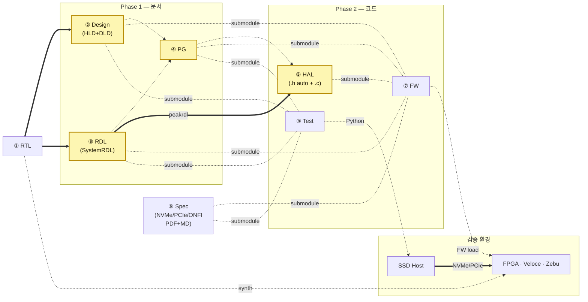

# 2. 아키텍처 — 8개 저장소 + Phase 1/2

## 2.1 한 장의 그림

## 2.2 저장소 카드

| # | Repo | 내용 | 책임자 | 누가 submodule? |
|---|---|---|---|---|
| ① | **RTL** | `rtl/**/*.sv` | RTL designer | 없음 (Design · RDL CI 가 fetch) |
| ② | **Design** | HLD.md · DLD.md (같은 repo) | Architect + RTL designer | FW, Test |
| ③ | **RDL** | SystemRDL `.rdl` + IP-XACT XML (peakrdl) | RTL designer | HAL, FW, Test |
| ④ | **PG** | Programmer's Guide (DLD+RDL 기반, SW-HW 계약) | SW lead | HAL (참조), FW, Test |
| ⑤ | **HAL** | HAL.h (auto-gen) + HAL.c (Claude) | FW team | FW |
| ⑥ | **Spec** | 표준 PDF (LFS) + 자동 MD extract | Standards | FW, Test |
| ⑦ | **FW** | driver · app firmware | FW team | (없음) |
| ⑧ | **Test** | Python coverif scenarios | DV / Validation | (없음) |

**Submodule fan-out 의 핵심**: FW 와 Test 가 각자 5/4 개 doc submodule 의 SHA 를 같게 핀해야 release (Release gate R1, §4).

## 2.3 4가지 빌딩블록 — 모두 산업 표준

| 빌딩블록 | 선택 | 산업 근거 |
|---|---|---|
| ① 문서 포맷 | Markdown + Mermaid + WaveDrom | Docs-as-Code · Diátaxis (OSS 다수) |
| ② 저장소 모델 | git + submodule fan-out | 본 레포 [`cm-strategies/`](../../cm-strategies/README.md) 4 전략 비교 |
| ③ SFR 표준 | SystemRDL `.rdl` author + IP-XACT 1685-2022 (peakrdl emit) | IEEE 1685-2022 · Accellera SystemRDL 2.0 |
| ④ 검색·정합성 | grep / ripgrep + 저장소별 CI invariant | Anthropic Claude Code 의 RAG→grep 전환 |

## 2.4 왜 문서를 3개로 쪼개고 HAL/Spec 을 분리하는가

- **Design vs RDL vs PG**: 작성자 (Architect/RTL/SW lead)·트리거·갱신 빈도 모두 다름. 한 repo 면 한 사람의 PR 이 다른 사람을 자주 conflict.
- **HAL 별도 repo**: HAL.h 는 RDL 에서 결정론적 auto-gen, HAL.c 는 Claude 작성. 다른 컨슈머 (사내 다른 펌웨어, 단위 테스트 러너) 도 HAL 만 끌어다 쓸 수 있게.
- **Spec Repo**: 외부 표준 (NVMe/PCIe/ONFI) 은 변경 빈도가 낮고 large binary (PDF). 사내 git LFS 에 격리하고 자동 MD extract 와 함께.

## 2.5 Before / After

| 항목 | Before | After |
|---|---|---|
| 문서 포맷 | Word + Excel + Confluence | Markdown + SystemRDL (8-repo 분리) |
| AI 컨텍스트 주입 | RAG/MCP 검색 → 청크 다수 | submodule 직접 read |
| 정합성 보장 | 사람의 성실성 | 8 CI invariant + Release gate R1 |
| 검증 방식 | SV TB 또는 spec walk-through | FW on FPGA·Veloce·Zebu + Python on SSD Host |
| 락인 | 벤더 위키·EDA AI | 표준 + 오픈 포맷 |
| FW/Test 의 RTL 참조 | 가능 | **금지** (CI 강제) |
| 수동 vs 자동 정합성 | 모두 사람 | Hybrid (authored + shadow zone) |

→ §3 산출물 분류 · §4 정합성 CI · §5 AI 자동화.
