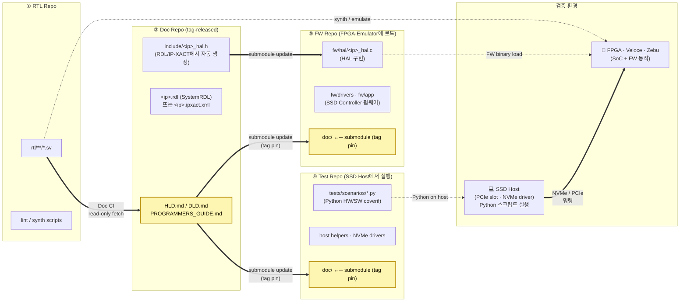

# 2. 제안 — Markdown · Git · Submodule · RTL-Grounded 통합 워크플로우

본 장은 본 보고서의 핵심 제안을 **한 장의 아키텍처**로 압축한다.
이후 3–6장에서 산출물 분류·정합성 CI·AI 자동화 측면에서 각각 정당화한다.

---

## 2.1 한 장의 그림 — 4개 저장소 토폴로지

본 제안의 형상관리는 **4개의 독립 저장소 + Doc Repo를 양쪽 단방향
submodule 출처로 두는 fan-out**으로 구성된다.



### 저장소별 내용 — "무엇이 어디에 사는가"

| Repo | 내용 | 1차 책임자 | 실행 위치 / 출구 |
|---|---|---|---|
| ① **RTL Repo** | `rtl/**/*.sv` (Verilog RTL), lint·synth 설정 | RTL designer | FPGA bitstream · Veloce/Zebu image (별도 빌드 인프라가 합성) |
| ② **Doc Repo** | HLD / DLD / Programmer's Guide (Markdown), **SystemRDL `.rdl`** (또는 IP-XACT XML), **HAL 헤더 `.h` 자동 생성본** | RTL designer + SW lead + Architect | tag로 release. FW Repo · Test Repo 양쪽이 submodule로 소비 |
| ③ **FW Repo** | HAL `*.c` 구현, driver/app firmware. **`doc/` = Doc Repo submodule** | FW team | 빌드된 FW binary가 FPGA·Veloce·Zebu에 **로드되어 실행** |
| ④ **Test Repo** | **Python coverif scenarios**, NVMe/PCIe host helper. **`doc/` = Doc Repo submodule** | DV / Validation team | **SSD Host (Linux 서버)에서 실행**되며 NVMe·PCIe로 SoC를 구동 |

### 핵심 관찰점

1. **FW와 Test는 분리된 저장소** — FW는 SoC 위에서 도는 코드, Test는 Host에서 SoC를 구동하는 Python. 책임·언어·실행 환경·릴리스 주기가 모두 다르므로 같은 저장소에 두지 않는다.
2. **Doc Repo가 fan-out의 중심** — FW Repo와 Test Repo가 각자 자신의 tag로 Doc Repo를 submodule pin. 두 팀이 같은 SW-HW 계약을 보는 것이 구조적으로 강제된다.
3. **Submodule은 모두 한 방향** — Doc → FW, Doc → Test. RTL은 어떤 곳의 submodule도 아니며, Doc Repo CI가 RTL을 read-only fetch하여 invariant를 검사한다.
4. **검증의 실행 면이 두 개** — (a) **FPGA·Veloce·Zebu** 위에서 펌웨어가 실제 동작, (b) **SSD Host** 위에서 Python이 NVMe/PCIe로 펌웨어를 구동·관찰. 실제 SSD가 동작하는 환경과 동일.
5. **노란 블록 = SW-HW 계약 + 그 핀** — Doc Repo의 문서·SFR·HAL.h + FW/Test 각각의 submodule pin. 4개 노란 지점이 같은 doc-tag로 정렬되면 시스템 전체가 결정론적이다.
6. **AI 컨텍스트는 결정론적** — FW Repo든 Test Repo든 clone하면 `doc/` submodule이 정확한 tag의 문서를 들고 따라온다. AI는 RAG/MCP 없이 `doc/<ip>/PROGRAMMERS_GUIDE.md` 같은 경로를 직접 read한다.

### 어느 시점에 무엇이 무엇과 정렬되는가

검증 1 회의 실행은 다음 **4-tuple**로 한 줄에 확정된다:

> `rtl-v3.2.0  ×  doc-v2.5.0  ×  fw-v1.7.0  ×  test-v0.9.3`

FW Repo의 `doc/` SHA와 Test Repo의 `doc/` SHA가 같으면, 두 팀이 같은
SW-HW 계약을 보고 있는 것이다. 다르면 — CI가 release sign-off 단계에서
경고하고, 배포 매니페스트가 일치 강제.

---

## 2.2 4개 빌딩블록과 그 선택 사유

### (1) Markdown (+ Mermaid + WaveDrom + 임베드된 IP-XACT XML 참조)
- **이유**: ① diff 가능 → PR-기반 리뷰 ② LLM이 토큰 효율 최상으로 읽음 ③ 어떤
  static site generator로도 렌더 가능 ④ 오프라인·CLI에서도 즉시 가독
- **반론 대비**: "DOCX/PDF가 더 익숙하다" — 익숙함은 잠금이다. PR 워크플로우
  내에서 마크다운 리뷰가 정착하면 익숙함도 1주 내 역전된다.

### (2) Git + 단방향 Submodule fan-out (Doc → {FW, Test})
이미 본 레포 `cm-strategies/` 가 **monorepo / submodule / repo+manifest /
subtree** 4개 전략을 비교한 결과, **submodule이 SoC 산출물의 현실에
가장 적합**하다는 결론이 도출되었다.[^1] 본 제안은 그 결론을 **4-repo
fan-out** 모델로 구체화한다 — 한 Doc Repo가 FW Repo · Test Repo 두 곳의
submodule 출처가 된다.

| 요구사항 | Monorepo | **4-repo + fan-out submodule (본 제안)** | repo+manifest | Subtree |
|---|---|---|---|---|
| RTL · Doc · FW · Test의 역할/권한 분리 | 어려움 | **자연스러움** (저장소가 곧 권한 경계) | 가능 | 어려움 |
| Doc 변경의 FW·Test 동시 전파 | 검토 PR 두 번 | **submodule update 각 1회** (양쪽 같은 tag) | 매니페스트 1회 | 어색 |
| FW와 Test의 독립 릴리스 주기 | 어려움 | **자연스러움** (각자 fw-v*, test-v*) | 가능 | 어색 |
| Tag 기반 doc release | 가능 | **자연스러움** | 자연스러움 | 어색 |
| 신규 SoC 파생 시 FW·Test만 fork | 어색 | **자연스러움** (doc·rtl은 공용) | 가능 | 어색 |
| 도구 생태계 표준성 | 표준 | **표준 (git native)** | Android 색채 | 비표준 |

#### 왜 RTL Repo는 어떤 것의 submodule도 아닌가
- RTL 산출물은 **합성/에뮬레이션 빌드 인프라**가 소비하지, FW나 Test가 직접 소비하지 않는다.
- 양방향 의존(FW/Test가 RTL을 submodule로 끌고 옴)을 만들면 RTL 전체가 SW 팀에 노출되어 권한 분리가 무너진다.
- 대신 Doc Repo CI가 RTL을 read-only fetch하여 invariant를 검사. **정합성 게이트는 Doc Repo에서 일어난다.**

#### 왜 Doc Repo가 FW · Test 양쪽의 submodule인가
- SW-HW 계약(Programmer's Guide·SFR·HAL 헤더)은 **FW 개발자와 Test 개발자가 모두 매일 보는 것**.
- Submodule은 commit SHA / tag를 핀하므로, "FW가 보는 가이드"와 "Test가 보는 가이드"가 같은 버전임이 명시적이다.
- 검증 실행 시: FW Repo의 `doc/` SHA == Test Repo의 `doc/` SHA → 두 팀이 같은 계약을 보고 있다는 객관 증거.
- `git submodule update --remote` 한 줄로 양쪽이 새 doc tag로 이동. AI가 각 저장소에서 자신의 출력물(HAL.c · Python scenario)을 자동 갱신.

#### 왜 FW와 Test를 분리하는가
- **실행 환경이 다르다** — FW는 SoC 위(FPGA·Veloce·Zebu)에서, Test는 SSD Host(Linux 서버) 위에서 실행.
- **언어·툴체인이 다르다** — FW는 C/임베디드 빌드, Test는 Python/pip/pytest.
- **책임 부서가 다르다** — FW는 펌웨어 팀, Test는 DV/Validation 팀.
- **릴리스 주기가 다르다** — FW는 ROM/eMMC에 굽혀 나가는 binary, Test는 빠른 iteration의 검증 스크립트.

Submodule의 단점인 "학습 곡선"은 양쪽 저장소의 `make doc-update` 한 줄 wrapper로 흡수된다 (9장 리스크 참고).

### (3) SFR 표준 — SystemRDL 또는 IEEE 1685-2022 IP-XACT
SFR을 어떤 포맷으로 author하느냐는 **두 가지 선택지**가 있으며, 둘 다
산업 표준이다.

| 옵션 | 권장 용도 | 강점 | 약점 |
|---|---|---|---|
| **SystemRDL** (Accellera 2.0) | **author format으로 권장** | 텍스트 친화·간결·`peakrdl-*` OSS 툴체인으로 IP-XACT XML/HAL.h/Markdown 표 일괄 emit | XML 표준 ID는 별도 |
| **IP-XACT XML** (IEEE 1685-2022) | **interchange format** | IEEE 국제 표준,[^2] EDA 벤더 도구 호환, UVM regmodel 자동 생성 | XML 직접 편집은 사람에게 비친화적 |

권장 워크플로우:

```
<ip>.rdl  (사람이 author, SystemRDL — Doc Repo)
   ↓ peakrdl
   ├─→  <ip>.ipxact.xml     (interchange, IEEE 1685-2022)
   ├─→  include/<ip>_hal.h  (HAL 헤더)
   └─→  DLD.md §5 register 표 (Markdown 인서트)
```

이 변환은 Doc Repo CI가 매 PR마다 결정론적으로 수행하므로, **사람은
SystemRDL `.rdl` 한 곳만 편집**한다. IP-XACT XML / HAL.h / Markdown 표는
모두 그 그림자이다. (IP-XACT XML을 author format으로 직접 쓰는 팀은
변환 단계 없이 IP-XACT → HAL.h만 emit해도 됨 — 정합성 검사는 동일.)

### (4) RTL-Grounded CI — 저장소별로 책임이 갈라진 정합성 검사
정합성 검사는 한 곳에서 모두 일어나지 않는다. **세 저장소(Doc / FW /
Test) 각각의 CI가 자기 경계 안의 invariant를 검사**하고, 경계를 넘는
검사는 Doc Repo CI가 RTL을 read-only fetch하는 형태로 흡수한다.

| Invariant | 검사 위치 | Source A | Source B |
|---|---|---|---|
| RTL ↔ DLD §5 register map | **Doc Repo CI** | RTL Repo의 RTL (fetch) | `doc/<ip>/DLD.md §5` |
| DLD §5 ↔ SFR (RDL/IP-XACT) | **Doc Repo CI** | `doc/<ip>/DLD.md §5` | `doc/<ip>/<ip>.rdl` 또는 `.ipxact.xml` |
| SFR ↔ HAL.h (auto-gen) | **Doc Repo CI** | `<ip>.rdl` / `.ipxact.xml` | `include/<ip>_hal.h` |
| HAL.h ↔ Guide §6 함수 시그너처 | **Doc Repo CI** | `include/<ip>_hal.h` | `doc/<ip>/PROGRAMMERS_GUIDE.md §6` |
| Diagram source ↔ SVG | **Doc Repo CI** | `doc/diagrams/*.json` | `doc/diagrams/*.svg` |
| HAL `.c` export ↔ HAL `.h` (submodule) | **FW Repo CI** | `doc/include/*_hal.h` | `fw/hal/*_hal.c` |
| FW Repo `doc/` submodule SHA 단조 증가 | **FW Repo CI** | submodule SHA | git tag history |
| Host smoke pass | **FW Repo CI** | HAL.c + host smoke | `make test` |
| Python scenarios ↔ Guide §6 worked example | **Test Repo CI** | `doc/<ip>/PROGRAMMERS_GUIDE.md §6` | `tests/scenarios/<ip>/*.py` |
| Python regression ↔ Guide §8 pitfall | **Test Repo CI** | `doc/<ip>/PROGRAMMERS_GUIDE.md §8` | `tests/scenarios/<ip>/regress_*.py` |
| Test Repo `doc/` submodule SHA 단조 증가 | **Test Repo CI** | submodule SHA | git tag history |
| FW.doc-SHA == Test.doc-SHA (release gate) | **Release CI** | FW Repo doc submodule | Test Repo doc submodule |

검사들은 PR 시점에 자동 실행되어 **정합성이 깨지면 PR이 fail**한다.
즉 정합성이 "규칙"이 아니라 "**빌드 시스템**"이 된다. 4장에서 각 invariant의
구현 디테일을 다룬다.

---

## 2.3 RAG 대신 Submodule을 쓰는 결정의 의미

이 제안의 가장 비전형적인 결정은 **"RAG/벡터DB를 일체 도입하지 않는다"**는
점이다. 대신:

- LLM이 문서를 읽어야 할 때 → **submodule path를 직접 read** (결정론적).
- 검색이 필요할 때 → **ripgrep / git grep** (sub-second, 정확).
- 버전이 필요할 때 → **git tag / commit SHA** (재현 가능).
- diff·blame이 필요할 때 → **git native** (별도 인프라 0).

이는 단순히 비용 절감이 아니다. Anthropic Claude Code 팀이 자신들의 도구
에 같은 결정을 내렸고, 4가지 사유로 RAG를 폐기했다: **precision, simplicity,
freshness, privacy**.[^3] 우리 SoC 산출물은 코드보다 더 정확한 심볼에
의존하므로, 이 4개 사유가 **더 강하게** 적용된다.

---

## 2.4 무엇이 달라지는가 — Before / After 한눈에

| 항목 | Before (Word/Excel + Confluence + RAG) | After (4-repo + Markdown + SystemRDL + RTL-Grounded) |
|---|---|---|
| 문서 포맷 | HLD/DLD = Word, SFR = Excel, 산출물 분산 | 모두 Markdown + SystemRDL (`.rdl`) — Doc Repo 한 곳 |
| 산출물 위치 | 여러 시스템에 분산 | RTL/Doc/FW/Test 4 repo 각각 명확한 경계 |
| 버전 관리 | 시스템별 별도 | git tag · Doc Repo가 FW/Test 양쪽의 submodule pin 기준 |
| AI 컨텍스트 주입 | RAG/MCP 검색 → 청크 다수 | FW/Test Repo의 `doc/` (submodule) 직접 read |
| 정합성 보장 | 사람의 성실성 | Doc/FW/Test 각 CI invariant + release gate |
| 검증 방식 | SV TB 또는 spec walk-through | **FW가 FPGA·Veloce·Zebu 위에서, Python이 SSD Host에서** — HW/SW coverif |
| FW와 Test의 결합 | 같은 산출물 또는 사람이 동기 | 다른 repo · 같은 doc-tag로 정렬 (CI release gate) |
| 신규 SoC 파생 | 사람이 복제·수정 | FW/Test Repo만 fork + submodule pin → CI 자동 |
| 평균 LLM 토큰 사용 | 검색 청크 포함 (수배) | 필요한 파일만 (최소) |
| 락인 | 벤더 위키·EDA AI | 표준 + 오픈 포맷 (SystemRDL · IP-XACT · Markdown) |

다음 장(3장)부터는 이 전략 안에서 다섯 가지 산출물 유형(HLD / DLD /
Programmer's Guide / SFR / HAL)이 어떻게 정의되고 서로 관계 맺는지를
Diátaxis 프레임워크에 비추어 정당화한다.

---

[^1]: 본 레포 [`cm-strategies/README.md`](../../cm-strategies/README.md) 4개 전략 비교 결론.
[^2]: [IEEE 1685-2022](https://ieeexplore.ieee.org/document/10054520), [Accellera IP-XACT WG](https://www.accellera.org/activities/working-groups/ip-xact).
[^3]: [Why Cursor, Claude Code, and Devin Use grep, Not Vectors — MindStudio](https://www.mindstudio.ai/blog/is-rag-dead-what-ai-agents-use-instead).
