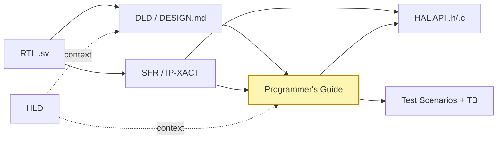

# 3. 산출물 분류 체계 — 5종 문서와 Diátaxis 매핑

본 장은 SoC 산출물을 **5종으로 한정**하고 각 산출물의 책임·포맷·정합성
계약을 명시한다. 산업 표준 문서 프레임워크인 **Diátaxis**[^1]에
SoC 도메인을 매핑하면 5종이 자연스럽게 도출된다.

---

## 3.1 5종 산출물 정의

| # | 산출물 | 포맷 | 책임자 | 1줄 정의 | 사는 저장소 |
|---|---|---|---|---|---|
| 1 | **HLD** (High Level Description) | Markdown + Mermaid | IP architect | IP의 목적·블록 구조·외부 인터페이스의 **개념적 설명** | Doc Repo |
| 2 | **DLD** (Detailed Level Description, 일명 DESIGN.md) | Markdown + Mermaid + WaveDrom | RTL designer | RTL의 구현 디테일 — FSM·timing·port table·register map | Doc Repo |
| 3 | **Programmer's Guide** | Markdown | SW lead (저자) + RTL designer (리뷰) | SW 개발자가 "이 IP를 어떻게 쓰는가"를 익히는 **How-to** + **worked examples** | Doc Repo |
| 4 | **SFR (IP-XACT)** | XML (IEEE 1685-2022) | RTL designer | Register/field-level 기계 판독 가능 **reference** | Doc Repo |
| 5 | **HAL API 헤더** | C 헤더 (`<ip>_hal.h`) + Doxygen 주석 | RTL designer / 자동 생성 | 함수 시그너처·전제조건·반환값의 **reference** (SW-HW 계약) | Doc Repo (auto-gen) |

위 5종은 모두 **Doc Repo가 단일 출처**이며, FW Repo가 `doc/` submodule로 소비한다. FW Repo는 그 위에 다음의 "검증·실행 산출물"을 얹는다:

| 산출물 | 포맷 | 책임자 | 1줄 정의 | 사는 저장소 |
|---|---|---|---|---|
| HAL `.c` 구현 | C source | SW / FW engineer | HAL.h 시그너처에 대한 펌웨어 구현 | FW Repo |
| **Python coverif scenarios** | Python (`tests/scenarios/*.py`) | DV / FW | Guide §6 worked example·§8 pitfall을 FPGA/Veloce/Zebu에서 실측 가능한 시퀀스로 변환 | FW Repo |
| Driver / App firmware | C source | FW engineer | SSD Controller 기능 펌웨어 (NVMe, FTL 등) | FW Repo |
| Host smoke / 단위 테스트 | Python / C | FW + DV | HAL.c 단위 검증 | FW Repo |

이 8개의 산출물이 **3개 저장소 안에 명확히 위치**한다. AI가 컨텍스트를
구성할 때 어느 파일을 읽어야 할지에 모호함이 없다.

---

## 3.2 Diátaxis 4분면과의 매핑

Diátaxis는 모든 기술문서를 **4가지 사용자 요구**로 분해한다.

```
                Action ↑                Cognition ↑
   Learning →   [Tutorials]    |    [Explanation]
                ───────────────┼─────────────────────
   Working  →   [How-to]       |    [Reference]
```

SoC 5종 산출물은 이 4분면을 다음과 같이 채운다:

| Diátaxis | SoC 산출물 |
|---|---|
| Tutorials (학습) | Programmer's Guide §1 "Getting started" — `irq_ctrl`에서는 reset → enable → ISR 첫 흐름 |
| How-to (작업) | Programmer's Guide §6 "Worked examples" — 각 use case의 호출 순서 |
| Reference (조회) | SFR (IP-XACT) + HAL API — 기계가, 그리고 사람이 검색·조회 |
| Explanation (이해) | HLD (개념) + DLD §1–4 (구현 근거·trade-off) |

DLD는 분면을 **Explanation + Reference 양쪽에 걸치는 hybrid**이다. 이는
RTL 설계서의 본질이 "설계 의도(왜)"와 "정확한 사양(무엇)"을 함께
담아야 하기 때문이며, Diátaxis 저자들도 hybrid 산출물 자체를 부정하지는
않는다.

> **귀결**: 5종은 자의적 분류가 아니다. **검증된 산업 프레임워크의 SoC
> 도메인 자연 매핑**이다. "왜 5종이냐"는 임원·감사자 질문에 즉답할 수
> 있는 근거를 가진다.

---

## 3.3 산출물 간 관계 (계약 그래프)



- 화살표 = "단방향 의존" (왼쪽이 변하면 오른쪽이 따라간다).
- 굵은 화살표 = harness가 invariant로 검사 (§4 참고).
- 노란 블록 = **SW-HW 계약**. 가이드의 모든 worked example은 반드시
  HAL 함수 호출과 test scenario에 1:1 매핑된다.

---

## 3.4 각 산출물의 최소 구성요소

### 3.4.1 HLD
- §1 Purpose & Position in SoC
- §2 Block Diagram (Mermaid)
- §3 External Interfaces (signals or protocol)
- §4 Use cases / target workloads
- §5 Performance budget / non-functional targets
- §6 Dependencies (clocks, resets, neighbor IPs)

### 3.4.2 DLD (DESIGN.md)
- §1 Architectural overview (HLD에서 인용 + 구현 수준 보강)
- §2 Port table
- §3 Clock / reset / power domains
- §4 FSM(s) — Mermaid state diagram
- §5 **Register map** ← IP-XACT와 1:1 일치 (harness 강제)
- §6 Timing diagrams (WaveDrom)
- §7 Verification entry points (참조)

### 3.4.3 Programmer's Guide
- §1 First touch (reset → minimal use)
- §2 Operating modes
- §3 Initialization sequence
- §4 ISR / interrupt flow
- §5 Power management hooks
- §6 **Worked examples** ← scenarios와 1:1 매핑 (harness 강제)
- §7 Performance tips
- §8 **Pitfalls** ← 회귀 시나리오의 원천
- §9 Reference snippets (HAL 호출 코드)

### 3.4.4 SFR (IP-XACT)
- `*.ipxact.xml` — IEEE 1685-2022 namespace
- `addressBlock` per logical group
- `register` with offset, width, access, resetValue
- `field` with bitOffset, bitWidth, description, access, enumeratedValues
- `vendorExtensions`로 회사 메타데이터 (optional)

### 3.4.5 HAL API
- `<ip>_hal.h` — public API 함수, register macro, enum
- `<ip>_hal.c` — 구현
- `test_hal_host.c` — host smoke test
- Doxygen 주석으로 `@brief`, `@param`, `@return`, `@pre`, `@post` 명시

---

## 3.5 "왜 더 추가하지 않는가" — 절제의 정당화

산출물이 5종을 넘으면 정합성 검사가 기하급수적으로 복잡해진다.
다음 산출물들은 **5종에 흡수**한다:

| 자주 제안되는 추가 산출물 | 우리 대응 |
|---|---|
| 별도 "SoC Architecture spec" | HLD에 흡수 |
| 별도 "RTL Implementation Doc" | DLD에 흡수 |
| 별도 "Verification Plan" | Programmer's Guide §6 (worked example) + §8 (Pitfalls) → FW Repo의 Python scenario로 분해 |
| 별도 "Driver API spec" | HAL.h의 Doxygen이 그 자체 |
| "Performance characterization" | DLD §1 (목표) + Programmer's Guide §7 (실측 팁) + Python scenario의 measurement |

이 분해는 "한 문서가 두 가지 청중을 동시에 충족시키려 하면 둘 다
실패한다"는 Diátaxis의 원칙[^1]에 기반한다.

다음 장(4장)에서 이 5종이 **CI invariant로 어떻게 정합성이 강제되는가**
를 본 레포의 `tools/ipflow.py` 구현을 들어 설명한다.

---

[^1]: [Diátaxis Documentation Framework](https://diataxis.fr/), [GitHub](https://github.com/evildmp/diataxis-documentation-framework).
