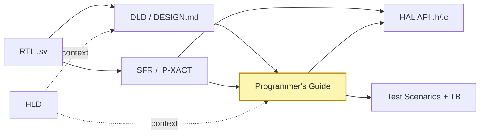

# 3. 산출물 분류 체계 — 5종 문서와 Diátaxis 매핑

본 장은 SoC 산출물을 **5종으로 한정**하고 각 산출물의 책임·포맷·정합성
계약을 명시한다. 산업 표준 문서 프레임워크인 **Diátaxis**[^1]에
SoC 도메인을 매핑하면 5종이 자연스럽게 도출된다.

---

## 3.1 5종 문서 산출물 + 3종 코드 산출물 + 1종 외부 reference

### 문서 산출물 (5종)

| # | 산출물 | 포맷 | 책임자 | 1줄 정의 | 사는 저장소 |
|---|---|---|---|---|---|
| 1 | **HLD** | Markdown + Mermaid | Architect | IP 의 목적·블록·외부 인터페이스 **개념 설명** | **② Design Repo** |
| 2 | **DLD** | Markdown + Mermaid + WaveDrom | RTL designer | RTL 의 구현 디테일 — FSM·timing·port table·register map | **② Design Repo** (HLD 와 같은 repo) |
| 3 | **Programmer's Guide** | Markdown | SW lead (저자) + RTL designer (리뷰) | SW 개발자의 SW-HW 계약 — How-to + worked example | **④ PG Repo** |
| 4 | **SFR (SystemRDL)** | `.rdl` author + IP-XACT XML interchange (peakrdl auto-gen) | RTL designer | Register/field-level **기계 판독 가능 reference** | **③ RDL Repo** |
| 5 | **HAL API 헤더** | C 헤더 + Doxygen 주석 (peakrdl auto-gen from RDL) | RTL designer | 함수 시그너처·전제조건의 **reference** (SW-HW 계약 코드 표현) | **⑤ HAL Repo** |

### 코드 산출물 (3종)

| 산출물 | 포맷 | 책임자 | 사는 저장소 | 실행 위치 |
|---|---|---|---|---|
| HAL.c 구현 | C source | Claude Code (1차) + FW lead 검토 | **⑤ HAL Repo** (HAL.h 와 같이) | FPGA · Veloce · Zebu |
| Driver / App firmware | C source | Claude Code + FW lead | **⑦ FW Repo** | FPGA · Veloce · Zebu |
| Python coverif scenarios + host helper | Python (`tests/scenarios/*.py`) | Claude Code + DV 보강 | **⑧ Test Repo** | SSD Host (Linux) |

### 외부 reference 산출물 (1종)

| 산출물 | 포맷 | 책임자 | 사는 저장소 |
|---|---|---|---|
| 표준 spec (NVMe / PCIe / ONFI) | PDF (git LFS) + 자동 추출 Markdown | Standards 담당 | **⑥ Spec Repo** |

### 산출물 ↔ 저장소 매핑 한눈에

```
RTL Repo ①           rtl/**/*.sv
                      ↓ (Phase 1 fetch)
Design Repo ②        HLD.md, DLD.md
RDL Repo ③           .rdl, IP-XACT XML
                      ↓ (PG 가 참조)
PG Repo ④            Programmer's Guide
                      ↓ (HAL 이 참조)
HAL Repo ⑤           HAL.h (auto), HAL.c
Spec Repo ⑥          NVMe/PCIe PDF + MD
                      ↓ (Phase 2 submodule)
FW Repo ⑦            driver, app firmware
Test Repo ⑧          Python coverif
```

> **8개 저장소 안에 명확히 위치**. Claude 가 컨텍스트를 구성할 때 어느 파일을
> 읽어야 할지에 모호함이 없다. 참조 위계 (§5.2): PG/RDL primary → DLD fallback
> → RTL 금지.

> **왜 HLD/DLD 는 같은 저장소, PG/RDL 은 별도 저장소인가** — HLD/DLD 는
> 작성자 (Architect/RTL designer) 와 생애주기가 같다. PG 는 다른 작성자 (SW lead)
> 와 다른 트리거 (SW-facing API 결정) 로 갱신된다. RDL 은 RTL 변경 시점에 sync
> 되며 매우 잦은 변경을 받는다. 분리하면 한 사람의 PR 이 다른 두 사람을 자주
> conflict 시키지 않는다.

> **왜 HAL 이 별도 저장소인가** — HAL.h 는 RDL 에서 auto-gen, HAL.c 는 Claude
> 가 PG 보고 작성. 둘 다 SW-HW 계약의 코드 표현. FW 가 아닌 다른 컨슈머 (사내
> 다른 펌웨어, 단위 테스트 러너) 도 HAL 만 끌어다 쓸 수 있도록 분리.

> **왜 FW 산출물과 Test 산출물이 다른 저장소인가** — FW 는 SoC 위에서 도는
> C 펌웨어, Test 는 Host 에서 SoC 를 구동하는 Python. 책임 부서·언어·툴체인·
> 릴리스 주기·보안 boundary 가 모두 다르다.

---

## 3.2 Diátaxis 4분면과의 매핑

Diátaxis는 모든 기술문서를 **4가지 사용자 요구**로 분해한다.

```
                Action ↑                Cognition ↑
   Learning →   [Tutorials]    |    [Explanation]
                ───────────────┼─────────────────────
   Working  →   [How-to]       |    [Reference]
```

SoC 5종 산출물은 이 4분면을 다음과 같이 채운다:

| Diátaxis | SoC 산출물 |
|---|---|
| Tutorials (학습) | Programmer's Guide §1 "Getting started" — `irq_ctrl`에서는 reset → enable → ISR 첫 흐름 |
| How-to (작업) | Programmer's Guide §6 "Worked examples" — 각 use case의 호출 순서 |
| Reference (조회) | SFR (IP-XACT) + HAL API — 기계가, 그리고 사람이 검색·조회 |
| Explanation (이해) | HLD (개념) + DLD §1–4 (구현 근거·trade-off) |

DLD는 분면을 **Explanation + Reference 양쪽에 걸치는 hybrid**이다. 이는
RTL 설계서의 본질이 "설계 의도(왜)"와 "정확한 사양(무엇)"을 함께
담아야 하기 때문이며, Diátaxis 저자들도 hybrid 산출물 자체를 부정하지는
않는다.

> **귀결**: 5종은 자의적 분류가 아니다. **검증된 산업 프레임워크의 SoC
> 도메인 자연 매핑**이다. "왜 5종이냐"는 임원·감사자 질문에 즉답할 수
> 있는 근거를 가진다.

---

## 3.3 산출물 간 관계 (계약 그래프)



- 화살표 = "단방향 의존" (왼쪽이 변하면 오른쪽이 따라간다).
- 굵은 화살표 = harness가 invariant로 검사 (§4 참고).
- 노란 블록 = **SW-HW 계약**. 가이드의 모든 worked example은 반드시
  HAL 함수 호출과 test scenario에 1:1 매핑된다.

---

## 3.4 각 산출물의 최소 구성요소

### 3.4.1 HLD
- §1 Purpose & Position in SoC
- §2 Block Diagram (Mermaid)
- §3 External Interfaces (signals or protocol)
- §4 Use cases / target workloads
- §5 Performance budget / non-functional targets
- §6 Dependencies (clocks, resets, neighbor IPs)

### 3.4.2 DLD (DESIGN.md)
- §1 Architectural overview (HLD에서 인용 + 구현 수준 보강)
- §2 Port table
- §3 Clock / reset / power domains
- §4 FSM(s) — Mermaid state diagram
- §5 **Register map** ← IP-XACT와 1:1 일치 (harness 강제)
- §6 Timing diagrams (WaveDrom)
- §7 Verification entry points (참조)

### 3.4.3 Programmer's Guide
- §1 First touch (reset → minimal use)
- §2 Operating modes
- §3 Initialization sequence
- §4 ISR / interrupt flow
- §5 Power management hooks
- §6 **Worked examples** ← scenarios와 1:1 매핑 (harness 강제)
- §7 Performance tips
- §8 **Pitfalls** ← 회귀 시나리오의 원천
- §9 Reference snippets (HAL 호출 코드)

### 3.4.4 SFR (IP-XACT)
- `*.ipxact.xml` — IEEE 1685-2022 namespace
- `addressBlock` per logical group
- `register` with offset, width, access, resetValue
- `field` with bitOffset, bitWidth, description, access, enumeratedValues
- `vendorExtensions`로 회사 메타데이터 (optional)

### 3.4.5 HAL API
- `<ip>_hal.h` — public API 함수, register macro, enum
- `<ip>_hal.c` — 구현
- `test_hal_host.c` — host smoke test
- Doxygen 주석으로 `@brief`, `@param`, `@return`, `@pre`, `@post` 명시

---

## 3.5 "왜 더 추가하지 않는가" — 절제의 정당화

산출물이 5종을 넘으면 정합성 검사가 기하급수적으로 복잡해진다.
다음 산출물들은 **5종에 흡수**한다:

| 자주 제안되는 추가 산출물 | 우리 대응 |
|---|---|
| 별도 "SoC Architecture spec" | HLD에 흡수 |
| 별도 "RTL Implementation Doc" | DLD에 흡수 |
| 별도 "Verification Plan" | Programmer's Guide §6 (worked example) + §8 (Pitfalls) → FW Repo의 Python scenario로 분해 |
| 별도 "Driver API spec" | HAL.h의 Doxygen이 그 자체 |
| "Performance characterization" | DLD §1 (목표) + Programmer's Guide §7 (실측 팁) + Python scenario의 measurement |

이 분해는 "한 문서가 두 가지 청중을 동시에 충족시키려 하면 둘 다
실패한다"는 Diátaxis의 원칙[^1]에 기반한다.

---

## 3.6 마크다운에서의 시각화 — 흔한 질문에 답하기

> **"산출물을 전부 마크다운으로 옮긴다면, 기존에 Visio·PowerPoint·Word
> 안에 그리던 블록 다이어그램·플로우차트·UML·웨이브폼은 어떻게 하나?"**

산업 표준 도구셋이 이미 모든 유형을 마크다운 친화적으로 처리한다.

| 시각화 유형 | 권장 도구 | 본 워크플로우에서 |
|---|---|---|
| 블록 다이어그램 · 플로우차트 · 시퀀스 · **클래스** · 상태 · ER · Gantt | **Mermaid** | 기본 (GitHub · 본 뷰어 모두 네이티브 렌더). 본 보고서·발표 슬라이드에서 이미 다수 사용 중. |
| **신호 타이밍 · bitfield** (SoC DLD §6 timing) | **WaveDrom** | SoC 산업 표준 (Stage 3 DLD에서 이미 사용). JSON 소스가 git diff 가능. |
| 고급 UML (컴포넌트 · 배포 · use-case) | **PlantUML** | [Kroki.io](https://kroki.io/) 게이트웨이 또는 사전 렌더 SVG. PlantUML 1685-2022 IP-XACT의 ipxactExt 영역도 표현 가능. |
| 복잡한 그래프 · DAG · 데이터 흐름 | **D2 · Graphviz (DOT)** | Kroki 동일 패턴. D2는 자동 레이아웃이 강력. |
| 자유 스케치 · 사진 · 직접 그리기 | **draw.io · excalidraw → SVG export** | 최후 수단. SVG를 git commit 후 마크다운에서 `` 인라인. |
| 수식 | **KaTeX / MathJax** | `$...$` inline 또는 `$$...$$` block. |
| 차트 (성능·KPI) | **Chart.js · plotly · vega-lite** | 본 보고서의 §8 ROI 차트가 Chart.js 예시. |

### 통합 렌더링 — Kroki.io 단일 게이트웨이

위 도구는 모두 **텍스트(또는 JSON) 소스 → SVG**의 단방향 변환이다.
[Kroki.io](https://kroki.io/)는 Mermaid · WaveDrom · PlantUML · D2 ·
BPMN · BlockDiag · Excalidraw 등 **20+종을 한 HTTP 엔드포인트**로 렌더한다.
사내 self-host도 가능. CI에서 한 단계로 모든 다이어그램을 SVG로 변환할 수 있다.

### 본 발표 슬라이드의 실증

발표 슬라이드 11번 ([▶ web/present/](../../web/present/index.html#11)) 에서
**Mermaid 클래스 다이어그램** (HAL 구조) 과 **WaveDrom APB write 타이밍**이
같은 페이지에서 **동시에 라이브 렌더**된다 — 단일 HTML 페이지·단일 마크다운
스타일 source 안에서. 이 자체가 "마크다운으로 다 가능하다"의 증거이다.

### 모든 경우의 출구

위 도구로도 표현이 어려운 케이스 (예: 칩 사진 위 annotation, 회사 표준 양식의
승인 도장 영역) 는 다음 출구를 쓴다:

1. 도구 (draw.io / Inkscape / Lucidchart) 에서 SVG export.
2. SVG를 `doc/<ip>/diagrams/*.svg` 로 git commit.
3. 마크다운에서 `` 1줄로 임베드.
4. 동시에 source 파일 (`.drawio`, `.svg` 자체)도 commit — 다음에 누구나 편집 가능.

즉 **"어떤 시각화도 마크다운 안에 박지 못한다"는 경우가 없다**.

다음 장(4장)에서 이 5종이 **CI invariant로 어떻게 정합성이 강제되는가**
를 본 레포의 `tools/ipflow.py` 구현을 들어 설명한다.

---

[^1]: [Diátaxis Documentation Framework](https://diataxis.fr/), [GitHub](https://github.com/evildmp/diataxis-documentation-framework).
