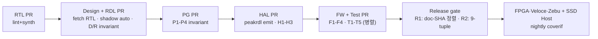

# 4. 정합성 CI — Hybrid Zone + 저장소별 invariant

## 4.1 핵심 정책 — Authored Zone vs Shadow Zone

문서를 3개 저장소로 쪼개면 수동 변경이 늘어 정합성 이슈가 생긴다.

**Hybrid 해법** — 각 문서를 두 영역으로 분리:

| Zone | 정의 | 예시 |
|---|---|---|
| **Authored** (사람 자유) | 의도·rationale·예제 | HLD 전체, DLD §1-4, PG §1-5, §6 worked example, §8 pitfall, RDL field `desc`, HAL.c 본문 |
| **Shadow** (자동 sync, 수동 차단) | 사실·이름·offset | DLD §5 regmap, RDL register offset/width, IP-XACT XML, HAL.h, PG §6 함수 시그너처 |

Shadow zone 은 마크다운 주석으로 명시:
```markdown
<!-- @shadow:gen src=rtl/nvme_ctrl.sv -->
| Register | Offset | Width | Access |
| CC       | 0x14   | 32    | RW     |
| CSTS     | 0x1C   | 32    | RO     |
<!-- @shadow:end -->
```

CI 가 shadow zone 의 수동 편집을 PR 차단. **사람 지식 보존 + drift 차단 동시 달성**.

## 4.2 저장소별 invariant 매트릭스

| Repo | 핵심 invariants | tag |
|---|---|---|
| ① RTL | lint · smoke synth | `rtl-v*` |
| ② Design | D1 RTL ↔ DLD shadow · D2 shadow 수동 차단 · D3 HLD ↔ DLD · D4 diagram ↔ SVG | `design-v*` |
| ③ RDL | R1 RTL ↔ RDL shadow · R2 shadow 차단 · R3 peakrdl emit OK | `rdl-v*` |
| ④ PG | P1 HAL.h ↔ §6 시그너처 (shadow) · P2 shadow 차단 · **P4 RTL 직접 참조 금지** | `pg-v*` |
| ⑤ HAL | H1 HAL.h = peakrdl(RDL) · H2 HAL.c ↔ HAL.h · H3 host smoke | `hal-v*` |
| ⑥ Spec | S1 PDF ↔ MD extract 짝 | `spec-v*` |
| ⑦ FW | F1 HAL 콜 ↔ HAL.h · F2 submodule monotonic · **F3 RTL #include 금지** · F4 host smoke | `fw-v*` |
| ⑧ Test | T1 Python ↔ §6 · T2 regress ↔ §8 · **T4 RTL 참조 금지** · T5 pytest collect | `test-v*` |
| Release | **R1**: FW · Test 의 5/4 개 doc submodule SHA 일치 · R2 9-tuple manifest 완결 | `release-v*` |

## 4.3 RTL 직접 참조 금지의 구조적 보장

| 지점 | 검사 | 위반 시 |
|---|---|---|
| PG | P4: PG markdown 안에 `*.sv` 직접 링크 regex | PG PR fail |
| FW | F3: FW source 의 `#include` 정적 분석 | FW PR fail |
| Test | T4: Test source 에 RTL path/import 검사 | Test PR fail |

이 셋이 §5.2 의 "RTL 직접 참조 금지" 를 **구조**로 강제한다 (문화·convention 아님).

## 4.4 CI 흐름 (4-단계 파이프라인)



PR latency 짧음, 실패 시 책임 부서 명확.

## 4.5 본 레포의 참조 구현 (concept proof)

[`tools/ipflow.py`](../../tools/ipflow.py) 가 한 저장소 안에서 동일 invariant 들을 실증 ([`docs/VERIFICATION_REPORT.md`](../VERIFICATION_REPORT.md), `irq_ctrl` · `trng` 두 IP 모두 PASS). 운영은 위 8-repo 분리.

→ §5 가 이 견고한 CI 위에서 Claude 가 어떻게 자동 생성하고 자체 검증하는지 다룬다.
