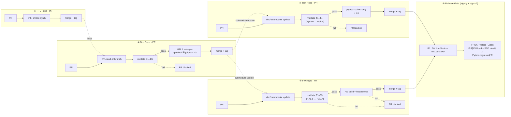

# 4. RTL ↔ 문서 정합성 CI — 정합성을 "정책"이 아니라 "빌드 시스템"으로

본 장은 본 제안의 가장 차별적인 요소를 다룬다: **문서 정합성을 사람의
성실성에 맡기지 않고 CI가 강제**한다. 본 레포에는 이미 동작하는 참조
구현이 있으며 ([`tools/ipflow.py`](../../tools/ipflow.py), 764 lines),
이 장은 그 구현을 인용 가능한 형태로 정리한다.

---

## 4.1 핵심 명제

> **"RTL이 single source of truth라면, 그것과 다른 산출물 사이의 어떠한
> 불일치도 PR 시점에 fail이 되어야 한다."**

이 명제는 두 가지를 동시에 달성한다:
1. **문서 drift** 의 구조적 차단 — RTL과 문서가 어긋날 수 없다.
2. **AI 자동 생성 산출물에 대한 검증 게이트** — AI가 만든 헤더/HAL/시나리오
   가 RTL과 어긋나면 머지가 막힌다. 즉 AI의 환각도 CI가 잡는다.

---

## 4.2 Invariant — 8개 저장소 CI 매트릭스 + Hybrid 정책

정합성 검사는 한 곳에서 일어나지 않는다. **각 저장소의 CI** 가 자기 경계
안의 invariant 를 검사하고, **Release gate** 가 8개 저장소의 tag 정렬을
확정한다.

### 4.2.0 핵심 정책 — Authored Zone vs Shadow Zone (item 4)

문서를 3개 저장소로 분리하면 **수동 변경이 늘어 정합성 이슈**가 생긴다.
두 가지 접근:

| 옵션 | 내용 | 약점 |
|---|---|---|
| (a) 수동 변경 전면 금지 | 모든 문서를 RTL → auto-gen | HLD 설계 의도, PG worked example 같은 **인간 지식이 사라짐** |
| (b) 수동 변경 자유 + 사후 정합성 자동화 | 사람이 자유 편집, CI 가 검사·정정 | 큰 수동 편집은 자동 정정이 불가능 — 결국 (a) 와 같은 문제로 회귀 |

**본 제안의 선택 — Hybrid: Authored Zone + Shadow Zone**.

각 문서를 두 영역으로 명확히 분리한다:

- **Authored zone** (사람이 자유 편집)
  - HLD 전체, DLD §1-4 (개념·FSM·timing 설명)
  - PG §1-5 (개념·시퀀스), §6 worked example, §8 pitfall, §7 performance tips
  - RDL 의 field `desc` 텍스트
  - HAL.c 본문, FW driver/app, Python scenario 의 측정·assertion
- **Shadow zone** (자동 생성, **수동 편집 차단**)
  - DLD §5 register map 표 (RTL 에서 sync)
  - RDL 의 register/field offset·width·access (RTL 에서 sync)
  - IP-XACT XML 전체 (RDL 에서 peakrdl)
  - HAL.h 전체 (RDL 에서 peakrdl)
  - PG §6 의 함수 시그너처 부분 (HAL.h 에서 sync)

각 shadow zone 은 마크다운 주석 `<!-- @shadow:gen -->...<!-- @shadow:end -->`
으로 명시되고, CI 가 그 안의 수동 변경을 PR 차단. authored zone 은 자유.

이 정책의 효과:
- **사람 지식 보존** — HLD 설계 의도, PG worked example, RDL field desc 는 그대로 사람이 쓴다.
- **drift 차단** — register offset·width·시그너처 같은 "사실"은 자동 sync, 사람이 만지면 차단.
- **명확한 경계** — 어디까지가 사람 영역인지 PR 시점에 매우 명확.

### 4.2.1 RTL Repo CI

| # | Invariant | Source A | Source B |
|---|---|---|---|
| RT1 | Verible lint clean | `rtl/**/*.sv` | lint rules |
| RT2 | Smoke synth (가능한 IP) | `rtl/**/*.sv` | Verilator/yosys 합성 |

RTL Repo 는 다른 저장소가 fetch 할 source. tag `rtl-v*` 가 Phase 1 입력.

### 4.2.2 Design Repo CI (HLD / DLD)

| # | Invariant | Source A | Source B |
|---|---|---|---|
| D1 | RTL ↔ DLD §5 shadow zone | RTL Repo (fetch) | `<ip>/DLD.md` shadow block |
| D2 | DLD §5 shadow 수동 편집 차단 | git diff | shadow annotation 영역 |
| D3 | HLD ↔ DLD §1 cross-ref | `HLD.md` | `DLD.md §1` |
| D4 | Diagram source ↔ SVG | `diagrams/*.json` | `diagrams/*.svg` |

Pass → tag `design-v*`.

### 4.2.3 RDL Repo CI (SystemRDL)

| # | Invariant | Source A | Source B |
|---|---|---|---|
| R1 | RTL ↔ RDL shadow zone | RTL Repo (fetch) | `<ip>.rdl` shadow block (offset·width·access) |
| R2 | RDL shadow 수동 편집 차단 | git diff | shadow annotation 영역 |
| R3 | RDL → IP-XACT XML emit OK | `<ip>.rdl` | peakrdl 출력 |

Pass → tag `rdl-v*`.

### 4.2.4 PG Repo CI (Programmer's Guide)

PG Repo 는 Design Repo + RDL Repo 를 submodule (또는 read-only fetch) 로
참조하며 다음을 검사:

| # | Invariant | Source A | Source B |
|---|---|---|---|
| P1 | HAL.h export ↔ PG §6 함수 시그너처 (shadow) | `hal-v*` 의 HAL.h | PG §6 shadow block |
| P2 | PG §6 shadow 수동 편집 차단 | git diff | shadow annotation |
| P3 | PG 가 참조하는 RDL register 가 실재 | `rdl-v*` | PG cross-ref |
| P4 | PG 가 RTL 을 직접 참조하지 않음 (regex) | PG markdown | "RTL", "*.sv" 직접 링크 금지 |

Pass → tag `pg-v*`.

### 4.2.5 HAL Repo CI

| # | Invariant | Source A | Source B |
|---|---|---|---|
| H1 | HAL.h 전체가 RDL → peakrdl 결과와 일치 | `rdl-v*` peakrdl emit | `HAL.h` |
| H2 | HAL.c export ↔ HAL.h declaration | `HAL.h` | `HAL.c` symbol table |
| H3 | Host smoke pass | `HAL.c` + mock | `make test` |
| H4 | HAL Repo 의 `rdl/` submodule SHA 단조 증가 | submodule SHA | tag history |

Pass → tag `hal-v*`.

### 4.2.6 FW Repo CI

FW Repo 는 5개 submodule (HAL · PG · RDL · Design · Spec) mount 상태에서:

| # | Invariant | Source A | Source B |
|---|---|---|---|
| F1 | HAL.c export ↔ FW 가 호출하는 HAL 함수 | submodule `hal-v*` 의 HAL.h | `fw/**/*.c` |
| F2 | 5개 submodule SHA 단조 증가 | submodule SHA | 이전 release tag |
| F3 | FW 가 RTL 을 직접 include 하지 않음 (정적 검사) | FW source | `#include` 그래프 |
| F4 | Host smoke pass | FW source + mock | `make test` |
| F5 | Build OK (target toolchain) | FW source | binary |

Pass → tag `fw-v*`.

### 4.2.7 Test Repo CI

Test Repo 는 4개 submodule (PG · RDL · Design · Spec) mount 상태에서:

| # | Invariant | Source A | Source B |
|---|---|---|---|
| T1 | Python scenarios ↔ PG §6 worked example | submodule `pg-v*` §6 | `tests/scenarios/<ip>/sc_*.py` |
| T2 | Python regression ↔ PG §8 pitfall | submodule `pg-v*` §8 | `tests/scenarios/<ip>/regress_*.py` |
| T3 | 4개 submodule SHA 단조 증가 | submodule SHA | 이전 release tag |
| T4 | Test 가 RTL 을 직접 참조하지 않음 (정적 검사) | Test source | `import`·string 검색 |
| T5 | pytest --collect-only + lint | `tests/**/*.py` | pytest |

Pass → tag `test-v*`.

### 4.2.8 Spec Repo CI

| # | Invariant | Source A | Source B |
|---|---|---|---|
| S1 | 각 PDF 와 자동 추출 MD 의 짝 존재 | `*.pdf` (LFS) | `extracted/*.md` |
| S2 | MD extract 가 stale 이 아님 | PDF mtime | extract mtime |

Pass → tag `spec-v*`.

### 4.2.9 Release Gate (cross-repo)

| # | Invariant | 의미 |
|---|---|---|
| R1 | FW · Test 가 5개 doc submodule (Design · RDL · PG · HAL [FW only] · Spec) 의 SHA 를 같게 핀 | "두 팀이 같은 SW-HW 계약을 보고 있다" 강제 |
| R2 | Release manifest 의 9-tuple 완결 | `rtl-v* × design-v* × rdl-v* × pg-v* × hal-v* × spec-v* × fw-v* × test-v*` 가 모두 존재 |

R1 위반 = "FW 는 PG v3, Test 는 PG v2 로 검증" 같은 미세 분기 → 결과 해석 불가 → release 차단.

### 4.2.10 본 레포의 참조 구현 — Concept 검증

본 레포 [`tools/ipflow.py`](../../tools/ipflow.py) 는 이 invariant 들의
**개념 증명**으로, 한 저장소 안에서 모든 단계를 실증한다. 실제 운영은 위
8-repo 분리 모델로 이행하며, 같은 invariant 가 8개 CI 에 흩어진다.

---

## 4.3 CI에서의 흐름 — 4-repo 파이프라인

각 저장소의 CI 정의가 분리되어 있으면 (a) 권한이 자연스럽게 분리되고
(b) PR latency가 짧으며 (c) 실패 시 책임 부서가 명확하다. (a) Doc PR이
RTL/FW/Test의 PR을 blocking하지 않고, (b) FW와 Test가 같은 doc-tag를
보고 있는가는 release gate에서만 강제된다.

**본 레포의 [`.github/workflows/ipflow-validate.yml`](../../.github/workflows/ipflow-validate.yml)
는 이 4개의 파이프라인을 한 저장소에서 합쳐 구현한 학습용 참조**이다.

---

## 4.4 정합성이 "빌드 시스템"이 됐을 때 무엇이 따라오는가

### (a) 신규 IP 추가의 부담 감소
- IP 폴더 스켈레톤만 만들면 (`ipflow scaffold`) — 6 invariant 검사가
  PR 시점에 자동 강제된다. 추가 setup이 0.

### (b) RTL 변경의 영향 범위가 자동 추적
- RTL의 SFR 비트 폭이 1비트 늘어났다면:
  1. `DESIGN.md §5` 도 업데이트해야 invariant #1 통과.
  2. `*.ipxact.xml` 도 업데이트해야 invariant #1, #2 통과.
  3. `*_hal.h` 매크로도 갱신해야 invariant #2 통과.
- 즉 "잊고 안 했음" 같은 사고가 구조적으로 차단된다.

### (c) AI 자동 생성에 대한 안전망
- AI가 IP-XACT XML에서 HAL 헤더를 생성한다고 가정. CI가 invariant #2를
  검사하므로, **AI가 잘못 생성하면 머지 불가**. AI 출력은 사람이 처음부터
  믿을 필요가 없고, CI가 신뢰의 마지막 관문이 된다.

### (d) 문서 ↔ 검증의 닫힌 루프
- PG §6 worked example 이 Test Repo Python scenario 에 등재되지 않으면 **T1 fail**.
- PG §8 pitfall 이 회귀 시나리오로 변환되지 않으면 **T2 fail**.
- 즉 "**문서가 약속한 것은 반드시 검증된다**." PG 가 곧 verification plan.
- 실측 플랫폼은 SV TB 가 아니라 **FPGA + Veloce/Zebu** 에서 펌웨어 실행 + **SSD Host** 의 Python 이 NVMe·PCIe 로 구동.

### (e) RTL 직접 참조 차단의 구조적 보장
- PG 가 RTL 을 직접 참조하면 **P4 fail** (PG 안에 `*.sv` 링크 정규식).
- FW source 가 RTL header 를 include 하면 **F3 fail** (`#include` 정적 분석).
- Test source 가 RTL 을 import 하거나 path 로 언급하면 **T4 fail**.
- 이 셋이 함께 작동해 §5.2 의 참조 위계 규칙 ("RTL 직접 참조 금지") 을 **구조적**으로 보장한다.

---

## 4.5 실증 — 본 레포의 두 reference IP (Concept proof)

[`docs/VERIFICATION_REPORT.md`](../VERIFICATION_REPORT.md) 가 본 레포의
두 참조 IP에 대해 closed-loop이 실제로 동작함을 기록한다:

- **`irq_ctrl`** (PLIC 계열) — 6 invariant PASS, scenarios.yaml + SV TB
  smoke pass, host smoke 16/16 PASS.
- **`trng`** — closed-loop의 두 번째 살아있는 참조.

CI 최신 run 기록: `ipflow-validate #25928231471 success`.

> **참조와 운영 모델의 관계**. 위 두 IP는 한 저장소 안에서 9-stage
> closed-loop의 모든 산출물(RTL → 문서 → SFR → HAL → scenarios → TB)이
> 동작함을 **개념적으로 증명**한다. 운영 환경에서는 이 산출물들이 §2.1
> 의 3-repo 모델로 흩어지며, 검증의 마지막 단계가 SV TB에서 **FW + Python
> scenarios on FPGA/Veloce/Zebu**로 대체된다. 즉 본 레포의 SV TB는
> "invariant 검사 가능성"을 증명하는 학습용 백본이고, 실제 SSD Controller
> 검증의 무게중심은 FW Repo에서 펌웨어로 옮겨간다.

---

## 4.6 정합성 CI가 보장하지 않는 것 (정직하게)

| Invariant가 잡는 것 | Invariant가 잡지 못하는 것 |
|---|---|
| 구조적 1:1 매핑 (이름·offset·width·access) | RTL의 기능적 정확성 (그건 시뮬레이션 cover) |
| 문서 ↔ 헤더 ↔ HAL ↔ 시나리오의 그래프 정합성 | 가이드 §6의 worked example의 의도적 정확성 (그건 리뷰 cover) |
| Diagram 소스 ↔ 렌더 동기화 | Diagram이 의미적으로 옳은가 (그건 리뷰 cover) |

이 셋은 사람·시뮬레이션·리뷰의 영역이며, CI가 잡는 게 아니다. 그러나
"잡을 수 있는 것은 모두 잡는다"는 원칙으로 사람의 부담을 의미 있는
영역에 집중시킬 수 있다.

다음 장(5장)에서 이 견고한 CI 위에 **AI가 어떻게 산출물을 자동 생성하고,
사람이 어떻게 그것을 안전하게 받아들이는가**를 다룬다.
