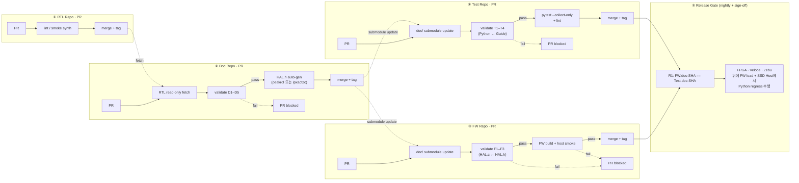

# 4. RTL ↔ 문서 정합성 CI — 정합성을 "정책"이 아니라 "빌드 시스템"으로

본 장은 본 제안의 가장 차별적인 요소를 다룬다: **문서 정합성을 사람의
성실성에 맡기지 않고 CI가 강제**한다. 본 레포에는 이미 동작하는 참조
구현이 있으며 ([`tools/ipflow.py`](../../tools/ipflow.py), 764 lines),
이 장은 그 구현을 인용 가능한 형태로 정리한다.

---

## 4.1 핵심 명제

> **"RTL이 single source of truth라면, 그것과 다른 산출물 사이의 어떠한
> 불일치도 PR 시점에 fail이 되어야 한다."**

이 명제는 두 가지를 동시에 달성한다:
1. **문서 drift** 의 구조적 차단 — RTL과 문서가 어긋날 수 없다.
2. **AI 자동 생성 산출물에 대한 검증 게이트** — AI가 만든 헤더/HAL/시나리오
   가 RTL과 어긋나면 머지가 막힌다. 즉 AI의 환각도 CI가 잡는다.

---

## 4.2 Invariant — 3개 저장소(Doc / FW / Test) CI로 분산

정합성 검사는 한 곳에서 모두 일어나지 않는다. **Doc Repo CI**는 RTL과
문서의 일치를, **FW Repo CI**는 그 문서(submodule)와 펌웨어의 일치를,
**Test Repo CI**는 그 문서와 Python coverif scenario의 일치를 본다.
경계 위의 일관성(FW와 Test가 같은 doc-tag를 보고 있는가)은 **release
gate**가 본다.

### 4.2.1 Doc Repo CI invariant

Doc Repo는 PR 시점에 RTL Repo를 read-only fetch한 뒤 다음을 검사한다:

| # | Invariant | Source A | Source B |
|---|---|---|---|
| D1 | RTL ↔ DLD §5 register map | RTL Repo의 `rtl/**/*.sv` (fetch) | `doc/<ip>/DLD.md §5` |
| D2 | DLD §5 ↔ SFR (RDL/XACT) | `doc/<ip>/DLD.md §5` | `doc/<ip>/<ip>.rdl` 또는 `.ipxact.xml` |
| D3 | SFR ↔ HAL.h (auto-gen) | `<ip>.rdl` / `.ipxact.xml` | `include/<ip>_hal.h` |
| D4 | Diagram source ↔ SVG | `doc/<ip>/diagrams/*.json` | `doc/<ip>/diagrams/*.svg` |
| D5 | HAL.h ↔ Programmer's Guide §6 함수 목록 | `include/<ip>_hal.h` | `doc/<ip>/PROGRAMMERS_GUIDE.md §6` |

Doc Repo가 PR pass + 새 tag release하면, **FW Repo와 Test Repo가 모두**
그 tag로 submodule을 끌어올린다.

### 4.2.2 FW Repo CI invariant

FW Repo는 Doc Repo가 `doc/`에 submodule로 mount되어 있는 상태에서
펌웨어 영역을 검사한다:

| # | Invariant | Source A | Source B |
|---|---|---|---|
| F1 | HAL.c export ↔ HAL.h (submodule) | `doc/include/<ip>_hal.h` | `fw/hal/<ip>_hal.c` |
| F2 | FW Repo `doc/` SHA 단조 증가 | `doc/` submodule SHA | 이전 release tag |
| F3 | Host smoke pass | `fw/hal/*_hal.c` + `fw/tests/host/*` | `make test` 결과 |

### 4.2.3 Test Repo CI invariant

Test Repo는 같은 Doc Repo submodule을 mount한 상태에서 SSD Host에서
실행될 Python coverif scenario의 정합성을 검사한다:

| # | Invariant | Source A | Source B |
|---|---|---|---|
| T1 | Python scenarios ↔ Guide §6 worked example | `doc/<ip>/PROGRAMMERS_GUIDE.md §6` | `tests/scenarios/<ip>/sc_*.py` |
| T2 | Python regression ↔ Guide §8 pitfall | `doc/<ip>/PROGRAMMERS_GUIDE.md §8` | `tests/scenarios/<ip>/regress_*.py` |
| T3 | Test Repo `doc/` SHA 단조 증가 | `doc/` submodule SHA | 이전 release tag |
| T4 | Scenario static check (pytest collect, lint) | `tests/scenarios/**/*.py` | `pytest --collect-only` 결과 |

### 4.2.4 Release gate — FW와 Test의 doc 정렬

릴리스 매니페스트를 만드는 별도 CI 단계(또는 사람 사인오프)가 다음을 강제한다:

| # | Invariant | Source A | Source B |
|---|---|---|---|
| R1 | FW와 Test가 같은 doc-tag를 본다 | FW Repo의 `doc/` SHA | Test Repo의 `doc/` SHA |
| R2 | Release manifest의 4-tuple 완결 | `rtl-v* × doc-v* × fw-v* × test-v*` | 모든 tag 존재·접근 가능 |

R1이 위반되면 "FW는 doc v2.5, Test는 doc v2.4로 검증" 같은 미세 분기가
발생해 결과 해석이 불가능해진다. 따라서 release 시점 강제.

### 4.2.5 본 레포의 참조 구현 — Concept 검증

본 레포 [`tools/ipflow.py`](../../tools/ipflow.py)는 이 invariant들의
**개념 증명**으로, 한 저장소 안에서 모든 단계를 실증한다 (`scenarios.yaml`
+ SV TB는 IP-level smoke). 실제 운영은 위 4-repo 분리 모델로 이행하며,
같은 invariant가 Doc / FW / Test 저장소 CI에 흩어진다.

---

## 4.3 CI에서의 흐름 — 4-repo 파이프라인

각 저장소의 CI 정의가 분리되어 있으면 (a) 권한이 자연스럽게 분리되고
(b) PR latency가 짧으며 (c) 실패 시 책임 부서가 명확하다. (a) Doc PR이
RTL/FW/Test의 PR을 blocking하지 않고, (b) FW와 Test가 같은 doc-tag를
보고 있는가는 release gate에서만 강제된다.

**본 레포의 [`.github/workflows/ipflow-validate.yml`](../../.github/workflows/ipflow-validate.yml)
는 이 4개의 파이프라인을 한 저장소에서 합쳐 구현한 학습용 참조**이다.

---

## 4.4 정합성이 "빌드 시스템"이 됐을 때 무엇이 따라오는가

### (a) 신규 IP 추가의 부담 감소
- IP 폴더 스켈레톤만 만들면 (`ipflow scaffold`) — 6 invariant 검사가
  PR 시점에 자동 강제된다. 추가 setup이 0.

### (b) RTL 변경의 영향 범위가 자동 추적
- RTL의 SFR 비트 폭이 1비트 늘어났다면:
  1. `DESIGN.md §5` 도 업데이트해야 invariant #1 통과.
  2. `*.ipxact.xml` 도 업데이트해야 invariant #1, #2 통과.
  3. `*_hal.h` 매크로도 갱신해야 invariant #2 통과.
- 즉 "잊고 안 했음" 같은 사고가 구조적으로 차단된다.

### (c) AI 자동 생성에 대한 안전망
- AI가 IP-XACT XML에서 HAL 헤더를 생성한다고 가정. CI가 invariant #2를
  검사하므로, **AI가 잘못 생성하면 머지 불가**. AI 출력은 사람이 처음부터
  믿을 필요가 없고, CI가 신뢰의 마지막 관문이 된다.

### (d) 문서 ↔ 검증의 닫힌 루프
- Programmer's Guide §6의 worked example이 Test Repo의 Python scenario에
  등재되지 않으면 **T1 invariant fail**.
- Guide §8의 pitfall이 회귀 시나리오로 변환되지 않으면 **T2 invariant fail**.
- 즉 "**문서가 약속한 것은 반드시 검증된다**." 가이드가 곧
  verification plan이 되며, 별도 v-plan 산출물이 필요 없어진다.
- 실측 플랫폼은 SV TB가 아니라 **FPGA + Veloce/Zebu에서 펌웨어가
  실행**되고, **SSD Host의 Python**이 NVMe·PCIe 명령·전력 시퀀스·에러 주입을 구동한다 — 실제 SSD가 동작하는 환경과 동일.

---

## 4.5 실증 — 본 레포의 두 reference IP (Concept proof)

[`docs/VERIFICATION_REPORT.md`](../VERIFICATION_REPORT.md) 가 본 레포의
두 참조 IP에 대해 closed-loop이 실제로 동작함을 기록한다:

- **`irq_ctrl`** (PLIC 계열) — 6 invariant PASS, scenarios.yaml + SV TB
  smoke pass, host smoke 16/16 PASS.
- **`trng`** — closed-loop의 두 번째 살아있는 참조.

CI 최신 run 기록: `ipflow-validate #25928231471 success`.

> **참조와 운영 모델의 관계**. 위 두 IP는 한 저장소 안에서 9-stage
> closed-loop의 모든 산출물(RTL → 문서 → SFR → HAL → scenarios → TB)이
> 동작함을 **개념적으로 증명**한다. 운영 환경에서는 이 산출물들이 §2.1
> 의 3-repo 모델로 흩어지며, 검증의 마지막 단계가 SV TB에서 **FW + Python
> scenarios on FPGA/Veloce/Zebu**로 대체된다. 즉 본 레포의 SV TB는
> "invariant 검사 가능성"을 증명하는 학습용 백본이고, 실제 SSD Controller
> 검증의 무게중심은 FW Repo에서 펌웨어로 옮겨간다.

---

## 4.6 정합성 CI가 보장하지 않는 것 (정직하게)

| Invariant가 잡는 것 | Invariant가 잡지 못하는 것 |
|---|---|
| 구조적 1:1 매핑 (이름·offset·width·access) | RTL의 기능적 정확성 (그건 시뮬레이션 cover) |
| 문서 ↔ 헤더 ↔ HAL ↔ 시나리오의 그래프 정합성 | 가이드 §6의 worked example의 의도적 정확성 (그건 리뷰 cover) |
| Diagram 소스 ↔ 렌더 동기화 | Diagram이 의미적으로 옳은가 (그건 리뷰 cover) |

이 셋은 사람·시뮬레이션·리뷰의 영역이며, CI가 잡는 게 아니다. 그러나
"잡을 수 있는 것은 모두 잡는다"는 원칙으로 사람의 부담을 의미 있는
영역에 집중시킬 수 있다.

다음 장(5장)에서 이 견고한 CI 위에 **AI가 어떻게 산출물을 자동 생성하고,
사람이 어떻게 그것을 안전하게 받아들이는가**를 다룬다.
