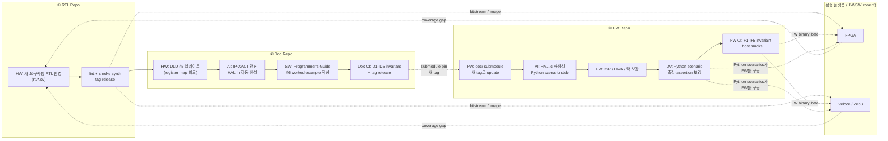

# 6. End-to-End 워크플로우 — Base SoC에서 신규 SoC까지

본 장은 본 제안이 **현장에서 어떻게 흘러가는가**를 신규 SoC 부트스트랩
시나리오로 보인다. 4개 부서(HW / SW / Co-verif / FW)가 어느 시점에
어떤 산출물을 주고받는지 swim lane으로 정리한다.

---

## 6.1 부서·저장소 매트릭스 (swim lane)



핵심: **AI는 "정합성 잡일"을 흡수**하고, 사람은 "**의도 정의**" (HW의 RTL,
SW의 가이드, FW의 ISR/락, DV의 측정·assertion)에 집중한다. 검증의 마지막
페이지는 **FPGA + Veloce/Zebu 위에서 펌웨어가 실제 시나리오를 수행**하는
HW/SW coverif이다.

---

## 6.2 8단계 워크플로우 (구체적 명령 포함)

### Step 1 — Base 선정 (RTL Repo · Doc Repo · FW Repo 세 갈래)
- HW lead가 가장 유사한 in-house Base SoC를 선정.
- 변경이 필요한 IP가 속한 **RTL Repo branch**를 cut.
- **Doc Repo**는 그대로 유지 (해당 IP의 doc 영역만 수정 예정).
- **FW Repo**는 fork 또는 새 branch — Doc Repo의 현재 tag를 submodule pin.
  ```bash
  cd fw-repo && git checkout -b derivative/new-soc
  git submodule update --init --remote doc/
  git -C doc/ checkout v2.4.0   # base doc tag
  ```

### Step 2 — RTL Repo: 새 요구사항 반영
- 예: `nvme_ctrl`에 NVMe 1.4 admin queue 확장 추가.
- `rtl/nvme_ctrl.sv` 수정, lint pass, RTL Repo CI green → tag (e.g. `rtl-v3.2.0`).

### Step 3 — Doc Repo: DLD §5 + AI가 IP-XACT 갱신
- HW가 `doc/nvme_ctrl/DLD.md §5` register map을 직접 수정 (의도 정의).
- Doc Repo CI는 RTL Repo의 `rtl-v3.2.0`을 read-only fetch하여 D1 (RTL ↔ DLD) 검사.
- AI가 `doc/nvme_ctrl/nvme_ctrl.ipxact.xml`을 갱신 → D2, D3 통과.
- AI가 `include/nvme_ctrl_hal.h`를 IP-XACT에서 재생성 → D3 통과.
- SW lead가 `doc/nvme_ctrl/PROGRAMMERS_GUIDE.md §6`에 새 worked example 추가.
- Doc Repo CI green → tag (e.g. `doc-v2.5.0`).

### Step 4 — FW Repo: submodule 갱신 + AI 자동 생성
```bash
cd fw-repo
git submodule update --remote doc/           # 새 doc tag로 이동
git -C doc/ checkout doc-v2.5.0
ai update-hal-and-scenarios nvme_ctrl        # AI가 시나리오 C, D 실행
```
다음을 갱신한다:
- `fw/hal/nvme_ctrl_hal.c` — HAL 함수 본문 (Guide §6 시퀀스를 1:1 변환)
- `tests/scenarios/nvme_ctrl/sc_admin_queue_enable.py` — Python coverif 시나리오
- `tests/scenarios/nvme_ctrl/regress_*.py` — Guide §8 pitfall 회귀

### Step 5 — FW: ISR / DMA / 락 보강
- AI가 만든 HAL을 FW lead가 review.
- 환경별 ISR 등록·락·DMA 정책 등 사람 영역 보강.
- `make test` host smoke pass 확인 (F5).

### Step 6 — DV: Python 시나리오 보강 (corner case · 측정)
- AI가 만든 시나리오에 측정 metric (latency·error 카운트·전력)과 corner case 추가.
- pre/post assertion 강화.
- F2, F3 invariant 통과 확인.

### Step 7 — FW Repo CI: F1–F5 + 시뮬레이션 게이트
- PR 시점 자동 실행: F1–F5 invariant + host smoke (Verilator IP-level smoke가 있다면 같이 실행).
- 모두 pass면 merge → tag (e.g. `fw-v1.7.0`).

### Step 8 — FPGA / Veloce / Zebu에서 HW/SW coverif 실행
- RTL Repo `rtl-v3.2.0`이 합성/에뮬레이션되어 **FPGA bitstream** 또는 **Veloce/Zebu image**가 준비됨 (별도 빌드 인프라).
- FW Repo `fw-v1.7.0`이 빌드된 binary를 그 플랫폼에 로드.
- DV가 `tests/scenarios/nvme_ctrl/*.py`를 nightly + regression suite로 실행.
- 결과(metric·assertion·coverage)가 dashboard로 수집.
- coverage gap → Step 2로 되돌아감 (RTL 또는 scenario 추가).

---

## 6.3 부서간 산출물 인계 정의

| 인계 시점 | 인계자 → 수신자 | 산출물 / 매개 |
|---|---|---|
| Step 2 종료 | HW → Doc Repo CI | RTL Repo의 새 tag (`rtl-v*`) |
| Step 3 종료 | HW + SW + AI → Doc Repo CI | DLD §5 · IP-XACT · HAL.h · Guide §6, §8 |
| Step 3 → Step 4 | Doc Repo → FW Repo | `doc-v*` tag (submodule pin) |
| Step 4 종료 | AI → FW · DV | HAL.c 초안, Python scenario 초안 |
| Step 5 종료 | FW → DV | 검증된 HAL.c + host smoke |
| Step 6 종료 | DV → FW Repo CI | 보강된 Python scenarios |
| Step 7 종료 | FW Repo CI → 검증 플랫폼 | `fw-v*` tag · FW binary |
| Step 8 결과 | 검증 플랫폼 → 전체 | metric / assertion / coverage 대시보드 |

각 인계는 **모두 git tag / submodule SHA**로 일어난다. Slack DM·메일
첨부·Confluence 페이지 없음. "어느 RTL × 어느 doc × 어느 FW로 측정했나"
가 항상 한 줄로 확정된다 — `rtl-v3.2.0 × doc-v2.5.0 × fw-v1.7.0`.

---

## 6.4 신규 SoC 부트스트랩의 정량적 이점

| 항목 | Before (수동) | After (submodule + AI) |
|---|---|---|
| Base SoC 복제 시간 | 2–5일 (수동 export·정리) | 분 단위 (`git submodule add`) |
| 변경 IP의 산출물 재생성 | 5종 × 사람 = 1–2주 | AI 초안 + 사람 review = 1–2일 |
| 산출물 정합성 검증 | 수동 cross-check, 누락 다수 | CI 자동 PASS/FAIL |
| FW 팀 부트스트랩 | 별도 spec 패키지 전달 | super-repo clone 한 번 |
| 신규 SoC 1차 tape-out 준비 | 분기 단위 | 월 단위 (단축 추정) |

이 정량은 산업 평균과 일치한다. McKinsey 2025[^1]에 따르면 AI 코딩 도구는
well-defined task에서 20–45% 생산성 향상을 보이며, 본 워크플로우는
"context를 결정론적으로 주는" 전제를 만족하므로 **상한값에 가깝게**
나타날 수 있다.

---

## 6.5 회귀 / 사고 / drift에 대한 대처

| 시나리오 | 대처 |
|---|---|
| RTL 변경 후 가이드/IP-XACT 미갱신 | Doc Repo D1·D2 fail → Doc PR 차단 (FW까지 안 감) |
| AI가 만든 HAL.h에 환각 | Doc D3 fail (IP-XACT ↔ HAL.h) → Doc PR 차단 |
| FW가 stale doc tag로 머묾 | FW Repo CI가 `doc/` SHA의 monotonic 진행 검사 (F4) — release 시 outdated 경고 |
| DV가 Python scenario를 Guide에서 빠뜨림 | FW Repo F2 fail → FW PR 차단 |
| Pitfall 회귀 누락 | F3 fail → FW PR 차단 |
| FPGA / Emulator에서만 보이는 결함 | coverage gap report → Step 2로 회귀 (RTL 또는 scenario 추가) |

이 모든 대처는 사람의 성실성이 아니라 **CI 또는 git의 native 기능**에
의존한다.

다음 장(7장)에서 본 워크플로우가 최신 LLM Wiki 트렌드와 어떻게
비교되는지, 그리고 왜 우리가 "한 발 앞섰는가"를 정리한다.

---

[^1]: McKinsey 2025, [Productivity gains from AI coding tools — RAGFlow 회고에서 인용](https://ragflow.io/blog/rag-review-2025-from-rag-to-context).
