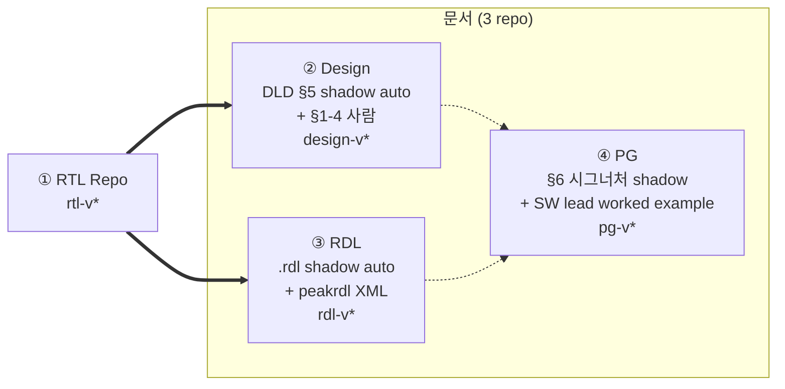
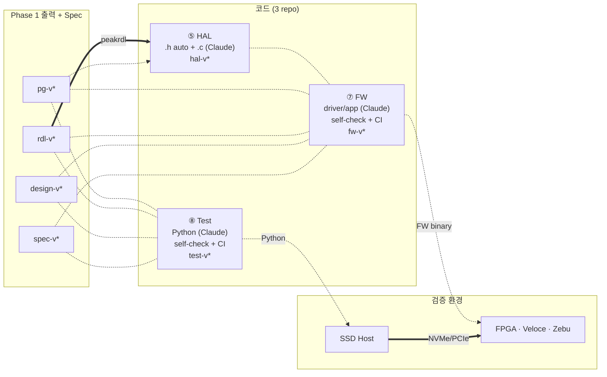

# 6. RTL 변경 전파 — Phase 1/2 흐름

"RTL 한 줄 바꾸면 무엇이 어떻게 자동으로 따라가는가" 에 답한다.

## 6.1 Phase 1 — RTL → 문서 (자동 + 사람 검토, 1–2일)

**원칙**:
- 체인 단방향: RTL → Design · RDL → PG. PG 는 RTL 직접 fetch 안 함 (§5.2 보장).
- Hybrid: shadow zone = RTL 에서 auto, authored zone = 사람.
- 각 doc 독립 tag release.

## 6.2 Phase 2 — 문서 → 코드 (Claude + CI, 3–4일)

**원칙**:
- Claude 가 1차 작성, **PG/RDL primary, RTL 금지** (§5.2).
- Self-check (§5.4) → CI (§4.2) → 사람 리뷰.
- 검증 두 면: FW on FPGA·Veloce·Zebu, Python on SSD Host.

## 6.3 실제 흐름 예시 — nvme_ctrl admin queue 확장

| Day | 단계 | 산출 |
|---|---|---|
| 1 | RTL: `rtl/nvme_ctrl.sv` 변경 + tag `rtl-v3.2.0` | RTL PR |
| 1–2 | Design CI fetch → DLD §5 shadow auto + HW lead §1-4 보강 → `design-v2.5.0` | DLD 갱신 |
| 1–2 | RDL CI fetch → `.rdl` shadow auto + peakrdl emit → `rdl-v1.8.0` | RDL · IP-XACT · HAL.h |
| 2–3 | PG: §6 시그너처 shadow auto + SW lead worked example → `pg-v3.1.0` | PG 갱신 |
| 3–4 | HAL: HAL.h re-gen + Claude `HAL.c` 추가 → `hal-v1.4.0` | HAL.c |
| 4–6 | FW: 5 submodule 갱신 + Claude driver/app 패치 → `fw-v1.7.0` | FW binary |
| 4–6 (병렬) | Test: 4 submodule + Claude Python coverif → `test-v0.9.3` | Python suite |
| 6 | Release gate R1: 5/4 submodule SHA 정렬 확인 → 9-tuple release | manifest |
| 6+ | FPGA/Emul + SSD Host coverif | metric/report |

**Phase 1 + 2 합계 ≈ 1주** (이전 1개월+ → -75%).

## 6.4 누가 무엇을 — 자동 vs 사람 vs Claude

| 산출물 | Phase | 작성 주체 |
|---|---|---|
| DLD §5 shadow / RDL shadow / IP-XACT / HAL.h / PG §6 시그너처 | 1 | **자동** (RTL → script) |
| HLD, DLD §1-4, RDL field desc, PG §1-5/§6 worked example/§8 pitfall | 1 | **사람** (의도) |
| HAL.c, FW driver/app, Python coverif | 2 | **Claude** (작성 + self-check) → 사람 검토 |
| FW ISR/락/DMA 정책, Python 측정·assertion 의도 | 2 | **사람** (의도) |

> **귀결**: 사람은 **의도**, Claude 는 **사실**, CI 는 **정합성**.

## 6.5 인계는 모두 git tag

| 시점 | 인계 | 매개 |
|---|---|---|
| Phase 1 시작 | RTL → Design · RDL CI | `rtl-v*` |
| Phase 1 종료 | PG → 모든 코드 repo | `pg-v*` (+ design + rdl) |
| Phase 2 시작 | RDL+PG → HAL | submodule + peakrdl |
| Phase 2 종료 | FW · Test → Release gate | `fw-v*` · `test-v*` |
| Release | 9-tuple manifest → 검증 환경 | `rtl × design × rdl × pg × hal × spec × fw × test` |

Slack DM · 메일 첨부 · Confluence 페이지 **없음**.

## 6.6 회귀·drift 대처 (CI 차단 지점)

| 시나리오 | 차단 |
|---|---|
| RTL 변경 후 DLD/RDL 미갱신 | D1 / R1 fail (Phase 1 막힘) |
| Claude HAL.h 환각 | H1 fail (RDL ↔ HAL.h) |
| FW가 stale doc | F2 fail (submodule monotonic) |
| FW · Test가 다른 doc-tag | **R1 fail** (release 차단) |
| Python scenario 누락 | T1 fail |
| FW · Test 가 RTL 직접 참조 | **P4 / F3 / T4 fail** |
| FPGA/Emul 에서만 보이는 결함 | coverage gap → Phase 1 회귀 |

→ §7 가 12주 일제 전환 step-by-step 으로 마이그레이션 경로를 보인다.
