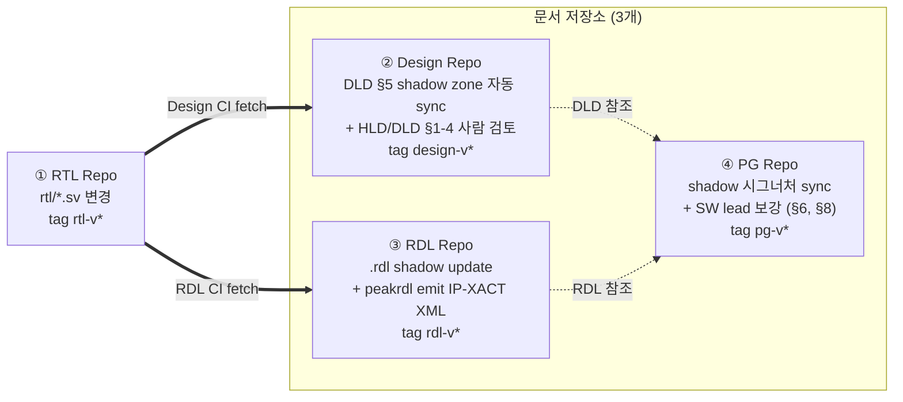
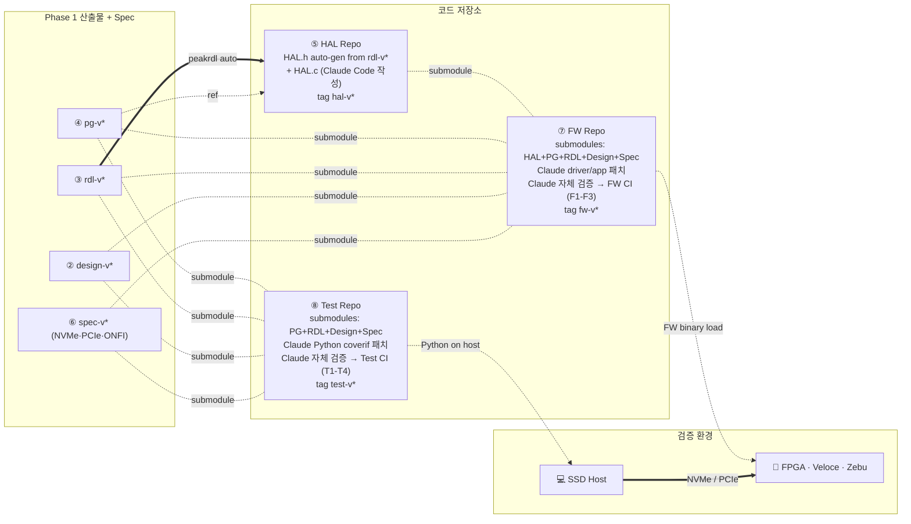

# 6. End-to-End 워크플로우 — RTL 변경의 Phase 1/2 전파

본 장은 **"RTL 한 줄을 바꾸면 무엇이 어떻게 자동으로 따라가는가"** 에 답한다.
전파는 명확히 **2 페이즈**로 나뉘며, 각 페이즈는 독립적으로 release 된다.

- **Phase 1 — RTL → 문서**: RTL 변경이 Design (HLD/DLD) · RDL (SystemRDL) ·
  PG (Programmer's Guide) 3개 저장소로 자동 전파. 자동 생성 (shadow zone)
  + 사람 검토 (authored zone) + 각 doc tag release.
- **Phase 2 — 문서 → 코드**: Doc tag 들이 HAL · FW · Test 로 전파. Claude
  Code 가 변경을 적용하고 자체 검증, CI 가 신뢰의 마지막 관문.

---

## 6.1 Phase 1 — RTL → 문서 (자동 + 사람 검토)

**Phase 1 의 핵심 원칙**:

| 원칙 | 의미 |
|---|---|
| **체인이 단방향** | RTL → Design · RDL → PG. PG 는 RTL 을 직접 fetch 하지 않고, Design + RDL 만 본다. 이것이 §5 의 "RTL 직접 참조 금지" 의 구조적 보장. |
| **자동 + 검토 (hybrid)** | shadow zone (regmap 표·시그너처) 은 RTL 에서 자동 sync. authored zone (rationale·worked example·pitfall) 은 사람이 보강. §4 §4.2 의 hybrid 정책. |
| **각 doc 가 독립 tag release** | `design-v*` · `rdl-v*` · `pg-v*` 가 각자 진행. Phase 2 가 이 5개 (Design+RDL+PG+HAL+Spec) tag 를 핀. |
| **AI 가 사람 작업 보조** | shadow auto-gen 은 결정론적 스크립트. AI 는 authored zone 의 초안만 제공 (예: §8 pitfall 후보를 기존 버그 트래커에서 추출). |

### Phase 1 의 실제 흐름 (nvme_ctrl 예시, RTL admin queue 확장)

1. **Week 1 Day 1** — RTL designer 가 `rtl/nvme_ctrl.sv` 에 새 레지스터 추가, RTL Repo PR + tag `rtl-v3.2.0`.
2. **Day 1–2** — Design Repo CI 가 `rtl-v3.2.0` fetch → DLD §5 register map shadow zone 자동 갱신 → HW lead 가 DLD §1-4 (의도·timing) 보강 → PR merge → `design-v2.5.0`.
3. **Day 1–2 (병렬)** — RDL Repo CI 가 `rtl-v3.2.0` fetch → SystemRDL `.rdl` shadow update + peakrdl emit (IP-XACT XML) → 검토 → PR merge → `rdl-v1.8.0`.
4. **Day 2–3** — PG Repo CI 가 `design-v2.5.0` + `rdl-v1.8.0` fetch → §6 worked example 의 시그너처 shadow sync → SW lead 가 새 시퀀스 (admin queue enable + identify) 의 **worked example 작성** + §8 pitfall 추가 → PR merge → `pg-v3.1.0`.

이 3개 tag (design + rdl + pg) 가 Phase 2 의 입력이 된다.

---

## 6.2 Phase 2 — 문서 → 코드 (Claude Code + CI)

**Phase 2 의 핵심 원칙**:

| 원칙 | 의미 |
|---|---|
| **Claude Code 가 1차 작성** | HAL.c · driver/app 패치 · Python scenario 를 Claude 가 작성. 입력: **PG + RDL (primary), Design (fallback), Spec (필요 시)**. **RTL 직접 참조 금지** (§5.2). |
| **Claude 자체 검증** | PR 생성 전 Claude 가 자기 출력물을 doc invariant 와 비교 (`pre-PR self-check`). 환각 1차 차단. 상세: §5.3. |
| **CI 가 신뢰의 마지막 관문** | F1–F3 (FW) · T1–T4 (Test) · Release gate R1 (5 doc-SHA 정렬) 이 PR 시점에 자동 실행. AI 신뢰는 CI 가 검증. |
| **검증 환경 두 면** | FW 는 FPGA·Veloce·Zebu 에 binary 로 load, Test 의 Python 은 SSD Host 에서 NVMe/PCIe 로 SoC 구동. |

### Phase 2 의 실제 흐름 (위 예시 이어서)

5. **Day 3–4** — HAL Repo: `rdl-v1.8.0` 의 peakrdl 결과로 `HAL.h` 재생성 → Claude Code 가 `HAL.c` 에 새 함수 (`hal_nvme_admin_enable` 등) 추가 → Claude 자체 검증 (시그너처 match · 사용 패턴 PG §6 호환) → HAL CI → `hal-v1.4.0`.
6. **Day 4–6** — FW Repo: 5개 submodule (HAL+PG+RDL+Design+Spec) 새 tag 로 갱신 → Claude Code 가 driver/app 패치 (Guide §6 worked example 따라) → Claude 자체 검증 → FW CI (F1–F3) + host smoke (F3) → FW lead 검토 → `fw-v1.7.0`.
7. **Day 4–6 (병렬)** — Test Repo: 4개 submodule 갱신 → Claude 가 `sc_admin_queue_enable.py` 등 Python coverif 패치 + `regress_*.py` (Guide §8 pitfall) 작성 → Claude 자체 검증 → Test CI (T1–T4) → DV 검토 (측정·assertion 보강) → `test-v0.9.3`.
8. **Day 6** — Release gate: `FW.{design,rdl,pg,hal,spec}-SHA == Test.{design,rdl,pg,spec}-SHA` 일치 확인 (R1 통과) → release manifest 확정.
9. **Day 6+** — FPGA bitstream / Veloce·Zebu image 빌드 → FW binary load → SSD Host 에서 `test-v0.9.3` 의 Python coverif 수행 → coverage report.

**Phase 1 + Phase 2 합계 ≈ 1주 (이전 워크플로우의 1개월+ 대비)**. AI 가
HAL.c · Python scenario · doc shadow zone 모두 흡수, 사람은 의도 영역에만
집중.

---

## 6.3 어디까지 자동, 어디부터 사람?

| 산출물 | Phase | 작성 주체 | 검증 |
|---|---|---|---|
| DLD §5 register map | 1 | shadow auto from RTL | Design CI D1 (RTL ↔ shadow) |
| HLD / DLD §1-4 (rationale, FSM, timing) | 1 | **사람 (Architect/RTL)** | Design CI D2 (cross-ref) |
| SystemRDL `.rdl` shadow | 1 | shadow auto from RTL | RDL CI R1 (RTL ↔ rdl) |
| RDL field description (의도) | 1 | **사람 (RTL designer)** | 리뷰 |
| IP-XACT XML | 1 | peakrdl auto from RDL | RDL CI R2 |
| HAL.h | 1→2 경계 | peakrdl auto from RDL | HAL CI H1 |
| PG §1-5 (개념·시퀀스) | 1 | **사람 (SW lead)** | PG CI P1 (HAL.h ↔ §6 시그너처) |
| PG §6 worked example | 1 | **사람 + AI 초안** | PG CI P2 (모든 worked example 이 HAL.h export 와 일치) |
| PG §8 pitfall | 1 | **사람 (incident log 에서 추출 보조: AI)** | (T2 invariant 가 회귀 강제) |
| HAL.c | 2 | **Claude Code** (자체 검증) | HAL CI + FW Repo F1 |
| FW driver / app 패치 | 2 | **Claude Code + FW lead 검토** | FW CI F1–F3 |
| Python coverif scenario | 2 | **Claude Code + DV 보강** | Test CI T1–T4 |
| Python 측정·assertion 의도 | 2 | **DV (사람)** | 리뷰 |

> **귀결**: 사람의 역할은 "**의도**" — Architect 의 설계 이유, RTL 의 timing
> 결정, SW lead 의 worked example 시퀀스, FW lead 의 ISR/락 정책, DV 의
> 측정 기준. **사실 (시그너처·offset·width·이름)** 은 모두 자동 또는 Claude.

---

## 6.4 부서간 산출물 인계 정의

각 인계는 **모두 git tag / submodule SHA** 로 일어난다. Slack DM·메일
첨부·Confluence 페이지 없음.

| 시점 | 인계자 → 수신자 | 매개 |
|---|---|---|
| Phase 1 시작 | RTL → Design·RDL CI | `rtl-v*` tag |
| Phase 1 중간 | Design → PG CI | `design-v*` tag |
| Phase 1 중간 | RDL → PG CI · HAL CI | `rdl-v*` tag |
| Phase 1 종료 | PG → HAL · FW · Test | `pg-v*` tag |
| Phase 2 시작 | RDL + PG → HAL Repo | submodule + peakrdl |
| Phase 2 중간 | HAL → FW Repo | `hal-v*` tag (submodule) |
| Phase 2 중간 | Spec → FW · Test | `spec-v*` tag (submodule) |
| Phase 2 종료 | FW · Test → Release gate | `fw-v*` · `test-v*` tag |
| Release | Release gate → 검증 환경 | 9-tuple release manifest |

"어느 RTL × 어느 Design × 어느 RDL × 어느 PG × 어느 HAL × 어느 Spec × 어느
FW × 어느 Test 조합으로 측정했나" 가 **9-tuple 한 줄**로 확정된다.

---

## 6.5 신규 SoC 부트스트랩의 정량적 이점

| 항목 | Before (수동) | After (8-repo + AI) |
|---|---|---|
| Base SoC 복제 시간 | 2–5일 (수동 export·정리) | 분 단위 (`git submodule add` × 5) |
| 변경 IP 의 산출물 재생성 | 5종 × 사람 = 1–2주 | AI 초안 + 사람 review = 1–2일 |
| 산출물 정합성 검증 | 수동 cross-check, 누락 多 | 8개 CI invariant + R1 자동 |
| HAL 의 다른 컨슈머 (별도 펌웨어 프로젝트) 부트스트랩 | 코드 수동 복제 | HAL Repo submodule pin 한 번 |
| 표준 spec 참조 (NVMe 새 버전) | 새 PDF 메일/공유 | Spec Repo tag bump 한 번 |
| FW · Test 팀 부트스트랩 | 별도 spec 패키지 전달 | 각 repo clone + submodule init |
| 신규 SoC 1차 tape-out 준비 | 분기 단위 | 월 단위 |

이 정량은 산업 평균과 일치한다. McKinsey 2025[^1] 에 따르면 AI 코딩 도구는
well-defined task 에서 20–45% 생산성 향상을 보이며, 본 워크플로우는
"context 를 결정론적으로 주는" 전제 + Claude 자체 검증을 만족하므로
**상한값에 가깝게** 나타날 수 있다.

---

## 6.6 회귀 / 사고 / drift 에 대한 대처

| 시나리오 | 차단 지점 |
|---|---|
| RTL 변경 후 DLD §5 미갱신 | Design Repo D1 fail → Design PR 차단 (PG 까지 안 감) |
| RTL 변경 후 RDL 미갱신 | RDL Repo R1 fail → RDL PR 차단 |
| AI 가 만든 HAL.h 에 환각 | HAL CI H1 fail (RDL ↔ HAL.h) → HAL PR 차단 |
| Claude 가 PG §6 에 없는 함수를 HAL.c 에 추가 | FW Repo F1 fail (HAL.c ↔ HAL.h export 불일치) |
| FW 가 stale doc tag 로 머묾 | F2 fail (submodule SHA monotonic 위반) |
| FW · Test 가 다른 doc-tag 를 봄 | **Release gate R1 fail** — release 차단 |
| DV 가 Python scenario 를 Guide 에서 빠뜨림 | Test Repo T1 fail |
| Pitfall 회귀 누락 | T2 fail |
| FW/Test 가 RTL 을 직접 참조하는 코드 commit | **AI dev-verifier convention 위반** → Claude 자체 검증 단계에서 차단 + 리뷰에서 reject |
| FPGA / Veloce / Zebu 에서만 보이는 결함 | coverage gap report → Phase 1 으로 회귀 (RTL 또는 PG worked example 추가) |

모든 대처는 사람의 성실성이 아니라 **CI · git native · Claude 의 자체
검증** 에 의존한다.

다음 장 (7장) 에서 본 워크플로우가 최신 LLM Wiki 트렌드와 어떻게 비교되는지
정리한다.

---

[^1]: McKinsey 2025, [Productivity gains from AI coding tools — RAGFlow 회고에서 인용](https://ragflow.io/blog/rag-review-2025-from-rag-to-context).
