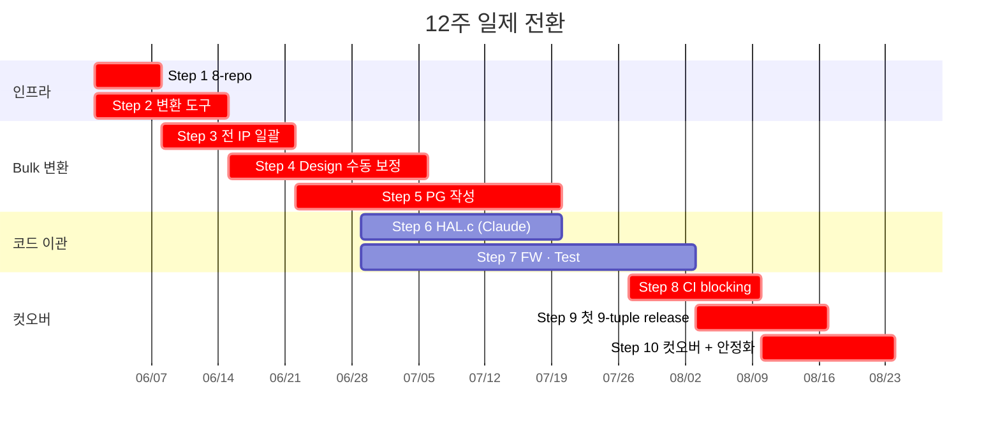
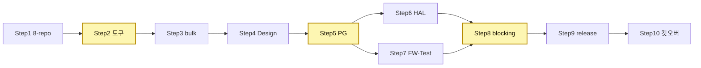

# 7. 로드맵 + 리스크 — 3개월 일제 전환

## 7.1 가정과 제약

| 가정 | 값 |
|---|---|
| 현재 상태 | HLD/DLD = Word, SFR = Excel, PG = Confluence, 표준 spec = PDF (메일/공유드라이브), HAL/FW/Test = 분산 |
| 목표 상태 | 8-repo (Markdown + SystemRDL + LFS Spec) + Phase 1/2 + Claude dev-verifier + 8 CI invariant |
| 제약 | **전 IP 동시 · 부분 채택 없음 · 12주 안에 컷오버** |

## 7.2 전략 — 일제 전환의 3가지 무기

1. **자동화 우선**. Word→MD, Excel→RDL, PDF→MD extract 는 일회성 스크립트로 80%+ 흡수.
2. **War-room 체제**. IP owner 전원 같은 채널·일일 standup·24h 내 블로커 해소.
3. **Claude 동원**. PG §6 worked example, HAL.c, Python scenario 를 Claude 가 1-shot 초안 + 사람 review.

## 7.3 12주 Step-by-Step

| Step | 기간 | 내용 |
|---|---|---|
| 1 | W1 | 8 repo 셋업 (권한·브랜치보호·submodule 잠금) |
| 2 | W1–2 | 변환 도구 (`docx2md` · `xlsx2rdl` · `pdf2md` · `peakrdl`) + CI invariant **warning 모드** |
| 3 | W2–3 | 전 IP **bulk 변환** (`.docx`→`.md`, `.xlsx`→`.rdl`, 표준 PDF→MD extract) |
| 4 | W3–5 | Design 수동 보정 (다이어그램·표 헤더, IP 병렬). 1 IP 당 2–4 person-days |
| 5 | W4–7 | PG §6 worked example 작성 (IP 병렬, Claude 추출 + SW lead 검토). 1 IP 당 3–5 person-days |
| 6 | W5–8 | HAL Repo: HAL.h auto + Claude 가 HAL.c 재생성 + 검토 |
| 7 | W5–9 | FW · Test Repo: Claude 가 driver/app · Python coverif 재생성, DV 측정·assertion 보강 |
| 8 | W9–10 | CI **warning → blocking**, Release gate R1 활성화 |
| 9 | W10–11 | 전 IP D + F + T + R 모두 PASS → 첫 9-tuple release |
| 10 | W11–12 | 컷오버 (Word/Excel/Confluence → read-only) + KPI baseline + 회고 |

## 7.4 12주 Gantt

## 7.5 Critical Path · 의존성

**가장 위험한 3개** (노란색):
- **Step 2 (변환 도구)**: 늦어지면 이후 전부 밀림. 1주 안에 80% 신뢰성 확보 필수.
- **Step 5 (PG 작성)**: 사람 손이 가장 많이 듦. Claude 초안 → SW lead 의도 검토 모델로 흡수.
- **Step 8 (CI blocking)**: false-positive 폭증 시 PR 정체. Step 4–7 동안 warning 튜닝 충분히.

## 7.6 인력 (War-room)

| 역할 | FTE | 기간 |
|---|---|---|
| PM | 1.0 | 12W |
| DevOps (변환·CI·peakrdl) | 2.0 | 12W |
| AI / 프롬프트 TF | 1.0 | 12W |
| FW lead | 0.5 | 12W |
| DV lead | 1.0 | 12W |
| IP owner spike (per IP) | 0.5 | 4–5W (Steps 4–7) |

IP 25개 가정 시 owner 총량 ≈ 63 person-weeks (8–10명 × 5–6주).

## 7.7 외부 도구

| 영역 | 도구 |
|---|---|
| AI | Claude Code (grep-first 패턴 본 제안과 일치) |
| Word→MD | pandoc + 사내 후처리 |
| Excel→RDL | openpyxl + 자체 emitter |
| RDL → 산출물 | peakrdl · peakrdl-ipxact · peakrdl-html |
| PDF→MD | pdftotext + 장/절 분리 |
| 다이어그램 | Mermaid · WaveDrom · D2 · Kroki |
| 검증 | pytest + libnvme-python |

## 7.8 핵심 리스크 5개

| # | 리스크 | 완화책 |
|---|---|---|
| R1 | 8 repo 의 git submodule 학습 곡선 | `make doc-update` 한 줄 wrapper, 일반 작업은 submodule 명령 직접 안 함 |
| R2 | FW · Test 가 다른 doc-tag 를 봄 (drift) | Release gate R1 자동 강제 (§4.2) |
| R3 | Claude 환각 (HAL.c, Python scenario) | Claude self-check (§5.4) → CI invariant (§4.2) |
| R4 | 변환 도구 신뢰성 부족 (Step 2 지연) | DevOps +1 spike, Excel template 강제 표준화 |
| R5 | 조직 변화 저항 | 자동 변환으로 진입장벽 ↓, 신규 IP 부터 우선, 기존 자산 read-only 병행 |

## 7.9 데드라인 협상 불가, 정합성 강도는 단계적

12주 컷오버 데드라인은 협상 대상이 아니다. 단, Step 8 에서 false-positive 폭증 시 가장 strict 한 invariant (D1, R1) 부터 blocking, 나머지는 컷오버 후 1–2주 안에 강화.

→ §8 가 12주 후 도달하는 모습을 정리한다.
