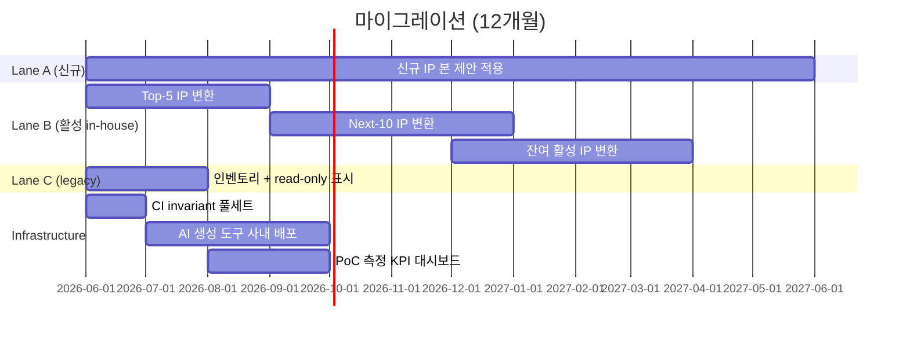

# 9. 리스크와 마이그레이션 전략

본 장은 본 제안의 약점과 그에 대한 완화책, 그리고 기존 환경에서 신환경
으로의 점진적 이행 경로를 정리한다.

---

## 9.1 리스크 7가지와 완화책

| # | 리스크 | 영향 | 완화책 |
|---|---|---|---|
| R1 | FW Repo의 `git submodule` 학습 곡선 | FW/SW 엔지니어가 익숙하지 않음 | `make doc-update` · `make doc-pin <tag>` 한 줄 wrapper. 일반 사용자는 submodule 명령 직접 입력 안 함 |
| R2 | 대용량 binary / waveform / FPGA bitstream | git에 두기 무거움 | git LFS 또는 별도 artifact bucket (S3). RTL/문서/HAL/Python은 git, bitstream/wave는 별도 |
| R3 | Doc submodule 핀이 detached HEAD로 떠도는 위험 | FW가 임의 commit을 가리킬 가능성 | FW Repo CI의 F4 invariant — submodule SHA가 Doc Repo의 release tag와 일치하는지 강제 |
| R4 | Cross-repo coordination latency | RTL 변경이 FW까지 가는 데 Doc Repo PR 한 번이 끼임 | nightly batch도 가능. Critical 변경은 RTL → Doc → FW가 같은 day-cycle 안에 흐를 수 있도록 SLA 정의 |
| R5 | AI 자동 생성 환각 (HAL.c, Python scenario) | 잘못된 HAL 매크로/시나리오 | Doc Repo / FW Repo CI invariant가 PR 시점에 차단. AI 출력 신뢰는 CI가 검증 |
| R6 | IP-XACT 작성 부담 | XML 직접 편집은 비친화적 | AI 자동 생성 (시나리오 A, §5) + spreadsheet → XML 변환기 보조 |
| R7 | FPGA / Veloce / Zebu 가용성 병목 | Python scenario 실행이 큐에 적체 | nightly 회귀 + 변경 영향분석 기반 우선순위. host smoke와 IP-level Verilator smoke를 PR 게이트에 두고, full coverif는 비동기 |
| R8 | 조직 변화 저항 | "지금까지 Confluence로 잘 해왔다" | 신규 IP부터 우선 적용. Confluence 기존 자산은 일정 기간 read-only로 병행 |

---

## 9.2 마이그레이션 전략 — Risk-tiered 3-Lane

기존 환경의 인공물을 한 번에 옮기지 않고, 다음 3 lane으로 점진적
이행한다:

### Lane A — 신규 IP/SoC (Day 1부터 본 제안)
- 모든 신규 IP는 본 워크플로우의 9-stage 산출물 구조를 따른다.
- Reference IP (`irq_ctrl`, `trng`) 템플릿에서 시작.
- CI invariant 6종을 PR Required Status Check로 강제.
- **이 lane은 비용이 가장 낮고 효과가 가장 빠르다**.

### Lane B — 활발히 수정되는 in-house IP (점진적)
- IP 단위로 우선순위를 정해 마이그레이션.
- 우선순위는 ① RTL 수정 빈도 ② SoC 파생 사용 빈도 ③ SW 팀 의존도.
- 1 IP당 평균 1–2주 (스켈레톤 변환 + 가이드 작성 + invariant 통과까지).

### Lane C — 안정화된 legacy IP (read-only 유지)
- 더 이상 수정되지 않는 legacy IP는 Confluence/SharePoint에 그대로
  read-only 보관.
- super-repo에서는 "legacy 참조 링크"만 둠.
- 새 SoC가 이 IP를 사용하려면 lane B로 승급 (그 시점에만 변환 비용).

---

## 9.3 12개월 마이그레이션 로드맵 (요약)

세부 마일스톤은 §10에서 다룬다.

---

## 9.4 조직 변화 관리 — 익숙함과 어떻게 화해하는가

| 우려 (현장 목소리) | 대응 |
|---|---|
| "Confluence 쓰던 게 더 편한데" | 마크다운 PR 리뷰 1주 체험 → diff·comment의 강력함 체감 |
| "Git submodule은 우리 팀에 너무 어렵다" | `make ip-clone <ip>` 한 줄로 추상. 일반 사용자는 submodule 명령 직접 입력 안 함 |
| "AI가 만든 산출물을 어떻게 믿나" | 사람이 믿을 필요 없음. CI가 검증. 사람은 intent만 본다 |
| "EDA 벤더 AI(JedAI 등) 도입하면 되는 거 아닌가" | 가능. 단 락인 + 비용. 본 제안은 비vender solution을 병행 가능 (벤더 도구의 입력 산출물 자체가 본 워크플로우에서 나옴) |
| "Python scenario 작성이 가이드를 두 번 쓰는 거 아닌가" | Python scenario는 가이드의 **실측 가능한 펌웨어 구동 시퀀스 변환**. AI가 1-shot 생성하므로 중복 비용 0 |

---

## 9.5 실패 시나리오와 fallback

> **만약 채택 후 6개월 시점에 KPI가 기대 미달이면?**

가능한 원인과 대응:

| 원인 | 진단 | 대응 |
|---|---|---|
| Submodule 운영 부담이 예상보다 큼 | `make` 추상화 도달 못함 | Harness CLI 보강, 사내 onboarding 강의 1회 |
| AI 자동 생성 품질 저조 | 프롬프트·컨텍스트 패키지 미정형화 | 프롬프트 템플릿 표준화, IP-별 sample 축적 |
| Invariant false-positive 다수 | 검사 로직 강도 조정 필요 | 6종 중 가장 strict한 #2를 단계적 강화 |
| 조직 저항 | 가시적 성공 사례 부족 | Lane A의 신규 IP 1건을 사내 사례로 공개 발표 |

본 제안은 **부분 채택 가능**하다. Lane A만 적용해도 가치가 있고, lane B
는 IP 단위로 trade-off를 다시 판단할 수 있다. **all-or-nothing 결정이
아니다**.

---

## 9.6 데이터 거버넌스 / 보안

| 측면 | 본 제안 |
|---|---|
| IP 비밀유지 | 사내 git 안에서 끝남. 외부 API/벡터DB 미경유 |
| 권한 분리 | IP별 git repo 권한으로 자연스럽게 분리 |
| 감사 로그 | git commit 로그 = 변경 이력 = 감사 로그 |
| 외주 IP 흡수 | 외부 git → 사내 git mirror → submodule. 표준 절차 |
| LLM API 사용 시 데이터 노출 | 사용자 콘솔에서 IP 정보가 LLM provider에 평문으로 전송될 가능성은 별도 정책 (사내 LLM 또는 zero-retention 옵션 권장) |

---

## 9.7 다음 장 예고

§10에서 본 마이그레이션을 **3·6·12개월 마일스톤**으로 분해하고, §11에서
임원/리더가 다음으로 취해야 할 액션을 정리한다.
