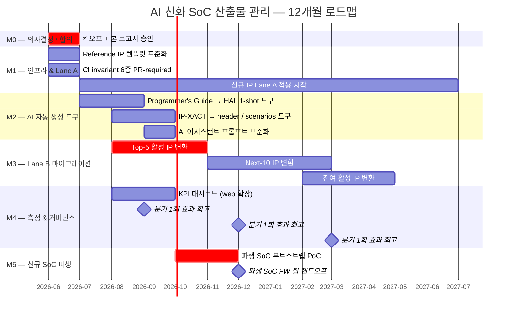

# 10. 로드맵 — 3·6·12개월 마일스톤

본 장은 본 제안의 채택을 **시간 축에 분해**한다. 각 마일스톤은 (a) 산출물,
(b) 조직 책임자, (c) 통과 기준(exit criteria)을 가진다.

---

## 10.1 한눈에 보는 12개월



---

## 10.2 3개월 (M0–M1 종료)

**목표**: Lane A의 신규 IP가 본 워크플로우로 흐를 수 있는 인프라 완비.

| 산출물 | 책임자 | Exit criteria |
|---|---|---|
| 본 제안서 임원 승인 | 본 보고서 작성자 + 사업부 | 사업부장 승인 + 분기 OKR 등재 |
| Reference IP 2종 표준화 (`irq_ctrl`, `trng`) | RTL팀 + 본 보고서 | 9-stage 산출물 6 invariant 모두 PASS (이미 달성[^1]) |
| CI 6 invariant PR-required | DevOps | GitHub Required Status Checks 활성 |
| IP 폴더 스캐폴드 도구 (`ipflow scaffold`) | DevOps | 1개 명령으로 신규 IP 폴더 생성 가능 |
| Onboarding 가이드 1.0 | 본 보고서 작성자 | 새 엔지니어가 가이드만 보고 첫 PR 가능 |

---

## 10.3 6개월 (M2 + M3 일부 + M4 일부)

**목표**: AI 자동 생성 도구 정상 동작 + 활성 IP의 30%가 Lane B 완료.

| 산출물 | 책임자 | Exit criteria |
|---|---|---|
| AI 어시스턴트 자동 생성 도구 (4 시나리오) | DevOps + AI 도입 TF | 각 시나리오에서 CI invariant pass 확인된 PR 사례 ≥ 3건 |
| 프롬프트 / 컨텍스트 패키지 표준화 | AI 도입 TF | IP-별 README에 표준 프롬프트 등재 |
| Lane B Top-5 IP 변환 완료 | IP owners | 5개 IP 모두 9-stage PASS |
| KPI 대시보드 (web/ 확장) | DevOps | 토큰 사용·invariant fail율·lead-time 가시화 |
| Confluence legacy 인벤토리 | 문서 owner | Lane C로 분류된 산출물 목록 |

---

## 10.4 12개월 (M3 종료 + M5 완료)

**목표**: 활성 IP 100% Lane B 완료. 신규 SoC 파생 PoC 성공.

| 산출물 | 책임자 | Exit criteria |
|---|---|---|
| 활성 IP 100% Lane B 완료 | 사업부 | 모든 활성 IP가 본 워크플로우 |
| 파생 SoC 부트스트랩 PoC | HW + AI TF | 신규 SoC 1건이 본 워크플로우로 first tape-out ready |
| FW 팀 핸드오프 표준 | FW lead | super-repo clone 만으로 펌웨어 개발 착수 가능 |
| ROI 보고서 (KPI 실측) | 본 보고서 작성자 | §8 정량 효과를 사내 실측 데이터로 갱신 |
| Lane C legacy 결정 | 사업부 | 유지 / 디지털 폐기 결정 명문화 |

---

## 10.5 단계별 의사결정 게이트

각 분기 종료 시점에 다음 4개 질문으로 go/no-go를 판단:

```
Q1. 정량 KPI가 산업 평균 범위 안에 있는가?
    (토큰 효율 -30% 이상, lead-time -30% 이상, drift 0)
Q2. 사용자(IP owner) 만족도가 임계 이상인가?
    (Net Promoter Score 또는 사내 설문)
Q3. CI invariant false-positive 비율이 허용 범위인가?
    (월 PR의 5% 이하)
Q4. 다음 분기에 흡수 가능한 IP 수 / 인력이 충분한가?
```

4개 중 3개 이상 yes → 진행. 아니면 다음 분기에서 원인 분석 + 보강.

---

## 10.6 인력 추정 (예시)

| 역할 | 헤드카운트 (FTE) | 기간 |
|---|---|---|
| 본 제안 PM | 0.5 | 12M |
| DevOps (CI / harness 보강) | 1.0 | 12M |
| AI 도입 TF (프롬프트 표준화) | 0.5 | 6M |
| Onboarding & docs | 0.3 | 12M |
| IP owner 측의 마이그레이션 부담 | 0.2 / IP | spike |

위 수치는 1차 추정. 실제 산정은 사업부 인력 풀과 IP 수에 의존.

---

## 10.7 외부 자원 / 도구

| 종류 | 후보 | 비고 |
|---|---|---|
| AI 어시스턴트 | Claude Code (Anthropic) / Cursor | grep-first 패턴이 본 제안과 가장 일치[^2] |
| Verilator | OSS | RTL TB sim, CI 통합 |
| IP-XACT 도구 | Kactus2 (OSS), Magillem (commercial) | 변환·검증 보조 |
| Mermaid / WaveDrom | OSS | 다이어그램 |
| MkDocs Material / Docusaurus | OSS | 마크다운 → 사내 wiki (필요시) |

---

## 10.8 다음 — Call to Action

§11에서 본 보고서가 임원/리더에게 요청하는 **3가지 결정**을 정리한다.

---

[^1]: 본 레포 [`docs/VERIFICATION_REPORT.md`](../VERIFICATION_REPORT.md).
[^2]: §7 참고.
