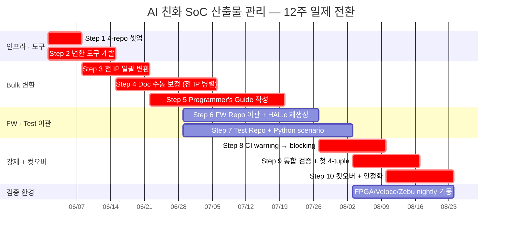
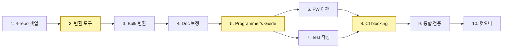

# 10. 로드맵 — 3개월 일제 전환 (Step-by-Step)

본 장은 본 제안의 채택을 **시간 축에 분해**한다. 부분 채택이 아니라
**전 IP 동시 적용**, 그리고 **3개월(12주) 이내 컷오버**를 목표로 한다.

---

## 10.1 가정과 제약

### 현재 상태 (Day 0)
- 모든 산출물이 예전 포맷.
  - **HLD / DLD**: Word (`.docx`) — Confluence/SharePoint에 산재.
  - **SFR**: Excel (`.xlsx`) — 컬럼 매핑이 IP마다 일부 상이.
  - **Programmer's Guide**: Confluence wiki 또는 별도 PDF.
  - **HAL / 펌웨어 / 테스트 코드**: 기존 단일 저장소 또는 분산. FW와 host-side validation 코드가 혼재.

### 목표 상태 (Day 90)
- 본 보고서 §2의 **4-repo 토폴로지** (RTL · Doc · FW · Test) 가 운영 중.
- 모든 산출물이 **Markdown + SystemRDL**.
- Doc / FW / Test CI invariant + Release gate R1이 PR 시점에 자동 강제.
- 첫 4-tuple release: `rtl-v* × doc-v* × fw-v* × test-v*`.

### 제약
- **전 IP 동시 적용** — 부분 채택 / lane 분할 없음.
- **3개월 이내 완료** — 12주 컷오버 데드라인.
- 컷오버 후 예전 포맷 (Word/Excel/Confluence) 은 read-only로만 유지.

---

## 10.2 전략 — 일제 전환의 3가지 무기

1. **자동화 우선**. 사람의 손은 마지막 정합성 보정에만 쓴다.
   - Word → Markdown은 `pandoc` + 사내 후처리로 80%+ 자동 흡수.
   - Excel → SystemRDL은 컬럼 매핑이 표준화되면 100% 자동.
   - SystemRDL → IP-XACT XML / HAL.h / Markdown 표는 `peakrdl-*`로 결정론적 emit.
2. **War-room 체제**. IP owner 전원이 같은 채널·같은 timezone·매일 sync.
   - 일일 standup으로 24h 안에 블로커 해소.
   - 슬랙·이슈트래커가 아닌 PR 코멘트가 정상 통신 경로.
3. **AI 동원**. Programmer's Guide §6 worked example · HAL.c · Python scenario를 모두 AI 1-shot 초안 → 사람 review.
   - 기존 FW 소스에서 usage pattern을 AI가 자동 추출.
   - 환각은 CI invariant가 머지 단계에서 차단.

---

## 10.3 Step-by-Step (10 단계)

### Step 1 — 4-repo 인프라 셋업 (Week 1)
- 4개 git 저장소 생성: `rtl`, `doc`, `fw`, `test`.
- 권한 매트릭스: RTL designer · SW lead · FW · DV 각자 경계 설정.
- 브랜치 보호 (Required Status Checks 자리만 등록, 실제 강제는 Step 8).
- Submodule 한 방향 잠금: `doc/`은 FW Repo·Test Repo만 mount, RTL Repo는 어디에서도 submodule이 아님.
- 표준 개발 환경: Makefile/Docker, `make doc-update` wrapper.

### Step 2 — 변환 도구 개발 (Week 1–2)
- `docx2md` 파이프라인: pandoc + 사내 후처리 (헤딩 번호 보정, 이미지 경로 추출, 다이어그램 placeholder 삽입).
- `xlsx2rdl` 스크립트: 사내 Excel 컬럼(`offset / width / access / reset / desc / fields`)을 SystemRDL `.rdl`로 1:1 변환. `openpyxl` 기반.
- `peakrdl` 빌드 파이프라인: `.rdl` → IP-XACT XML · HAL.h · DLD §5 Markdown 표 (3 outputs).
- 모든 CI invariant (Doc D1–D5 · FW F1–F3 · Test T1–T4 · Release R1) **warning 모드** 가동 — 위반 시 PR에 comment 만 달림.

### Step 3 — 전 IP Bulk 변환 (Week 2–3)
- 전 IP의 HLD/DLD `.docx` → `.md` 일괄 변환 (스크립트 1회 실행).
- 전 IP의 SFR `.xlsx` → `.rdl` 일괄 변환.
- 모든 변환 결과를 Doc Repo의 `bulk-conversion` branch로 commit.
- 첫 Doc Repo PR (warning 위반 다수 허용 — 이 단계는 인벤토리 목적).

### Step 4 — Doc 수동 보정 (Week 3–5, 전 IP 병렬)
- 다이어그램 (Visio/PowerPoint/JPEG) → **Mermaid/WaveDrom**으로 다시 그리기.
- 표 헤더, 헤딩 번호, 이미지 경로, 본문 흐름 정리.
- AI 보조: 수치·표·다이어그램 골격 자동 추출.
- 1 IP당 평균 **2–4 person-days** (IP 규모에 따라 변동).
- 완료 IP부터 main으로 merge — Doc D1, D2, D4 invariant pass.

### Step 5 — Programmer's Guide 작성 (Week 4–7, 전 IP 병렬)
- 기존 FW 소스 (대상: 가장 활발한 driver/app)에서 usage pattern을 AI가 추출 → Guide §6 worked example 초안 생성.
- SW lead가 의도·시퀀스·전제조건 검토.
- §8 pitfall은 기존 버그 트래커·incident log에서 회귀 케이스를 추출 → AI가 정리.
- 1 IP당 평균 **3–5 person-days**.
- 완료 IP는 D3, D5 invariant pass → Doc Repo의 첫 release tag `doc-v1.0`.

### Step 6 — FW Repo 이관 (Week 5–8)
- 기존 펌웨어 코드 → FW Repo로 이관 (디렉터리 구조 표준화).
- `doc/` submodule pin to `doc-v1.0`.
- 기존 HAL `.c`를 AI가 시나리오 C (Guide → HAL.c)로 **재생성** → FW lead 리뷰.
- ISR / DMA / 락 정책 등 사람 영역 보강.
- F1 (HAL.c ↔ HAL.h) · F3 (host smoke) invariant pass.

### Step 7 — Test Repo 신규 작성 (Week 5–9)
- Test Repo 셋업 + NVMe/PCIe host helper 라이브러리.
- `doc/` submodule pin to `doc-v1.0`.
- AI가 시나리오 D (Guide §6, §8 → Python)로 **전 IP의 Python scenario 일괄 생성**.
- DV가 측정 metric (latency · throughput · error 카운트 · 전력 시퀀스) 보강.
- pytest infrastructure: `pytest --collect-only` 가 CI에 통합.
- T1–T4 invariant pass.

### Step 8 — CI 게이트 강제 전환 (Week 9–10)
- 모든 invariant **warning → blocking** 전환.
- Release gate R1 (`FW.doc-SHA == Test.doc-SHA`) 활성화 — release manifest 단계에서 자동 강제.
- 잔존 위반 IP가 있으면 unblock 스프린트로 해결 (보통 표 헤더 누락·시그너처 불일치 같은 잔재).

### Step 9 — 통합 검증 + 첫 4-tuple release (Week 10–11)
- 전 IP가 D + F + T + R invariant 모두 PASS.
- Release manifest: `rtl-vX × doc-vY × fw-vZ × test-vW`.
- FPGA · Veloce · Zebu에 새 FW binary 배포.
- SSD Host에서 Python scenarios nightly + on-demand regression 가동.
- 첫 coverif report — 산업 평균 KPI와 비교.

### Step 10 — 컷오버 + 안정화 (Week 11–12)
- Confluence/Word/Excel/SharePoint 원본을 **read-only** 전환.
- 모든 신규 변경은 신 워크플로우 only — 컷오버 일자 명문화.
- KPI baseline 측정·기록: 토큰 사용·invariant fail율·PR lead-time·신규 IP 부트스트랩 시간.
- 회고: 무엇이 잘됐고, 무엇이 다음 분기 백로그인지.

---

## 10.4 12주 타임라인 (Gantt)

(Week 번호는 예시. 실제 킥오프 시점에 절대 날짜로 환산.)

---

## 10.5 Critical Path · 의존성

**가장 위험한 3개 critical step** (노란색):
- **Step 2 (변환 도구)** — 늦어지면 Step 3 이후 전부 밀림. 도구 신뢰성 80%+ 가 1주 안에 확보돼야 함.
- **Step 5 (Programmer's Guide)** — 가장 많은 사람 손이 들어가는 단계. AI 자동 초안 → SW lead 리뷰로 흡수 가능 여부가 관건.
- **Step 8 (CI blocking)** — false-positive가 많으면 PR이 모두 멈춤. Step 4–7 동안 warning 모드로 충분히 튜닝.

---

## 10.6 인력 / 자원 (War-room 체제)

3개월 단발 투입. 전 IP가 동시에 움직이므로 IP owner 인력이 spike.

| 역할 | FTE | 기간 | 비고 |
|---|---|---|---|
| **PM / 코디네이터** | 1.0 | 12주 | 일일 standup 운영, 블로커 escalation |
| **DevOps (변환 도구·CI·peakrdl)** | 2.0 | 12주 | Step 2가 critical, 도구 신뢰성 책임 |
| **AI / 프롬프트 TF** | 1.0 | 12주 | 시나리오 A·B·C·D 프롬프트 표준화, 검수 sample |
| **FW lead (전체 조정)** | 0.5 | 12주 | Step 6 책임, ISR/DMA 정책 |
| **DV lead (Test Repo)** | 1.0 | 12주 | Step 7 책임, Python helper 라이브러리 |
| **IP owner (per IP)** | 0.5 spike | 4–6주 (Steps 4–7) | 자기 IP의 Doc 보정 + Guide 작성 |
| **임원 sponsor** | 주 1회 sync | 12주 | 블로커 해소 권한 |

**IP 수가 25개**라고 가정하면 IP owner spike 총량 = 25 × 0.5 × 5주 ≈ **63 person-weeks**.
이는 8–10명의 owner가 5–6주에 걸쳐 자기 담당 IP들을 변환한다는 의미. 한 owner가 평균 2–3 IP 담당.

---

## 10.7 외부 자원 / 도구

| 종류 | 후보 | 비고 |
|---|---|---|
| AI 어시스턴트 | Claude Code (Anthropic) / Cursor | grep-first 패턴이 본 제안과 가장 일치[^2] |
| Word → Markdown | `pandoc` (OSS) | docx 표·이미지 처리 후 사내 후처리 |
| Excel → SystemRDL | `openpyxl` + 자체 emitter | 사내 Excel template 표준화 선행 |
| SystemRDL → 산출물 | `peakrdl`, `peakrdl-ipxact`, `peakrdl-html` (OSS) | RDL → IP-XACT XML / C header / HTML 일괄 emit |
| IP-XACT 도구 | Kactus2 (OSS), Magillem (commercial) | 변환·검증 보조 (옵션) |
| Mermaid / WaveDrom | OSS | 다이어그램 |
| pytest + libnvme-python | OSS | Test Repo의 host scenario 실행 |

---

## 10.8 컷오버 후 (Week 12+)

| 산출물 | 책임자 | 후속 |
|---|---|---|
| KPI baseline 측정 | PM | 토큰 사용·invariant fail율·PR lead-time |
| 사내 retrospective | PM + 모든 lead | 다음 신규 SoC 부트스트랩 백로그 |
| 외부 발표 / 공유 | 본 보고서 작성자 | 사내 컨퍼런스 또는 외부 사례 공유 |

신규 SoC 파생은 컷오버 후 처음부터 본 워크플로우로만 진행한다 — 별도 마이그레이션 불요.

---

[^1]: 본 레포 [`docs/VERIFICATION_REPORT.md`](../VERIFICATION_REPORT.md).
[^2]: §7 참고.
