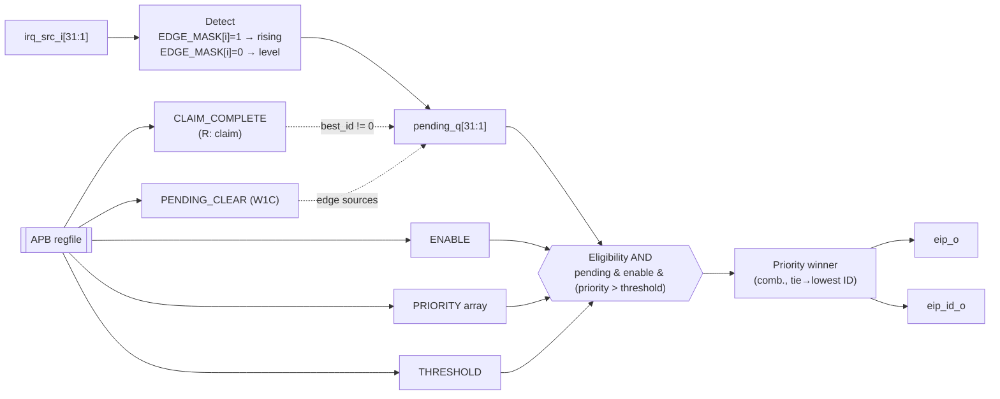
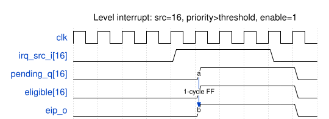
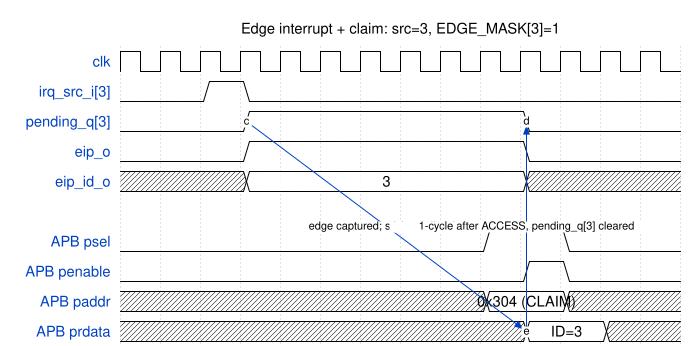

# irq_ctrl — Design Document

| 항목           | 값                                    |
|---------------|---------------------------------------|
| IP            | `irq_ctrl` (PLIC 계열)                |
| Version       | 1.0.0                                 |
| Subsystem     | `cpu_ss`                              |
| Bus           | APB (32-bit data, 12-bit local addr)  |
|소스 파일      | `rtl/irq_ctrl.sv`                     |
| Language      | SystemVerilog (synthesizable subset)  |
| License       | Apache-2.0                            |

본 문서는 [`rtl/irq_ctrl.sv`](../rtl/irq_ctrl.sv)의 RTL 구현을 분석한다.

---

## 1. 개요

`irq_ctrl`은 최대 `NUM_IRQ-1`개의 외부 interrupt source를 하나의 CPU용 external
interrupt pending 신호(`eip_o`)로 집약하는 platform-level interrupt controller
(PLIC) 이다. source 0은 PLIC 관례에 따라 예약(reserved)되어 있으며, claim이
반환하는 "no interrupt" sentinel로 사용된다.

source별로 software가 설정할 수 있는 항목:
- **priority** (4-bit, 0..15; 0이면 priority로 인해 비활성화)
- **enable** (1-bit; source별 mask)
- **detection mode** (edge 또는 level — compile-time `EDGE_MASK`로 지정)

전역 설정:
- **threshold** (4-bit; `priority > threshold`일 때만 source가 fire)
- **claim/complete** atomic handshake (ISR 진입/종료)

본 블록은 single hart, single context를 대상으로 한다. multi-hart 지원은
향후 확장 사항이다 (§8 참조).

---

## 2. Top-level interface

```
            ┌──────────────────────────────────────┐
            │              irq_ctrl                │
  APB ──────┤ paddr/psel/penable/pwrite/pwdata     │
            │ → prdata/pready/pslverr              │
            │                                      │
 irq_src ───┤ irq_src_i[NUM_IRQ-1:0]               │
            │                                      │
            │                       eip_o ───►     │ to CPU mip.MEIP
            │                    eip_id_o ───►     │ informational
            └──────────────────────────────────────┘
```

| Port            | Dir | Width        | 설명                                                   |
|-----------------|-----|--------------|--------------------------------------------------------|
| `clk`           | in  | 1            | 주 clock; 모든 logic이 이 domain에 위치.               |
| `rst_n`         | in  | 1            | Async active-low reset; sync deassert 권장.            |
| `paddr`         | in  | 12           | APB byte 주소 (word-aligned).                          |
| `psel`/`penable`| in  | 1/1          | 표준 APB select / enable.                              |
| `pwrite`        | in  | 1            | 1=write, 0=read.                                       |
| `pwdata`        | in  | 32           | Write data.                                            |
| `prdata`        | out | 32           | Read data (read access 외에는 0).                      |
| `pready`        | out | 1            | ACCESS phase 동안 high (wait-state 없음).              |
| `pslverr`       | out | 1            | 미매핑 주소 또는 RO write 시 high.                     |
| `irq_src_i`     | in  | `NUM_IRQ`    | 외부 source; `[0]`은 무시.                             |
| `eip_o`         | out | 1            | CPU에 전달되는 external interrupt pending.             |
| `eip_id_o`      | out | `clog2(N)`   | 현재 winning source ID (informational).                |

얇은 wrapper `irq_ctrl_apbif`는 프로젝트 공통 `apb_if.slave` interface를
flat-port core에 연결한다.

---

## 3. Parameters

| Parameter   | 기본값  | Range/Type             | 효과                                          |
|-------------|--------|------------------------|----------------------------------------------|
| `NUM_IRQ`   | 32     | int (예약 0 포함)      | source 개수 (1..32 권장).                    |
| `PRIO_W`    | 4      | int                    | priority 폭; 4 → 16 단계.                    |
| `EDGE_MASK` | `'0`   | `[NUM_IRQ-1:0]`        | source별 감지 모드 (1=edge, 0=level).        |

현재 pending/enable register는 32-bit 단일 word로 매핑되어 있어 `NUM_IRQ ≤ 32`
로 제한된다. 더 넓은 구성은 strided register array가 필요하며 v1.0 범위 밖이다.

---

## 4. Block diagram



---

## 5. Register map

모든 offset은 byte 주소이며, 접근 단위는 32-bit word, word-aligned 이다.

| Offset  | 이름              | Access      | Reset       | 설명                                                          |
|---------|-------------------|-------------|-------------|--------------------------------------------------------------|
| `0x000` | `PRIORITY[0]`     | RO          | 0           | 예약 — 항상 0.                                                |
| `0x004` | `PRIORITY[1]`     | RW          | 0           | source-1 priority (`PRIO_W` LSBs).                            |
| …       | …                 | RW          | 0           | …                                                             |
| `0x07C` | `PRIORITY[31]`    | RW          | 0           | source-31 priority.                                           |
| `0x100` | `PENDING`         | RO          | 0           | 비트 i = source-i pending.                                    |
| `0x104` | `PENDING_CLEAR`   | W1C         | 0           | 비트에 1 write 시 clear (edge source만).                      |
| `0x200` | `ENABLE`          | RW          | 0           | 비트 i = source-i 해제 상태; 비트 0은 항상 0.                 |
| `0x300` | `THRESHOLD`       | RW          | 0           | 전역 priority threshold.                                      |
| `0x304` | `CLAIM_COMPLETE`  | R: claim    | n/a         | Read → winning source ID 반환 & pending atomic clear.         |
|         |                   | W: complete | n/a         | Write → 완료 ack (v1.0에서는 informational).                  |
| `0x308` | `IP_ID`           | RO          | `0x49524301`| ASCII "IRC\\1".                                               |
| `0x30C` | `IP_VERSION`      | RO          | `0x00010000`| {major[15:8], minor[7:0], patch[7:0]} = 1.0.0.                |

**에러 동작:**
- 미매핑 offset read → `pslverr=1`, `prdata=0`.
- RO register (`PENDING`, `IP_ID`, `IP_VERSION`) write → `pslverr=1`, 상태 변경 없음.

### 5.1 대표 register의 bit-field 레이아웃

`PRIORITY[i]` (4-bit field, 나머지 reserved):


`CLAIM_COMPLETE` ([4:0] ID, 나머지 reserved):


`IP_VERSION` (PATCH / MINOR / MAJOR 분할):


> 도면 source는 `doc/diagrams/regfield_*.json`에 있으며,
> `tools/render-diagrams.sh`로 SVG가 재생성된다.

---

## 6. Datapath 및 기능 동작

### 6.1 Pending 추적
- 매 cycle 입력 vector `irq_src_i`를 `irq_src_d`에 register한다.
- **edge source** (`EDGE_MASK[i]=1`): rising edge (`irq_src_i[i] & ~irq_src_d[i]`)
  다음 cycle에 `pending_q[i]`가 set된다. clear 조건:
  - SW가 `PENDING_CLEAR`의 비트 i에 1을 write, 또는
  - 현재 winning source가 i일 때 SW가 `CLAIM_COMPLETE`를 read.
- **level source** (`EDGE_MASK[i]=0`): `pending_q[i]`가 `irq_src_i[i]`를 그대로
  추적한다. SW W1C / claim은 level pending을 clear하지 못하며, source가
  자체적으로 line을 deassert해야 한다.
- source 0은 매 cycle 0으로 강제된다.

### 6.2 Arbitration
`always_comb` 내부에서 2단계 reduction:
1. `eligible[i] = pending_q[i] & enable_q[i] & (priority_q[i] > threshold_q)` 계산.
2. `i=1..NUM_IRQ-1`을 순차 scan하여 `priority_q[i]`가 strictly 가장 큰 source를
   선택. tie는 최소 ID로 해결 (scan이 `>=`가 아닌 `>`로만 update하기 때문).

`eip_o`는 `best_id ≠ 0`일 때 assert된다. source assert부터 `eip_o` rising까지
지연:
- **level source:** 입력 flop → eligibility → mux → eip_o ≈ 1 cycle.
- **edge source:** edge 검출은 직전 cycle 샘플이 필요하므로 `pending_q` set에
  1 cycle, 이후 조합 경로로 eip_o까지 ≈ 1 cycle.

### 6.3 Claim/complete
- `CLAIM_COMPLETE` read는 `{0…, best_id}`를 반환한다. 동일 ACCESS cycle에
  `best_id ≠ 0`이고 winning source가 edge인 경우 `pending_q[best_id]`가
  atomic하게 clear된다 (synchronous, 다음 cycle에 register됨).
- eligible source가 없을 때 claim read는 0을 반환한다 (PLIC 관례).
- `CLAIM_COMPLETE` write는 현재 informational (gating 없음)이다. 향후
  per-context "in-flight" tracking을 추가해도 ABI를 깨지 않도록, full PLIC와
  동일한 SW flow (`claim → ISR body → complete`)를 노출하기 위해 존재한다.

### 6.4 APB protocol
- 2-cycle SETUP/ACCESS access; `pready`는 ACCESS (`psel & penable`)에만
  assert되므로 `pready`를 보는 master는 1 wait 동작으로 본다. v1.0에서
  wait-state는 추가로 삽입되지 않는다.
- `pslverr`는 ACCESS 동안 미매핑 주소 또는 RO write에서 assert된다.

---

## 7. Timing

### 7.1 Level interrupt



`irq_src_i[16]` 어서트 → 다음 clock edge에 `pending_q[16]` set →
조합 경로로 `eip_o`까지 전파 (≈1 cycle FF 지연).

### 7.2 Edge interrupt + claim



`irq_src_i[3]`의 1-cycle pulse가 edge 검출되어 `pending_q[3]`가 set되고
claim read까지 유지된다. `CLAIM_COMPLETE` read의 ACCESS phase에서
`prdata=ID=3`이 반환되고, 다음 cycle에 `pending_q[3]`가 atomic clear된다.

> 도면 source는 `doc/diagrams/timing_*.json`에 있으며,
> `tools/render-diagrams.sh`가 SVG를 산출한다.

---

## 8. 향후 확장 (v1.0 범위 외)

- Multi-context 지원 (per-hart THRESHOLD/ENABLE bank).
- `NUM_IRQ > 32`를 위한 strided pending/enable array.
- Claim-in-flight tracking (`CLAIM_COMPLETE` write가 의미를 가지도록 확장).
- AXI4-Lite 대체 front-end.
- 보안 subsystem 요구사항인 configuration register ECC.

---

## 9. Verification

[`sim/tb_irq_ctrl.sv`](../sim/tb_irq_ctrl.sv)는 reset, RO/RW 동작,
level/edge source, threshold gating, priority + tie-break arbitration,
claim-atomic-clear, W1C, `pslverr` 생성 등 11개 directed 시나리오를 다룬다.
Smoke 수준의 CI sim job이 PR마다 본 testbench를 실행한다.
