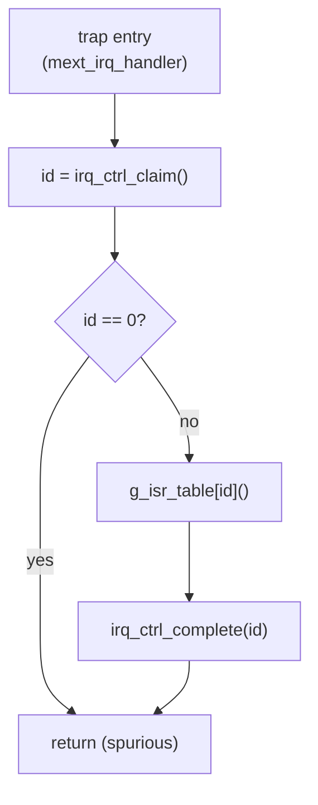

# irq_ctrl — Programmer's Guide

대상: `cpu_ss` subsystem에 통합되는 `irq_ctrl` (PLIC 계열) 펌웨어 엔지니어.
v1.0.0.

본 문서는 register 사용 시나리오, 권장 초기화 sequence, ISR flow,
edge vs level 차이, [`sw/`](../sw/) 의 HAL과 매칭되는 실전 예제를 다룬다.

---

## 1. 주소 맵 요약

Base 주소는 SoC integration에서 정의한다. HAL은 이를 `IRQ_CTRL_BASE`로 노출한다.
4 KiB window 내부 offset:

| Offset      | Register         | Access      | 비고                                              |
|-------------|------------------|-------------|--------------------------------------------------|
| `0x000`     | `PRIORITY[0]`    | RO=0        | 예약 (source 0).                                  |
| `0x004+4*i` | `PRIORITY[i]`    | RW (4 bits) | i=1..31. 0이면 priority로 인해 비활성화.          |
| `0x100`     | `PENDING`        | RO          | 비트 i = source-i pending.                        |
| `0x104`     | `PENDING_CLEAR`  | W1C         | edge source 전용.                                 |
| `0x200`     | `ENABLE`         | RW          | 비트 i = source-i 해제.                           |
| `0x300`     | `THRESHOLD`      | RW (4 bits) | `priority > threshold`일 때 source가 fire.        |
| `0x304`     | `CLAIM_COMPLETE` | R: claim    | Read → winning ID 반환, pending clear (edge만).   |
|             |                  | W: complete | 완료 ack.                                         |
| `0x308`     | `IP_ID`          | RO          | `0x49524301` ("IRC\\1").                          |
| `0x30C`     | `IP_VERSION`     | RO          | v1.0.0의 경우 `0x00010000`.                       |

---

## 2. 초기화 sequence

부팅 시 권장 bring-up 순서. 각 단계는 이전 단계 상태를 깨뜨리지 않는다.

```
 1. (선택) IP_ID / IP_VERSION sanity check
 2. THRESHOLD ← 0xF             ; 설정 동안 모든 interrupt를 mask
 3. ENABLE    ← 0               ; source별 mask 해제 상태 초기화
 4. 사용할 source i에 대해:
       PRIORITY[i] ← 원하는 level (1..15)
 5. PENDING_CLEAR ← 0xFFFFFFFE  ; 잔존 edge pending 비트 flush
 6. ENABLE    ← 사용 source의 bitmask
 7. THRESHOLD ← 허용할 최소 priority - 1
       (예: THRESHOLD=0이면 priority 1..15를 허용)
 8. CPU 측: local pending clear, global IRQ enable (mstatus.MIE / CPSR.I 등)
```

2–3단계는 설정 도중 CPU가 spurious `eip` rising을 보지 않도록 보장하고,
5단계는 reset 동안 source가 toggling 중이었을 때 남을 수 있는 stale edge
pending을 청소한다.

참조 HAL 루틴: [`sw/irq_ctrl_hal.c`](../sw/irq_ctrl_hal.c) 의 `irq_ctrl_init()`.

---

## 3. source 구성

source가 "CPU를 fire"시키는 조건:

```
   pending[i] AND enable[i] AND priority[i] > threshold
```

따라서 세 가지가 *모두* set되어야 한다. 흔한 실수 두 가지:
- `ENABLE`만 set하고 `PRIORITY[i]=0`으로 두면 → 절대 fire되지 않음.
- `THRESHOLD ≥ PRIORITY[i]`로 올려 "임시 비활성"하는 방법은 동작하지만,
  threshold 이하 *모든* source에 영향을 주므로 source별 mask가 아닌
  전역 mask가 된다. source별로 mask하려면 `ENABLE` 비트를 사용한다.

---

## 4. Edge vs level source

source별 detection mode는 instantiation 시점의 `EDGE_MASK` parameter로
**compile-time** 고정된다. HAL은 `irq_ctrl_is_edge(i)`를 제공하여 generic 코드가
적절한 flow를 선택할 수 있도록 한다.

| 항목                  | Edge source                                          | Level source                                |
|----------------------|------------------------------------------------------|---------------------------------------------|
| pending set 시점     | `irq_src_i[i]`의 rising edge 다음 cycle.             | `irq_src_i[i]` 조합 추적.                   |
| pending clear 방법   | SW: `CLAIM_COMPLETE` read (atomic) **또는** W1C.     | source가 line을 deassert해야 함.            |
| ISR 책임             | 디바이스 서비스; SW clear로 충분.                    | line이 떨어질 때까지 디바이스 서비스.       |
| 이벤트 손실 위험      | ISR latency보다 빠른 두 edge가 오면 발생.            | 없음 — line이 유지됨.                        |

**ISR 경험 법칙:** edge source는 claim + 서비스. level source는 claim + 디바이스
자체 status register를 서비스하여 line이 떨어진 *후* PENDING을 재확인.

---

## 5. ISR 제어 flow

CPU machine-mode trap vector에서의 표준 PLIC handler:



```c
void mext_irq_handler(void)
{
    uint32_t id = irq_ctrl_claim();          // CLAIM_COMPLETE read
    if (id == 0) return;                     // spurious

    g_isr_table[id]();                       // source별 ISR로 dispatch

    irq_ctrl_complete(id);                   // CLAIM_COMPLETE write
}
```

주의:
- 블록이 매 cycle eligibility를 재평가하므로 다른 source가 pending이면 `eip_o`는
  high를 유지하고, `mret` 후 CPU는 다시 `mext_irq_handler`로 진입한다. handler
  내부에서 loop을 돌릴 필요는 **없다**.
- nested / priority-preemptive 처리가 필요하면 ISR 내부에서 global IRQ를
  재허용하기 전에 `THRESHOLD`를 현재 source priority로 올리고, ISR 종료
  시점에 복원한다.

---

## 6. 사용 예제

### 6.1 Level-triggered UART RX 인터럽트 활성화 (source 12, priority 5)

```c
irq_ctrl_set_priority(12, 5);
irq_ctrl_enable(12);
irq_ctrl_set_threshold(0);   // priority ≥ 1 허용
```

UART ISR에서는 RX FIFO를 비울 때까지 drain하면 line이 deassert된다.
SW pending clear는 불필요 (level mode).

### 6.2 Edge-triggered DMA done 인터럽트 활성화 (source 4, priority 10)

```c
irq_ctrl_set_priority(4, 10);
irq_ctrl_clear_pending(4);   // stale edge 비트 flush
irq_ctrl_enable(4);
```

DMA ISR에서는 디바이스를 서비스한다. `irq_ctrl_claim()` 호출이 이미
`PENDING[4]`를 atomic clear했으므로 별도 W1C는 필요 없다.

### 6.3 SW로 trigger되는 soft IRQ (debug)

본 블록에는 전용 software-trigger register가 없다. 다만 W1C로 "아무것도 아닌"
비트를 쓰는 것은 no-op이다. 실제로 inject하려면 `irq_src_i` aggregation harness를
통해 GPIO source 등을 한 cycle 동안 high로 hold한다.

### 6.4 critical section에서 인터럽트 일시 차단

```c
uint32_t prev = irq_ctrl_get_threshold();
irq_ctrl_set_threshold(0xF);     // priority 1..15 모두 mask
/* critical section */
irq_ctrl_set_threshold(prev);
```

`ENABLE`을 만지는 것보다 빠르며 atomic하게 복원된다.

---

## 7. 에러 응답

블록은 다음 상황에서 `pslverr`를 assert한다:
- 4 KiB window 내 미매핑 offset에 대한 read/write.
- 임의의 RO register (`PENDING`, `IP_ID`, `IP_VERSION`) write.

펌웨어는 `pslverr`를 치명적 misconfiguration으로 취급해야 한다 — "retry"
의미는 정의되지 않는다. HAL은 `pslverr`를 polling하지 않으며, bus fabric이
load/store fault로 노출하리라 가정한다.

---

## 8. 흔한 함정

| 증상                                       | 원인                                                                |
|-------------------------------------------|---------------------------------------------------------------------|
| `eip`가 전혀 rise하지 않음.                 | `PRIORITY[i]=0`, 또는 `THRESHOLD ≥ PRIORITY[i]`, 또는 `ENABLE[i]=0`. |
| ISR return 후에도 `eip`가 계속 fire.        | Level source: 디바이스 line이 여전히 assert 상태 (ISR 미서비스).    |
| Edge source에서 가끔 `eip` 재발.            | 가까운 두 edge — 두 번째가 ISR 도중 captured 됨.                    |
| ISR 내부에서 claim이 0을 반환.              | HW 재 arbitration과 ISR 진입의 race; 정상으로 처리.                 |
| 부팅 시 spurious IRQ.                       | stale edge pending — init에서 `irq_ctrl_clear_pending_all()` 호출.  |

---

## 9. Versioning

| HAL macro              | v1.0.0 값     |
|------------------------|---------------|
| `IRQ_CTRL_ID_EXPECTED` | `0x49524301`  |
| `IRQ_CTRL_VER_EXPECTED`| `0x00010000`  |

`irq_ctrl_probe()`는 두 값을 모두 read하여 일치 시 0을 반환한다.
