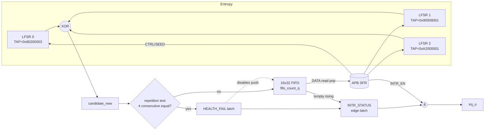
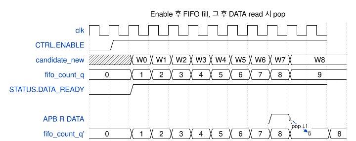
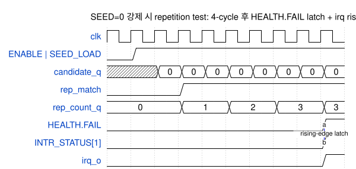

# trng — Design Document

| 항목       | 값                                    |
|-----------|---------------------------------------|
| IP        | `trng` (True Random Number Generator) |
| Version   | 1.0.0                                 |
| Subsystem | `sec_ss`                              |
| Bus       | APB (32-bit data, 12-bit local addr)  |
| 소스 파일 | `rtl/trng.sv`                         |
| Language  | SystemVerilog (synthesizable subset)  |
| License   | Apache-2.0                            |

본 문서는 [`rtl/trng.sv`](../rtl/trng.sv) 의 RTL 구현을 분석한다.

---

## 1. 개요

실제 silicon TRNG 의 analog entropy source 는 본 디자인에서 **3개의 32-bit
Galois LFSR XOR** 로 대체된 emulator 이다. 그 위에 얹은 health test / FIFO /
SFR / interrupt 인프라는 production-grade 동작 그대로이며, analog source 만
swap 하면 그대로 silicon target 으로 이식 가능하도록 의도되었다.

핵심 동작:
- ENABLE high → 매 cycle candidate word 생성 (3 LFSR XOR)
- Repetition health test: 4 cycle 연속 동일 candidate → HEALTH_FAIL latch + push 정지
- 16-entry FIFO 에 저장; CPU 가 DATA register read → pop
- DATA_READY / HEALTH_FAIL 두 source 의 rising edge 가 INTR_STATUS 에 latch,
  INTR_EN 마스크 결과가 irq_o 로 출력

---

## 2. Top-level interface

| Port      | Dir | Width | 설명                                        |
|-----------|-----|-------|--------------------------------------------|
| `clk`     | in  | 1     | 주 clock                                    |
| `rst_n`   | in  | 1     | Async active-low reset                      |
| `paddr`   | in  | 12    | APB byte 주소 (word-aligned)                |
| `psel`    | in  | 1     | APB select                                  |
| `penable` | in  | 1     | APB enable (ACCESS phase 식별)              |
| `pwrite`  | in  | 1     | 1=write, 0=read                             |
| `pwdata`  | in  | 32    | Write data                                  |
| `prdata`  | out | 32    | Read data                                   |
| `pready`  | out | 1     | ACCESS phase 동안 high                      |
| `pslverr` | out | 1     | 미매핑 / RO write 시 high                   |
| `irq_o`   | out | 1     | level interrupt; INTR_STATUS & INTR_EN     |

`trng_apbif` wrapper 가 프로젝트 공통 `apb_if` 와 연결.

---

## 3. Block diagram



---

## 4. Register map

| Offset  | 이름           | Access | Reset       | 설명                                            |
|---------|---------------|--------|-------------|------------------------------------------------|
| `0x000` | `CTRL`        | RW + W1S | 0         | bit0=ENABLE, bit1=SOFT_RESET (pulse), bit2=SEED_LOAD (pulse) |
| `0x004` | `STATUS`      | RO     | 0x4         | bit0=DATA_READY, bit1=FIFO_FULL, bit2=FIFO_EMPTY, bit3=HEALTH_FAIL |
| `0x008` | `DATA`        | RO pop | 0           | Read 시 FIFO 에서 한 word pop. empty 면 0       |
| `0x00C` | `FIFO_LEVEL`  | RO     | 0           | 현재 FIFO 에 저장된 word 수 (0..16)             |
| `0x010` | `HEALTH`      | RO     | 0           | bit0=FAIL_LATCH, bit[11:8]=rep_count            |
| `0x014` | `SEED0`       | RW     | 0x80000001  | LFSR0 seed (SEED_LOAD 펄스 시 LFSR로 로드)      |
| `0x018` | `SEED1`       | RW     | 0xA5A5A5A5  | LFSR1 seed                                      |
| `0x01C` | `SEED2`       | RW     | 0xC3C3C3C3  | LFSR2 seed                                      |
| `0x020` | `INTR_EN`     | RW     | 0           | bit0=DATA_READY_EN, bit1=HEALTH_FAIL_EN         |
| `0x024` | `INTR_STATUS` | RW1C   | 0           | latched interrupt sources                       |
| `0x030` | `IP_ID`       | RO     | 0x54524E47  | ASCII "TRNG"                                    |
| `0x034` | `IP_VERSION`  | RO     | 0x00010000  | {major[15:8], minor[7:0], patch[7:0]} = 1.0.0  |

**에러 동작:**
- 미매핑 offset read/write → `pslverr=1`
- RO register (STATUS / DATA / FIFO_LEVEL / HEALTH / IP_ID / IP_VERSION) write → `pslverr=1`

### 4.1 주요 register bit-field

`CTRL`:


`STATUS`:


---

## 5. Datapath 동작

### 5.1 Galois LFSR step
```
lfsr_next = state[31] ? ({state[30:0], 1'b0} ^ TAP_MASK)
                       :  {state[30:0], 1'b0}
```
각 LFSR 은 서로 다른 TAP_MASK (max-length polynomial 가정). 셋의 XOR 가
candidate word.

> **Note** Seed 가 0 이면 LFSR 이 0-state 에 갇혀 candidate 도 0 으로
> 머무른다. 본 동작은 **의도된 health-fail 검증 경로**이다 (TB §T7, scenario S07).

### 5.2 Repetition health test
- 매 cycle 새 candidate 와 직전 candidate 비교
- 4 cycle 연속 동일 → `HEALTH_FAIL` latch, SOFT_RESET 까지 유지
- HEALTH_FAIL 동안 FIFO push 차단 (FIFO 가 잠긴다)

### 5.3 FIFO push/pop
- push 조건: `ENABLE & !FIFO_FULL & !HEALTH_FAIL`
- pop: APB DATA read 시 매 read 마다 한 word pop
- push/pop 동일 cycle 시 fifo_count 불변

### 5.4 Interrupt edge-latch
- `data_ready = !FIFO_EMPTY` 의 rising edge → `INTR_STATUS[0]` 1로 set
- `health_fail_q` 의 rising edge → `INTR_STATUS[1]` 1로 set
- SW 는 INTR_STATUS 비트를 W1C 로 clear
- `irq_o = |(INTR_STATUS & INTR_EN)`

---

## 6. Timing

### 6.1 Enable → FIFO fill → DATA read pop



ENABLE=1 이후 매 cycle FIFO 가 채워지며, `STATUS.DATA_READY` 가 1로 raise.
DATA read 가 일어나면 그 cycle 에 한 word 가 pop 되고 다음 cycle 부터
push 가 다시 채운다 (race-free).

### 6.2 SEED=0 → health fail



SEED 0 + SEED_LOAD → 모든 LFSR 0, candidate 도 0. 4 연속 0 후
`HEALTH.FAIL` latch, `INTR_STATUS[1]` rising-edge 캡쳐, `irq_o` rise.

---

## 7. Verification

[`sim/tb_trng.sv`](../sim/tb_trng.sv) — 10개 directed scenario 그룹
(reset / IDs / fill / pop / seed-reuse / soft_reset / health_fail /
intr W1C / pslverr unmapped / pslverr RO write). Verilator 5.048 로
**로컬에서 23/23 PASS** 확인.

---

## 8. 향후 확장

- Analog entropy source swap (LFSR 자리에 ring-oscillator + von-Neumann conditioner)
- 추가 health tests (adaptive proportion / NIST SP 800-90B startup test)
- AES-CBC-MAC 또는 SHA-3 기반 conditioner
- DMA 직접 출력 (FIFO 우회)
